#  JVM 类加载机制（看）

加载--验证--准备--解析--初始化--使用--卸载


## 1.验证，准备，初始化

### （1）验证

原理：文件头信息

.class 加载到内存，先验证，校验必须符合JVM规范


### （2）准备


### （3）初始化

**符号引用代替为直接引用**

先不做过深的解读


### （4）3个阶段的总结

最核心的是“**准备阶段**”

是给加载进来的类分配好内存空间，类变量也分配好内存空间，并且给了**默认的初始值**。	0

## 2.核心阶段：初始化

真正的赋值


# 内存区域划分（看）

## 存放类的方法区

class 和静态方法


## 执行代码指令用的程序计数器


多线程的情况：

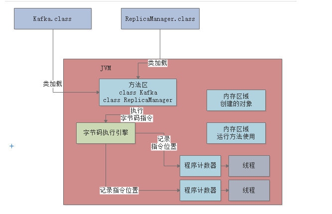


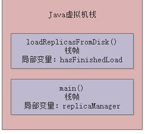

总体流程：


## 堆内存


## 昨天问题


# 垃圾回收机制是用来干嘛的？为什么要垃圾回收？

## 方法执行完毕会怎么样


## 占用


## 不需要的对象处理

是后台线程


## 昨天问题

对象头16 个字节


# JVM分代模型：年轻代、老年代、永久代（看）

## 存放周期短


## 长期存活


static 在方法区

## 年轻代和老年代


不过static 是从新生区近老年区的


## 方法区会不会垃圾回收


# 对象在JVM内存中如何分配？


## 垃圾回收的触发条件


## 进入老年区

15次后

# JVM参数


# 百万交易的支付系统，设置JVM堆大小

## 1.支付的核心业务流程


## 2.压力在哪里


每天在JVM创建百万个订单对象 

## 3.分析具体并发数


## 4.每个订单耗时

假设一秒一个


## 5.每个订单对象的空间大小

1024字节 == 1KB


每台每秒30个

每台：30*500=15000字节 就**15kb**。

总共: 3*15 = 45KB

## 6.运行起来分析系统

当我们持续的创建订单对象，就会在新生代堆积和增加，新生代快满的时候触发 Minor GC来腾出空间。

## 7.完整的系统预估

每秒会创建大量的**其他**大对象，

也就是说，每秒会创建订单对象，也会创建其他数十个对象，那么栈的局部变量的引用对象大致占据的内存空间就在**几百K~1M**，下一秒就变成垃圾，垃圾多了就Mior GC了。

## 8. JVM堆内存设置

2核4G：JVM最多2G，堆最多1G，新生代可能就几百M了，所以会频繁Minor GC

4核8G：JVM 4G， 堆3G，新生代	就至少2G

500kb

# 什么情况下会被垃圾回收

## 那些对象是不能回收的

进行**可达性分析**，判断是否有一个GC ROOT，分析有谁在引用他，一层一层	

举例子：


去分析，replicaManeger的可达性，**局部变量可作为GC ROOT 的**

另外一种：


​	

静态变量也可以看做一直GC ROOT


## finalize（）方法的作用

dinalize方法可以拯救自己


# 垃圾算法各自的优劣？

## 复制算法

- 浪费内存


浪费50%

所以优化：增加个Eden区，相当于可以使用900M的内存

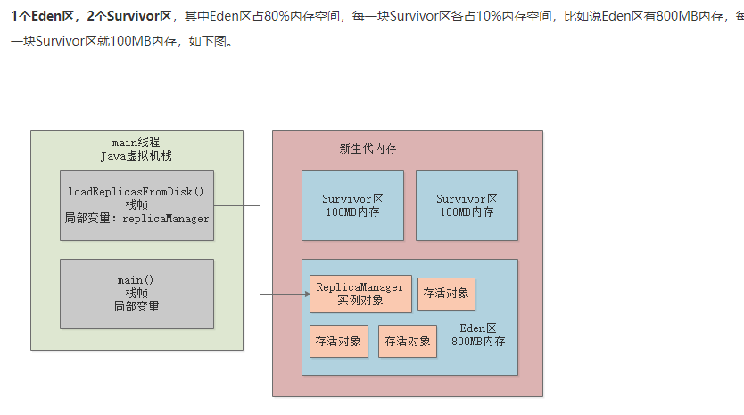


## 躲过15次进入老年代

可以挑参数：

## 动态对象年龄判断

假如说当前放对象的Survivor区域里，**一批对象**的总大小大于了这块Survivor区域的**内存**大小的50%，那么此时**大于等于这批对象年龄的对象**，就可以**直接进入老年代**了。


## 大对象直接进老年代


## Minor GC 后，对象太多，无法放进Survivor


## 老年代空间分配担保原则

就是Minor GC 后，老年代也不够放：

**任何的Minor GC，JVM都会先检查老年代的可用空间，是否大于新生代的所有对象的总大小**

因为极端情况下会都存活下来


不够用的情况：

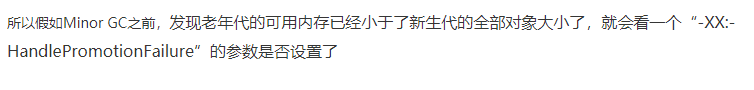

就会进行判断，是否大于之前每次的进入老年代的平均值


如果没有设置参数，或者小于平均的大小：**就会触发FULL GC，然后在Minor GC**


Minor GC之后：

1. 小于 Survivor，直接进 Survivor
2. 大于 Survivor，进老年代
3. 大于老年代可用大小，发生“Handle Promotion Failure” ，触发 Full GC


4. 如果还不行就内存溢出 “OOM”


**标记整理算法**

# 	实战JVM常见垃圾回收器

## 实战

假设：


每次执行一个计算任务：Eden 10M，一分钟100次计算任务，**一分钟满了**

Minor GC 会先进行检查：老年代

假设每次 有200M存活到老年代

七次Minor GC 后，老年代剩下100M（执行上一章的操作，小于平均）


## 优化


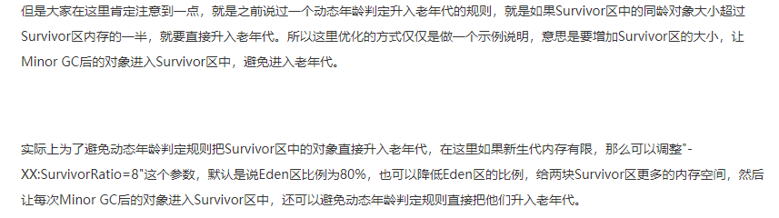

## 垃圾回收器简介


# Stop the world	

相当于线程和回收器配合着使用


## GC的时候还可以创建对象吗？


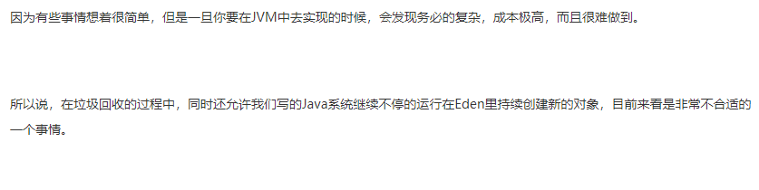

## 疼点：Stop the world	


禁止运行不能创建对象，所以会卡顿


针对新手区的

## ParNew垃圾回收器


单线程和多线程的区别


# 新生代ParNew垃圾回收器

JVM参数进行设置

## 默认情况的线程数


一般不改，


## 单核使用多线程的情况


如何只YGC

- 加大年龄代
- 改新生代比例


# 老年代CMS


- 大对象放不下
- 率达到了92%的阈值

采用的是标记整理算法


## Stop the world 时候垃圾回收会怎么样？

所以CMS垃圾回收器采取的是**垃圾回收线程**和**系统工作线程 **  **尽量同时执行**的模式来处理的。

## CMS如何一边工作一边回收


### 1.初始标记

标记GC ROOT的直接引用对象


### 2.并发标记（最耗时）

进行GC ROOT追踪


存在新对象和垃圾


### 3.重新标记

要 “stop the world”

数量少

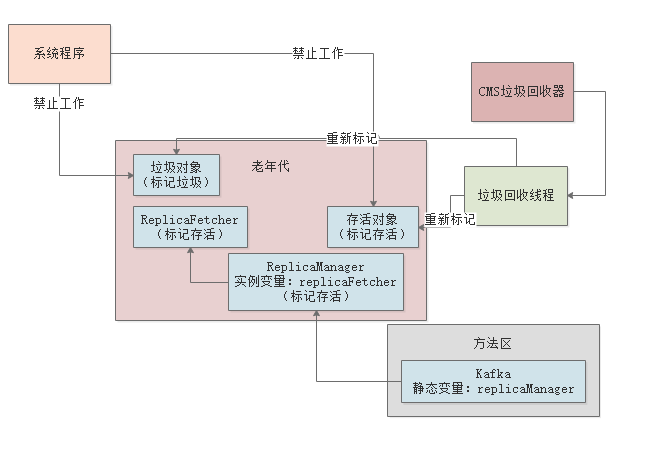

### 4.并发清理


## 对CMS的垃圾回收机制进行性能分析

第二阶段和第四阶段，都是和系统程序并发执行的，所以基本这两个最耗时的阶段对性能影响不大。

- 最耗时的，其实就是对老年代全部对相关进行GC Roots追踪.
- 各种垃圾对象从内存里清理掉，这是最耗时的。

# 设置垃圾回收相关参数

## 并发回收垃圾导致CPU资源紧张

CMS垃圾回收器有一个最大的问题：

- 垃圾回收的同时让系统**同时工作**

CMS默认启动的垃圾回收线程的数量是（CPU核数 + 3）/ 4

**<font color="red">所以其实CMS这个并发垃圾回收的机制，第一个问题就是会消耗CPU资源。</font>**

## Concurrent Mode Failure问题

随着系统运行让一些对象进入老年代，同时还变成垃圾对象，这种垃圾对象是“**浮动垃圾**”


需要等到下一次GC的时候才会回收他们

当老年代内存占用达到一定比例了，就自动执行GC  “-XX:CMSInitiatingOccupancyFaction”

如果CMS垃圾回收期间，系统程序要放入老年代的对象大于了可用内存空间

- Concurrent Mode Failure，并发垃圾回收失败了，一边回收，一边把对象放入老年代，内存都不够了

自动用“Serial Old”垃圾回收器替代CMS

## 内存碎片问题

CMS有一个参数是“-XX:+UseCMSCompactAtFullCollection”，默认就打开了

Full GC**之后**要再次进行“Stop the World”，停止工作线程，然后进行碎片整理

-XX:CMSFullGCsBeforeCompaction 执行多少次Full GC之后再执行一次内存碎片整理的工作 **默认：0**

# 实战：每日上亿请求，年轻代垃圾回收参数如何优化

1. 按每个用户平均访问20次来计算，那么上亿请求量，大致需要有500万日活用户
2. 按照10%的付费转化率
3. 每天大概有50万人会下订单
4. 他集中在每天4小时的高峰期内
5. 平均下来每秒钟大概也就几十个订单

## 特殊的电商大促场景

短短10分钟内，瞬间就会有50万订单。

## 瞬时压力需要几台机器

按3台来算，每台300个下单请求 ，4核8G，抗住是没问题的

## 内存使用模型估算

基本上每秒处理100~300个下单请求是差不多的

每个订单咱们就按1kb

算上订单对象连带的订单条目对象、库存、促销、优惠券等等一系列的其他业务对象，一般需要对单个对象开销放大**10倍~20**倍。

其他操作，比如订单查询之类的，所以连带算起来，可以往大了估算，再**扩大10倍**的量。


**300kb * 20 * 10 = 60mb**

## 内存到底该如何分配

4核8G的机器

JVM 一般 4G， 堆内存一般3G ，新手区和老年代 各自1.5G

Java虚拟机栈有1M，那么JVM里如果有几百个线程大概会有几百M

再给永久代256M内存，基本上这4G内存就差不多了。

```java
“-Xms3072M -Xmx3072M -Xmn1536M -Xss1M -XX:PermSize=256M -XX:MaxPermSize=256M  -XX:HandlePromotionFailure”
```

JDK 1.6以后就被废弃HandlePromotionFailure

只要判断“老年代可用空间”> “新生代对象总和”，或者“老年代可用空间”> “历次Minor GC升入老年代对象的平均大小”，两个条件满足一个，就可以直接进行Minor GC，不需要提前触发**Full GC**了。


25秒过后就会要进行Minor GC了-----》可能存活对象就100MB左右 25*60 == 1200

“-XX:SurvivorRatio”参数默认值为8


## 新生代垃圾回收优化之一：Survivor空间够不够

- 首先每次新生代垃圾回收在100MB左右，有可能会突破150MB
- 经常会出现Minor GC过后的对象无法放入Survivor中？然后岂不是频繁会让对象进入老年代？
- 一批同龄对象，直接超过了Survivor区空间的50%

新生代调整为2G，老年代为1G，那么此时Eden为1.6G，每个Survivor为200MB


````java
“-Xms3072M -Xmx3072M -Xmn2048M -Xss1M -XX:PermSize=256M -XX:MaxPermSize=256M  -XX:SurvivorRatio=8”
````

这个时候，Survivor区域变大，就大大降低了新生代GC过后存活对象在Survivor里放不下的问题，或者是同龄对象超过Survivor 50%的问题。

## 新生代对象躲过多少次垃圾回收后进入老年代

这个参数考虑必须结合系统的运行模型来说

躲过15次GC都几分钟了，一个对象几分钟都不能被回收，说明肯定是系统里类似用@Service、@Controller之类的注解标注的那种需要长期存活的核心业务逻辑组件。

那么他就应该进入老年代，何况这种对象一般很少，一个系统累计起来最多也就几十MB而已

其实这个参数甚至你都可以**降低他的值**，比如降低到5次，也就是说一个对象如果躲过5次Minor GC，在新生代里停留超过1分钟了，尽快就让他进入老年代，别在新生代里占着内存了

```java
“-Xms3072M -Xmx3072M -Xmn2048M -Xss1M  -XX:PermSize=256M -XX:MaxPermSize=256M  -XX:SurvivorRatio=8 -XX:MaxTenuringThreshold=5”
```

## 指定垃圾回收器

新生代使用ParNew，老年代使用CMS

```java
“-Xms3072M -Xmx3072M -Xmn2048M -Xss1M  -XX:PermSize=256M -XX:MaxPermSize=256M  -XX:SurvivorRatio=8 -XX:MaxTenuringThreshold=5 -XX:PretenureSizeThreshold=1M -XX:+UseParNewGC -XX:+UseConcMarkSweepGC”
```

# 实战：每日上亿请求，老年代垃圾回收参数如何优化

## 什么时候对象会进入老年代？

- 年龄够了
- Minor GC过后，Survivor存放不下
- 一下子占到超过Surviovr的50%

## 大促期间多久会触发一次Full GC？

1. 没有打开“ -XX:HandlePromotionFailure”选项

   “老年代可用内存” < “新生代总对象大小”，这会导致每次Minor GC前都触发Full GC-----JDK 1.6以后的版本废弃了这个参数

2. 老年代可用内存空间” < “历次Minor GC后升入老年代的平均对象大小”

3. Minor GC后，老年代可用空间不足了

4. 设置了“-XX:CMSInitiatingOccupancyFaction”参数，比如设定值为92%

此时可能会因为上述的条件234中任何一个满足了，就触发Full GC。

## 老年代GC的时候会发生“Concurrent Mode Failure”吗？

概率是挺小的，因为必须是CMS触发Full GC的时候，系统运行期间还让200MB对象进入老年代，这个概率其实本身就很小，但是理论上是有可能的。

暂时看来是没有必要的，不需要针对小概率事件特意优化参数。

## CMS垃圾回收之后进行内存碎片整理的频率应该多高

Full GC可能也就1小时执行一次，然后大促高峰期过去之后，就没那么多的订单了，此时可能几个小时才会有一次Full GC。

单价

# G1垃圾回收器的工作原理

## ParNew + CMS的哪些痛点

Stop the World ，所以是减少“Stop the World”的目标

## G1垃圾回收器

<font color=red>他最大的一个特点，就是把Java堆内存拆分为多个大小相等的Region</font>


新生代和老年代是**逻辑上存在**。

特点：就是可以让我们**设置一个垃圾回收的预期停顿时间**

比如：在1小时内由G1垃圾回收导致的“Stop the World”时间，也就是系统停顿的时间，不能超过1分钟。

## G1是如何做到停顿可控的？

追踪每个Region里的回收价值：对这个Region进行垃圾回收，需要耗费多长时间，可以回收掉多少垃圾？


最后在垃圾回收的时候，**尽量**把垃圾回收对系统造成的影响控制在你**指定的时间范围内**，同时在有限的时间内**尽量回收**尽可能**多的垃圾对象**

## Region可能属于新生代也可能属于老年代


垃圾回收后：	


总结：

**最少回收时间和最多回收对象的Region进行垃圾回收**

# G1为什么回收性能比传统GC更好

合适场景是大内存使用，因为一次GC时间长

## 如何设定G1对应的内存大小

每个Region的大小是一致的

用“-Xms”和“-Xmx”来设置堆内存的大小，“-XX:+UseG1GC”来指定使用G1垃圾回收器

系统默认会：**堆大小除以2048，因为最多2048个Region**

手动方式来指定：-XX:G1HeapRegionSize

默认新生代对堆内存的占比是5%,最大60% 可以修改：XX:G1NewSizePercent 和 XX:G1MaxNewSizePercent

## 新生代还有Eden和Survivor的概念吗

新生代参数：-XX:SurvivorRatio=8，所以还是有Eden和Survivor的概念的

## G1的新生代垃圾回收

一旦新生代达到了设定的占据堆内存的最大大小60%，而且Eden区还占满了对象，还是会触发新生代的GC

**但是**:“-XX:MaxGCPauseMills”设定目标GC停顿时间,动态的

## 对象什么时候进入老年代？

达到了一定的年龄了

动态年龄判定规则

survivor 放不下

**不一样**：G1中大对象不会进入老年代，而是**专门有一部分Region存放大对象用**。

## 大对象Region

G1提供了专门的Region来存放大对象

判定规则就是一个大对象超过了一个Region大小的50%

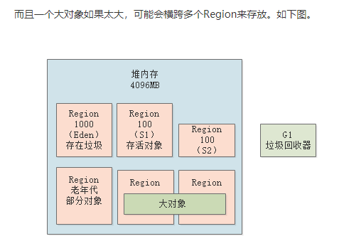

那么什么时候会触发垃圾回收呢？

也很简单，其实新生代、老年代在回收的时候，会顺带带着大对象Region一起回收

# 如果采用G1垃圾回收器，应该如何设置参数？

上篇文章大家已经搞清楚了G1的动态内存管理策略

然后跟之前说的一样，如果一些对象在新生代熬过了一定次数的GC，或者是触发了动态年龄判定规则，或者是存活对象在Survivor放不下了，都会让对象进入老年代中。

而大对象则是进入单独的大对象Region，不再进入老年代。

所以实际上在G1中，还是会存在新生代的对象慢慢会因为各种情况进入老年代的

## 触发新生代+老年代的混合垃圾回收

“-XX:InitiatingHeapOccupancyPercent”，他的默认值是45%

老年代占据了<font color=red>堆内存的45%</font>的Region的时候，此时就会尝试触发一个新生代+老年代一起回收的混合回收阶段。

而且大家需要在这里有一点认识，其实老年代对堆内存占比达到45%的时候，触发的是“**混合回收**”

他会从新生代、老年代、大对象里各自挑选一些Region，保证用指定的时间（比如200ms）回收尽可能多的垃圾

### 初始标记


### 并发标记


### 最终标记阶段


### 混合回收


## G1垃圾回收器的一些参数

“-XX:G1HeapWastePercent”，默认值是5% ：一旦空闲出来的Region数量达到了堆内存的5%，此时就会 立即停止混合回收


“-XX:G1MixedGCCountTarget”参数，就是在一次混合回收的过程中，最后一个阶段执行几次混合回收，默认值是8次


“-XX:G1MixedGCLiveThresholdPercent” 默认值是85%，<font color=red>必须是存活对象低于85%的Region才回收</font>

都是基于**复制算法**进行


## 回收失败时

一旦失败，立马就会切换为停止系统程序，然后采用单线程进行标记、清理和压缩整理，空闲出来一批Region，这个过程是极慢极慢的。

# 百万级用户的在线教育平台,基于G1垃圾回收器优化性能

## 分析背景

注册用户大概是几百万的规模，日活用户规模大概在几十万。

高频行为是什么呢？ 上课

就是每天**晚上那两三小时**的高峰时期

**核心业务流程分析**：就是大量的游戏互动环节


## 系统的运行压力

### 晚上高峰期内几十万用户同时在线使用平台，每秒钟会产生多少请求？

​	每小时大概会有20万活跃用户同时在线学习，一小时内会进行60次互动操作，1小时内会进行1200万次，平均到每秒钟大概是3000次左右，需要部署**5台4核8G**的机器来抗住是差不多的，每台机器每秒钟抗个600请求

### 每个请求会产生多少个对象？

一次互动请求大致会连带创建几个对象，占据几KB的内存，比如我们就认为是5KB吧那么一秒600请求会占用3MB左右的内存。

## G1参数

每个Java线程的栈内存为1MB，元数据区域（永久代）的内存为256M

“-Xms4096M -Xmx4096M  -Xss1M  -XX:PermSize=256M -XX:MaxPermSize=256M -XX:+UseG1GC“

新生代最小5% 和最大60%默认不用设置

**GC停顿时间**：-XX:MaxGCPauseMills”，他的默认值是200毫秒

## 多长时间会触发新生代GC？


其实这个G1到底会分配多少个Region给新生代，多久触发一次新生代gc，每次耗费多长时间，这些都是不确定的，必须通过一些工具去查看系统实际情况才知道，这个提前是无法预知

运行原理，他会根据你预设的gc停顿时间，给新生代分配一些Region，然后到一定程度就触发gc，并且把gc时间控制在预设范围内，尽量避免一次性回收过多的Region导致gc停顿时间超出预期。

## 新生代gc如何优化

应该合理设置“-XX:MaxGCPauseMills”参数**GC停顿时间**

需要结合后续给大家讲解的系统压测工具、gc日志、内存分析工具结合起来进行考虑，尽量让系统的gc频率别太高，同时每次gc停顿时间也别太长，达到一个理想的合理值

## mixed gc如何优化

老年代在堆内存里占比超过45%就会触发

尽量避免频繁触发mixed gc，就可以做到根本上优化mixed gc了。


# 面试题：Young GC和Full GC分别在什么情况下会发生？

## Young GC的触发时机

Young GC其实一般就是在新生代的Eden区域满了之后就会触发

## Old GC和Full GC的触发时机

Old GC

- Young GC之前进行检查，如果“老年代可用的连续内存空间” < “新生代历次Young GC后升入老年代的对象总和的平均大小”
- Young GC之后入老年代，空间不够
- 老年代内存使用率超过了92%

他触发的实际上就是Full GC，这个Full GC会包含Young GC、Old GC和永久代的GC

上述条件满足时触发Full GC，Full GC一般会带上一次Young GC去回收新生代，同时也会有Old GC也回收老年代，还会去回收永久代。

大对象

## 永久代满了之后怎么办？

如果永久代真的放满了，回收之后发现没腾出来更多的地方，此时只能抛出内存不够的异常了。

# 每秒10万并发的BI系统


## 技术痛点：实时自动刷新报表 + 大数据量报表

根据我们之前的测算，每个请求大概需要加载出来100kb的数据进行计算，因此每秒500个请求，就需要加载出来50MB的数据到内存中进行计算


3分钟左右的时间，就会迅速填满Eden区，10ms，但是对终端用户和系统性能几乎是没有影响


高峰期会有每秒10万的并发压力

还是用4核8G的机器来支撑，那么可能需要部署上百台机器来抗住每秒10万的高并发压力

本身BI系统就是非常吃内存的系统，所以我们将部署的机器全面提升到了**16核32G**的高配置机器上去。每台机器可以抗个每秒几千请求，此时只要部署比如二三十台机器就可以了。


每秒几千请求的话，每秒大概会加载到内存中几百MB的数据，那么大概可能几十秒，甚至1分钟左右就会填满Eden区，会就需要执行Young GC。


## 用G1来优化大内存机器的Young GC性能

# 每日百亿数据量的实时分析引擎，频繁发生Full GC


每次执行一个计算任务，就会在Eden区里分配10MB左右的对象

一分钟大概对应100次计算任务

基本上一分钟过后，Eden区里就全是对象

## Minor GC的时候会有多少对象进入老年代

先看看老年代的可用内存空间是否大于新生代全部对象？

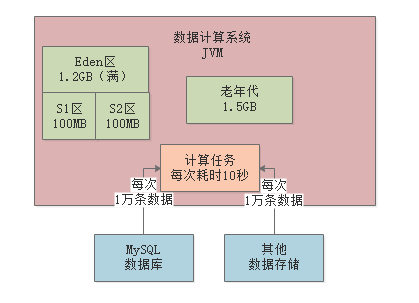

每个计算任务1万条数据需要计算10秒钟，所以假设此时80个计算任务都执行结束了，但是还有20个计算任务共计200MB的数据还在计算中

## 系统运行多久，老年代大概就会填满？

7次Minor GC执行过后，大概1.4G对象进入老年代，七八分钟一次Full GC，这个频率就相当高了

## 该案例应该如何进行JVM优化？

增加了新生代的内存比例


## 如果该系统的工作负载再次扩大10倍呢？

使用大内存机器来优化上述场景

需要用G1来减少每次Young GC的停顿时间吗？

**答案是：不用**。因为这是一个后台自动进行计算的系统，他不是直接面向用户的系统，所以哪怕每隔2分钟一次Young GC，一次要停顿1秒钟，也对系统几乎没任何影响。

# 模拟出频繁Young GC的场景

````java
-XX:NewSize=5242880 -XX:MaxNewSize=5242880 -XX:InitialHeapSize=10485760 -XX:MaxHeapSize=10485760 -XX:SurvivorRatio=8 -XX:PretenureSizeThreshold=10485760 -XX:+UseParNewGC -XX:+UseConcMarkSweepGC
````

“-XX:PretenureSizeThreshold=10485760”指定了大对象阈值是10MB。


## JVM GC日志

```java
-XX:NewSize=5242880 -XX:MaxNewSize=5242880 -XX:InitialHeapSize=10485760 -XX:MaxHeapSize=10485760 -XX:SurvivorRatio=8 -XX:PretenureSizeThreshold=10485760 -XX:+UseParNewGC -XX:+UseConcMarkSweepGC -XX:+PrintGCDetails -XX:+PrintGCTimeStamps -Xloggc:gc.log
```


## 程序代码


最后看第五行代码：byte[] array2 = new byte[2 * 1024 * 1024];。**放不下了**

所以这个时候就会触发年轻代的Young GC。

# JVM的Young GC日志

可以用在线平台，easygc

```java
0.268: [GC (Allocation Failure) 0.269: [ParNew: 4030K->512K(4608K), 0.0015734 secs] 4030K->574K(9728K), 0.0017518 secs] [Times: user=0.00 sys=0.00, real=0.00 secs]
```

​	ParNew: 4030K->512K(4608K), 0.0015734 secs

触发的是年轻代的Young GC

​	4030K->512K(4608K)

年轻代可用空间是4608KB

0.0015734 secs，这个就是本次gc耗费的时间，看这里来说大概耗费了1.5ms，仅仅是回收3MB的对象而已。

4030K->574K(9728K), 0.0017518 secs，这段话指的是整个Java堆内存的情况


## 图解


有512KB的对象存活了下来, 从Eden区转移到了Survivor1区


# 模拟出对象进入老年代的场景（动态）

对象进入老年代的4个常见的时机


```java
“-XX:NewSize=10485760 -XX:MaxNewSize=10485760 -XX:InitialHeapSize=20971520 -XX:MaxHeapSize=20971520 -XX:SurvivorRatio=8  -XX:MaxTenuringThreshold=15 -XX:PretenureSizeThreshold=10485760 -XX:+UseParNewGC -XX:+UseConcMarkSweepGC -XX:+PrintGCDetails -XX:+PrintGCTimeStamps -Xloggc:gc.log”
```


## gc日志

第一次gc，from区超过了50%。但是没有进老年带，因为要下一次才进，1+N

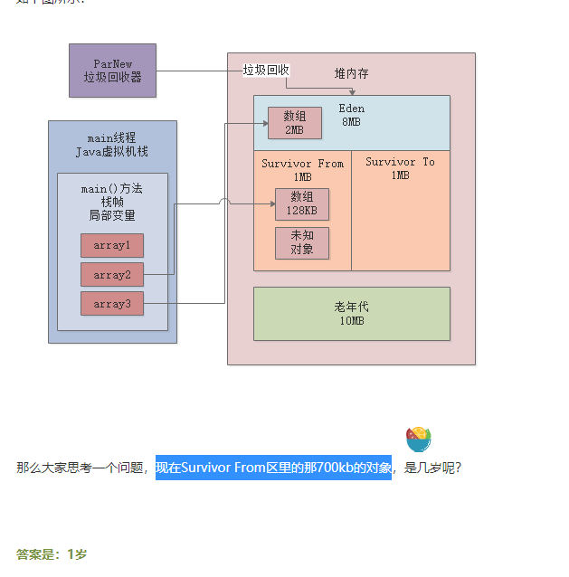


实际上会接着分配2个2MB的数组，然后再分配一个128KB的数组，最后是让array3变量指向null，如下图所示。


进入老年代


## 其他场景


在这种场景下，有部分对象会留在Survivor中，有部分对象会进入老年代的。

# Full GC日志(重点)

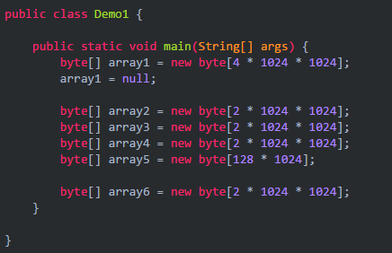

```java
 “-XX:NewSize=10485760 -XX:MaxNewSize=10485760 -XX:InitialHeapSize=20971520 -XX:MaxHeapSize=20971520 -XX:SurvivorRatio=8  -XX:MaxTenuringThreshold=15 -XX:PretenureSizeThreshold=3145728 -XX:+UseParNewGC -XX:+UseConcMarkSweepGC -XX:+PrintGCDetails -XX:+PrintGCTimeStamps -Xloggc:gc.log”

“-XX:PretenureSizeThreshold=3145728”, 3M大对象
    
   // 先是新生代回收，回收不到就放到老年代，放到8M的情况下就触发full gc，去了4m就继续放了
```


发生youg gc

ParNew (promotion failed): 7260K->7970K(9216K), 0.0048975 secs

**回收不掉,放到8M的情况下就触发full gc，去了4m就继续放了**


# jstat 摸清线上系统的JVM运行状况


## jstat -gc PID


# Metaspace内存溢出

一旦JVM不停地加载类，加载了很多很多的类，然后Metaspace区域放满了，触发FULL GC


## 什么情况下会发生Metaspace内存溢出

- 上线系统的时候对Metaspace区域直接用默认的参数

   默认几十MB

- 用cglib之类的技术动态生成一些类

## 模拟

### CGLIB动态生成类的代码示例

```java
<dependency>

   <groupId>cglib</groupId>

   <artifactId>cglib</artifactId>

   <version>3.3.0</version>

</dependency>
```

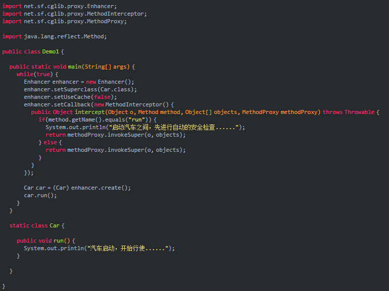

你权且当做Enhancer是用来生成类的一个API

Enhancer生成的类是Car类的子类，Car类是生成类的父类

如果你调用子类对象的run()方法，会先被这里的MethodInterceptor拦截一下

```java
-XX:MetaspaceSize=10m -XX:MaxMetaspaceSize=10m
    while(true){
        
    }
Caused by: java.lang.OutOfMemoryError: Metaspace。
```


# 线程的栈内存溢出

## 一个重要的概念：

- 每次**方法**调用的栈桢都是要占用内存的
- 每次这个线程**调用一个方法**，都会将本次方法调用的栈**桢压入虚拟机栈里**，这个栈桢里是有方法的局部变量的。

## 什么情况下会发生栈内存溢出

1. 递归方法调用

通常来说，我们会设置每个线程的栈内存就是1MB，假设你一个JVM进程内包括他自带的后台线程，你依赖的第三方组件的后台线程，加上你的核心工作线程（比如说你部署在Tomcat中，那就是Tomcat的工作线程），还有你自己可能额外创建的一些线程，可能你一共JVM中有1000个线程。

**4核8G机器上**:内部所有的线程数量加起来在几百个是比较合理的，也就占据几百MB的内存，线程太多了，4核CPU负载也会过高，也并不好。

## 模拟


当这个线程调用了5675次方法之后，他的栈里压入了5675个栈桢，最终把1MB的栈内存给塞满了

所以GC日志对你有用吗？

**没用**

内存快照呢？

同样是针对堆内存和Metaspace的，所以对线程的栈内存而言，也不需要借助这个东西。

- -XX:ThreadStackSize=1m
- -XX:+PrintGCDetails
- -Xloggc:gc.log
- -XX:+HeapDumpOnOutOfMemoryError
- -XX:HeapDumpPath=./
- -XX:+UseParNewGC
- -XX:+UseConcMarkSweepGC

报错：


你只要把所有的异常都写入本地日志文件，那么当你发现系统崩溃了，第一步就去日志里定位一下异常信息就知道了。

# 堆内存溢出

老年代GC过后，依然存活下来了很多的对象，这个时候如果年轻代还有一批对象等着放进老年代，人家GC过后空间还是不足怎么办？


## 什么时候

1. 系统承载高并发请求，因为请求量过大，导致大量对象都是存活的
2. 系统有内存泄漏的问题

## 模拟


```java
：-Xms10m -Xmx10m
    
```

-Xms10m

-Xmx10m

-XX:+PrintGCDetails

-Xloggc:gc.log

-XX:+HeapDumpOnOutOfMemoryError

-XX:HeapDumpPath=./

-XX:+UseParNewGC

-XX:+UseConcMarkSweepGC


mat分析


点击**Details**


# 大数据量系统OOM

这个系统会不停的加载数据到内存里来计算，几十万多则上百万


## 针对Kafka故障设计的高可用场景

​	刚开始是：一旦kfk错误就存留在内存中，直到恢复（重试）

​	所以导致内存堆积越来越多

解决：取消重试方案，计算结果写本地磁盘，允许内存中的数据被回收

## 场景二：

如果在某个节点写日志时发生了某些异常，此时也必须将这个链路节点的异常写入ES集群里去


当时这个同学居然在log()方法中一旦ES集群出现故障的时候再次调用了自己，继续尝试将日志写入ES集群。无限循环

## 第二个案例：没有缓存的动态代理


其实可以混存起来（相当于工厂模式）


# OOM进行监控和报警

- 公司最好是应该有一种监控平台，比如Zabbix、Open-Falcon之类的监控平台。
- 一种是被动等待系统挂掉后客服来通知你

# 溢出的时自动dump内存快照

```java
-XX:+HeapDumpOnOutOfMemoryError  

-XX:HeapDumpPath=/usr/local/app/oom
    
    目前为止：
    “-Xms4096M -Xmx4096M -Xmn3072M -Xss1M  -XX:MetaspaceSize=256M -XX:MaxMetaspaceSize=256M -XX:+UseParNewGC -XX:+UseConcMarkSweepGC -XX:CMSInitiatingOccupancyFaction=92 -XX:+UseCMSCompactAtFullCollection -XX:CMSFullGCsBeforeCompaction=0 -XX:+CMSParallelInitialMarkEnabled -XX:+CMSScavengeBeforeRemark -XX:+DisableExplicitGC -XX:+PrintGCDetails -Xloggc:gc.log -XX:+HeapDumpOnOutOfMemoryError  -XX:HeapDumpPath=/usr/local/app/oom”
        
```

无限的在永久 创建class

发生OOM，会自动生存一个是gc.log，还有一个是java_pid910.hprof

先来分析一下gc.log 

然后我们再用MAT分析一下OOM


**解决这个问题的办法也很简单，直接对Enhancer做一个缓存，只有一个，不要无限制的去生成类就可以了**

# 案例实战：每秒上百请求的OOM？

## 案例背景介绍

一个每秒仅仅只有100+请求的系统却频繁的因为OOM而崩溃

到一个OOM问题是如何牵扯到Tomcat底层工作原理、Tomcat内核参数的设置、服务请求超时时间等问题的。

## 系统发生OOM的生产现场

**第一件事情：**一定是登录到线上机器去看日志，而不是做别的事情。

```java
Exception in thread "http-nio-8080-exec-1089" java.lang.OutOfMemoryError: Java heap space
```

Tomcat的底层工作原理有一定了解的朋友，看出是Tomcat

## Tomcat如何去监听8080上收到请求？

Tomcat有自己的工作线程


## 看异常日志

-XX:+HeapDumpOnOutOfMemoryError

**这个参数会在系统内存溢出的时候导出来一份内存快照到我们指定的位置。**

## 分析

首先我们会发现占据内存最大的是大量的“byte[]”数组

因此我们直接可以得出第一个结论：Tomcat工作线程在处理请求的时候会创建大量的byte[]数组，大概有8G左右，直接把JVM堆内存占满了。


- 那么在MAT上可以继续查看一下这个数组是被谁引用的，大致可以发现是Tomcat的类引用的，具体来说是类似下面的这个类：

  org.apache.tomcat.util.threads.TaskThread

- 此时我们发现Tomcat的工作线程大致有400个左右，也就是说每个Tomcat的工作线程会创建2个byte[]数组，每个byte[]数组是10MB左右


## 每秒QPS才只有100？！！	

我们检查了一下系统的监控，发现每秒请求并不是400，而是100！

出现这种情况只有一种可能，那就是每个请求处理需要4秒钟的时间！

好，**第一个问题**解决了，那么**第二个问题**来了，为什么Tomcat工作线程在处理一个请求的时候会创建2个10MB的数组？

找到 tomcat 的配置;  max-http-header-size: 10000000

> 导致Tomcat工作线程在处理请求的时候会创建2个数组，每个数组的大小如上面配置就是10MB。


## 为什么处理一个请求需要4秒钟？

发现日志中除了OOM以外，其实有大量的服务请求调用超时的异常，类似下面那样子：

Timeout Exception...

超时时间一直卡住4秒钟之后才会抛出Timeout异常


## 优化

- 最核心的问题就是那个超时时间设置的实在太长了，因此立马将超时时间改为1秒即可。
- 对Tomcat的那个参数，max-http-header-size，可以适当调节的小一些就可以了


# 案例实战：Jetty 服务器的 NIO 机制是如何导致堆外内存溢出的？ 

## 背景

使用Jetty作为Web服务器的时候在某个非常罕见的场景下发生的一次堆外内存溢出的场景。

其实你大致可以理解为跟Tomcat一样的东西，就是Web容器

## 案发现场

日志

```java
nio handle failed java.lang.OutOfMemoryError: Direct buffer memory
at org.eclipse.jetty.io.nio.xxxx
at org.eclipse.jetty.io.nio.xxxx
at org.eclipse.jetty.io.nio.xxxx
```

是我们没见过的一块区域：**Direct buffer memory**

## 初步分析

Direct buffer memory，就是直接内存的意思，通常更好的称呼就是“堆外内存”。


## 堆外内存是如何申请的，如何释放的？

- 申请

如果在Java代码里要申请使用一块堆外内存空间，是使用DirectByteBuffer这个类，**在构建这个对象的同时**，会在堆外内存中划出来一块内存空间跟这个对象关联起来	


- 释放

buffer对象没人引用的时候，会在yougGC或者full GC去掉。


## 为什么OOM

Buffer 对象一直存活

可能：高并发，不过这个系统并不高

**真实原因**：

 新生代 一两百m，老年七八百

导致：Survivor只有10M，放不下，关联堆外的对象太多

老年代没有触发FULLGC 就堆外OOM

## 难道Java NIO就没考虑过这个问题吗？

在**Java NIO的源码中会做如下处理**

都会调用System.gc()去提醒JVM去主动执行以下gc

但是我们又在JVM中设置了如下参数：

> -XX:+DisableExplicitGC

## 最终优化

给年轻代更多内存，让Survivor区域有更大的空间

另外一个就是放开-XX:+DisableExplicitGC这个限制，让System.gc()生效。

# MAT的使用（第二种分析）

## 场景

一次没有写where的查询，OOM

**这是另外的一种查找方式**

> 下面内存快照分析时候的一些技巧

看日志，找到 ：java.lang.OutOfMemoryError，java heap space。

## 第一步：检查什么对象多

用MAT的 Histogram功能


然后跳转到另外的页面：


很明显现在是Demo1$DAte占用的内存多

## 第二步：深入看看占用内存过多的对象

深入的看看占用内存过多的对象是被谁引用的，哪个线程引用的，他们里面都是什么东西


可以看到排名第一的线程：

> java.lang.Thread @ 0x5c0020838 main Thread

展开看


发现里面有一个java.util.ArrayList @ 0x5c00206a8

说明了线程创建了巨大的ArrayList

## 第三步：到底是哪一行代码创建了这么多的对象


会进入一个thread_overview界面，如下图所示，这里会展示出来JVM中所有的线程以及每个线程当时的方法方

法调用栈，以及每个方法中创建了哪些对象：


我们接着展开上图中的Demo1.main()方法，你就可以看到线程调用每个方法的时候创建和引用了哪些对象，如下图所示


## 总结

通过上述步骤，你可以快速的定位出来占用内存过多的对象，以及到底是哪个线程创建了这些对象，到底是线程执行哪个方法的时候创建了这些对象，每个对象的细节你都可以看到是什么东西。

# 实战：每天10亿数据的OOM问题（特别）

## 背景：

一个每天10亿数据量的日志清洗系统，他主要就是从Kafka中不停的消费各种日 志数据，然后对日志的格式进行很多清洗，比如对一些涉及到用户敏感信息的字段（姓名、手机号、身份证号）进行脱敏处理，然后把清洗后的数据交付给其他的系统去使用。


## 事故发生现场

看日志：


似乎同样的一个方法（XXClass.process()）反复出现了多次，最终导致了堆内存溢出的问题。

有经验的朋友可能已经可以发现一个问题了，那就是在某一处代码出现了大量的递归操作。

## 初步分析内存快照

最后因为XXClass.process()方法又多次递归调用，也就导致了大量的char[]数组耗尽了内存


## 功夫在诗外：问题在JVM参数上

也就递归几次就出问题


```java
-Xmx1024m -Xms1024m -XX:+PrintGCDetails -XX:+PrintGC() -XX:+HeapDumpOnOutOfMemoryError -

Xloggc:/opt/logs/gc.log -XX:HeapDumpPath=/opt/logs/dump
```


每次只能回收部分对象，当时日志里显示的是每秒钟都会执行一次Full GC


- 可能是每秒钟执行young gc之前，发现老年代可用空间不足，就会提前触发full gc
- 可能是young gc过后存活对象太多无法放入Survivor中，都要进入老年代，放不下了

### 分析一下JVM运行时内存使用模型

jstat -gc pid **先看老年代**


刚开始都是年轻代的Eden区在涨，接着YGC从36到37，就是发生了一次YGC，接着Old区直接从占比69%到99%

所以是内存分配问题。再则是代码的问题

# 实战：一次服务类加载器过多引发的OOM问


