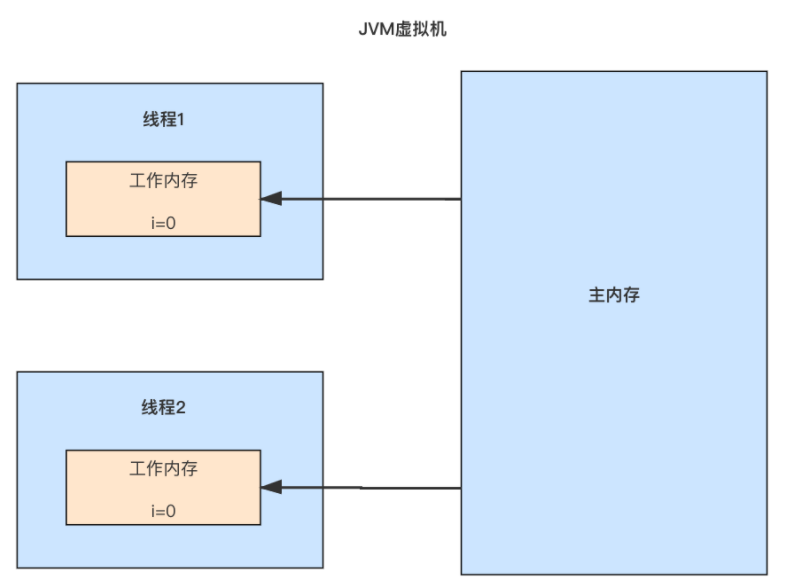
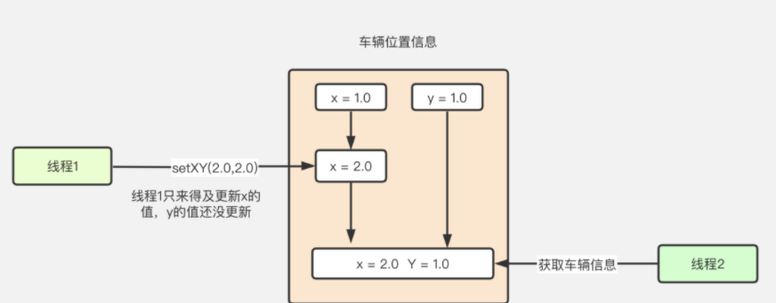
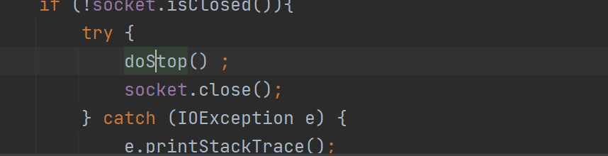
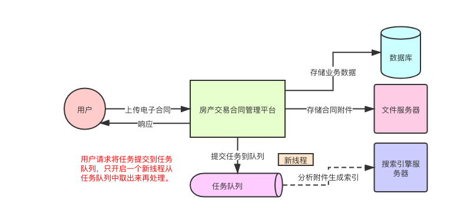
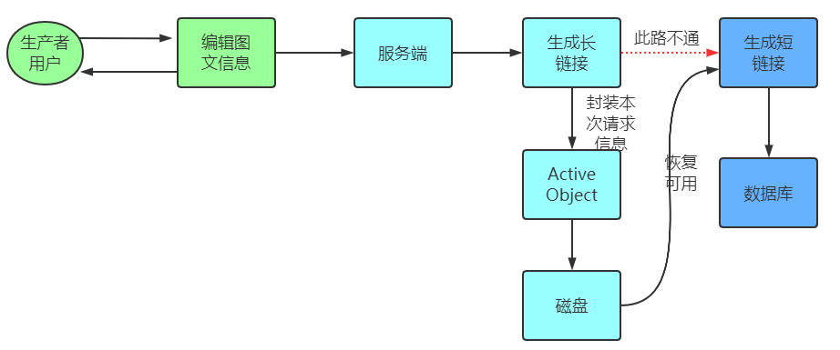
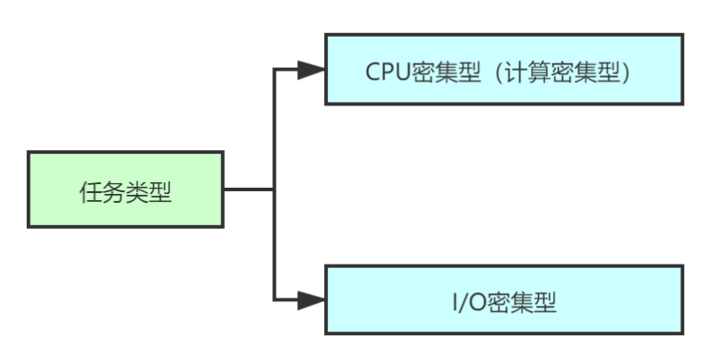
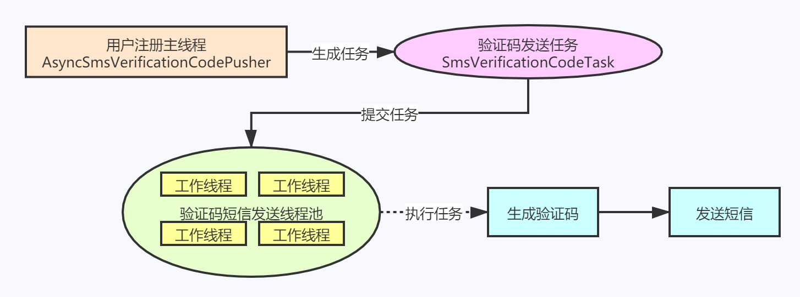
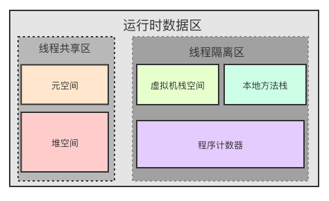
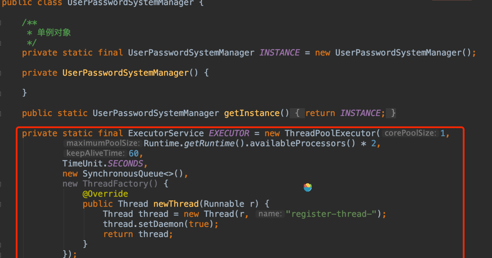
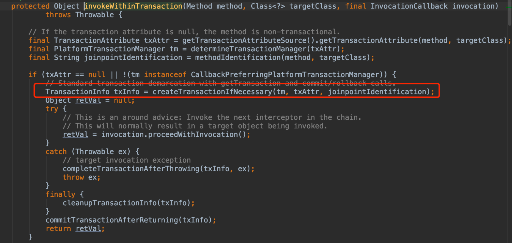

# 多线程读写同一共享变量并发问题？

## 内存模型概念

### CPU的内存模型


存在个问题CPU执行速度非常快，比计算机主存的读取和写入的速度快了很多，这样就会导致CPU的执行速度大大下降。

因此，每个CPU都会自带一个高速缓冲区


### Java内存模型

JVM的内存模型**屏蔽**了不同的操作系统和底层硬件之间的内存**访问差异**，实现了在各个平台都能达到一致的内存访问效果。


## 问题

accessCount++ 这个语句，需要分为以下3个步骤


# 解决并发问题的方法


## 局部变量

因为每个局部变量是存在每个线程的工作内存的




不同线程之间是没有交集，所以是不存在并发

## 不可变变量

一经创建，状态是恒古不变的，所以不存在并发

## ThreadLocal

每个线程都只有自己的副本


## CAS原子类


是基于 **乐观锁**，并发性能高，源码内部是unsafe的实例，，提供硬件级别的原子操作


统计某个接口的访问次数。如果采用Atomic系列的原子类对代码进行改写的话


中间淡绿色区域的操作是原子操作

- 线程1很幸运地成功了，将accessCount的值更新为1
- 线程2失败后会再次通过CAS操作进行累加，这时线程2重新读取最新的accessCount的值为1，接着将accessCount的值从1更新为2

## Synchronized/ReentrantLock加锁

采用了悲观锁的策略。因为他们的实现非常类似，只不过一种是通过语言层面来实现(Synchronized)，另一种是通过编程方式实现(ReentrantLock)，所以咱们把两种方式放在一起分析了。


首先两个线程都去争抢同一个锁，假设线程1获取到了锁，而线程2获取不到锁，就会进入等待队列，等到线程1，执行完代码逻辑之后，会去通知线程2：嘿，哥们，我用完了，你可以去尝试获取锁了，这时线程2会重新尝试去获取锁，假如线程2获取锁成功，线程2才开始执行代码

# 实现一个不可变类

## 如何实现一个不可变类？	



> 问题：因为存在set 一个，另外一个没set就并发，信息不完整


Class 的final 是为了不让他继承的，继承了就会重写

如果车辆位置发生了变化，可以通过**替换**整个Location从而避免线程安全问题


第5点则需要另外做一下说明


这样就会导致DefensiveReplicaDemo类中的data数据内容改变为1，2，3，4。


所以进行防御，外部无法修改我们返回的结果

另外短信选择平台


# **等效不可变对象CopyOnWriteArrayList**

源码中运用了不可变对象模式，使得集合在进行遍历操作的时候，不用加锁也能保证线程安全（**读**）

## 等效不可变对象


array数组只能通过getArray和setArray方法来访问

> 遍历和新增的时候


都要获取getArray（）

add方法的时候，也是通过getArray()获取到对象数组，然后直接新生成一个数组，最后把旧的数组的值复制到新的数组中，然后直接使用新的数组覆盖实例变量array

## 实例变量array就是一个等效不可变对象？

就是数组的长度和元素都不变，只能复制再add

等效的原因：但是这里会存在一些差异，因为实例变量array本质上是一个数组，而数组的各个元素都是一个**对象**，每个对象内部的状态是**可以替换**的。因此实例变量并非严格意义上的不可变对象，所以我们称之为等效不可变对象。


CopyOnWriteArrayList中的array内容大致如下：

array = [ Message{msg =“你好，张三”, hashCode = 001} ]

## 写时复制机制

在进行写操作的时候，首先是基于array这份数据复制出来一份数据，接着在复制出来的数据基础上进行写操作。

> 删除一个元素
>


主要看红色框，在移除一个元素的时候，最终都是基于原有的数组复制一个新的数组，然后直接用新的数据替换掉旧的数组。

一个特点：弱一致性。意思就是说线程1看到的是某一时刻的一份“快照数据”，**无法保证能读取到最新的数据。**

让大量的读请求在无需加锁牺牲性能的情况下**保证多线程并发读写的情况下线程安全**。


## 场景

读多写少的场景

调用JDBC得到数据库连接的时候，会去遍历所有的driver，然后找到一个driver，然后通过那个特定的driver来获取连接，

需要经常和数据库进行交互，会经常需要获取连接，所以getConnection的调用频率肯定会高一些

# 基础：线程执行过程状态流转

## 一：生命周期


源码位置：rc/main/java/java/lang/Thread.java 中 线程状态State枚举

## 线程的状态流转图


## RUNNABLE（就绪，运行中状态）


## TERMINATED（终止状态）


## 线程间的转换

### NEW---->RUNNABLE


### RUNNABLE---->BLOCKED 


### RUNNABLE---->WAITING 


LockSupport.park() 方法，当前线程会阻塞，线程的状态会从 RUNNABLE 转换到 WAITING

### RUNNABLE--->TERMINATED 


interrupt() 方法仅仅是通知线程，让线程有机会执行一些后续操作，同时也可以无视这个通知。

```java
public static void main(String[] args) {
        Thread thread = new Thread(new ThreadTerminatedState());
        //NEW 
        System.out.println( thread.getState());
        thread.start();
        
        //RUNNABLE 
        System.out.println( thread.getState());
        try {
            Thread.sleep(1000);
        } catch (InterruptedException e) {
            e.printStackTrace();
        }
        //TERMINATED        System.out.println( thread.getState());
    }

    @Override
    public void run() {
        for (int i = 0; i < 10000; i++) {
            System.out.println(i);
        }
    }
}

```


# 百万交易系统转账过程中循环等待，性能太差的问题

## 场景：

账户A】转账给【账户B】，同时【账户B】也转账给【账户A】，两个账户都需要锁住余额，所以通常会申请两把锁。转账时，先锁住自己的账户，并获取对方的锁，保证同一时刻只能由一个线程去执行转账。

## 死锁产生的原因


## 如何避免死锁


占用且等待 ：我们可以一次性申请所有的资源，这样就不存在等待了

不可抢占 ：如果申请不到，可以在一定时间后，主动释放它占有的资源

循环等待：以靠按“次序”申请资源来预防

## 占用且等待解决

文章开头的【账户A】、【账户B】来举例，就是一次性申请账户A，账户B的锁，当线程01拿到账户A、B全部的锁后，再执行具体的操作（用list存放两个对象，有就是加锁了）


##  破坏不可抢占条件

lock1.tryLock(1, TimeUnit.MILLISECONDS)

## 破坏循环等待条件

资源有序分配法

```java
class Account {
    private int id;
    private int balance;
    void transfer(Account target, int amt){
        Account left = this;
        Account right = target;
        if (this.id > target.id) {
            left = target;
            right = this;
        }
        synchronized(left){
            synchronized(right){
                if (this.balance > amt){
                    this.balance -= amt;
                    target.balance += amt;
                }
            }
        }
    }
}
```

# Guarded Suspension模式，优化百万交易系统

Guarded Suspension模式又称为“保护性暂挂模式”；

常常为了提高应用程序的并发性，会将一个任务分解为多个子任务交给多个线程并行执行，而多个线程之间相互协作时，仍然会存在一个线程需要等待另外的线程完成后继续下一步操作

线程01需要持有账户A的锁，同时也需要持有账户B的锁，如果线程01拿不到两个锁，则进行while(!actr.apply(this, target))死循环的方式来循环等待，可能要循环上万次才能获得锁，非常消耗性能

最好的方案就是使用Guarded Suspension模式，如果线程01拿不到所有的锁，就阻塞自己，进入“**等待WAITING**”状态。当线程01要求的所有条件都满足后，“通知”等待状态的线程01重新执行

## 看牙医的就诊流程


线程首先获取互斥锁，当线程要求的条件不满足时，释放互斥锁，进入等待状态；当要求的条件满足时，通知等待的线程，重新获取互斥锁。

放进队列

# Guarded Suspension模式在BlockingQueue源码

## 案例分析

```java
public class RequestQueue {

   private Queue<Request> queue = new ArrayBlockingQueue<>(MAX_LIMIT);
   ReentrantLock lock = new ReentrantLock();
   Condition condition = lock.newCondition();

   public Request get() {
       Request result = null;
       lock.lock();
       try {
           while (queue.isEmpty()) {
               condition.await();            }
           result = queue.poll();
           condition.signalAll();
       } catch (InterruptedException e) {
           condition.signalAll();
       } finally {
           lock.unlock();
       }
       return result;
   }

   public void put(Request request) {
       lock.lock();
       try {
           while (queue.size() >= LIMIT) {
               condition.await();
           }
           queue.offer(request);
           condition.signalAll();        } catch (InterruptedException e) {
           condition.signalAll();
       } finally {
           lock.unlock();
       }
   }
}
```

## 源码分析

已经满了的队列进行入队列操作时，它将会被阻塞，除非有**另一个线程**做了出队列操作；同样，当一个线程试图对一个空队列进行出队列操作时，它将会被阻塞，除非有**另一个线程**进行了**入队列**操作。我们看到这里，是不是觉得似曾相识！是的，BlockingQueue源码里就用到了Guarded Suspension保护性暂挂模式。


## 非阻塞

这里的add方法和offer方法的实现相对简单，其中需要注意的是入队enqueue(E x)方法，其内部是通过putIndex索引直接将元素添加到数组items中。


## 阻塞式方法

```java
//put方法，阻塞时可中断
    public void put(E e) throws InterruptedException {
   		checkNotNull(e);
   		final ReentrantLock lock = this.lock;
   		lock.lockInterruptibly();//该方法可中断
   try {
       //当队列元素个数与数组长度相等时，无法添加元素
       while (count == items.length)
           //将当前调用线程挂起，添加到notFull条件队列中等待唤醒
           notFull.await();  
       enqueue(e);//如果队列没有满直接添加。
   } finally {
       lock.unlock();
   }
}
//入队操作
private void enqueue(E x) {
   //获取当前数组
   final Object[] items = this.items;
   //通过putIndex索引对数组进行赋值
   items[putIndex] = x;
   //索引自增，如果已是最后一个位置，重新设置 putIndex = 0;
   if (++putIndex == items.length)
       putIndex = 0;
   count++;//队列中元素数量加1
   //唤醒调用take()方法的线程，执行元素获取操作。
   notEmpty.signal();
}
```


队列空的时候


## 总结

当执行put操作时，如果队列满了，就加入到notFull的等待队列中，此时若有任务通过take操作移除元素时，会唤醒notFull condition条件等待队列中的线程，执行put操作。

当执行take操作时，如果队列为空，就加入到notEmpty的等待队列中，此时若有任务通过put操作插入元素时，会唤醒notEmpty condition条件等待队列中的线程，执行take操作。

# 两阶段终止模式（标记位）


感知到**标记位**的改变，从而优雅的终止线程。既要保证线程灵活的切换运行状态，又要保证线程优雅的处理完当前任务，就是两阶段终止模式（Two-phase Termination）的核心思想。

如何去打断这个线程，有些人可能会想到用 interrupt()方法，但其实呢interrupt() 方法是将一个处于**等待状态**的线程**唤醒**，只不过这种唤醒方式会导致线程**会抛出**InterruptedException异常，从而导致其终止运行，但**只要此异常被捕获并处理**，那么线程依然可以继续运行。

**interrupt()不能中断在运行中的线程，它只能改变中断状态而已。**

## 关于阻塞状态下线程如何终止

受interrupt方法影响的方法表


> 两阶段终止模式就不合适了
>

线程阻塞本质上是一段代码执行时间过长，那它自然也**没有办法感知到标记位的改变**，从而优雅的终止线程。那么当一个线程发生阻塞时我们又该怎么去终止它呢？属于一种暴力解决方式，这里提供一段代码作为一种思路。

synchronized在获锁的过程中是不能被中断的，意思是说如果产生了死锁，则不可能被中断

> 强制结束任务的时长阈值（加上标记位）
>

```java
public class ThreadExecutor {
   /**
    * 执行线程
    */
   private Thread executeThread;
   /**
    * 运行状态
    */
   private volatile boolean isRunning = false;

   /**
    *
    * @param task 发生阻塞的线程任务
    */
   public void execute(Runnable task) {
       executeThread = new Thread(() -> {
           Thread childThread = new Thread(task);

           // 子线程设置为守护线程
           childThread.setDaemon(true);

           childThread.start();
           try {
               // 强行执行子线程，使其进入休眠状态
               childThread.join();
               isRunning= true;
           } catch (InterruptedException e) {
               //e.printStackTrace();
           }
       });

       executeThread.start();
   }

   /**
    *
    * @param mills 强制结束任务的时长阈值
    */
   public void shutdown(long mills) {
       long currentTime = System.currentTimeMillis();
       while (!isRunning) {
           if ((System.currentTimeMillis() - currentTime) >= mills) {
               System.out.println("任务超时，需要结束他!");
               executeThread.interrupt();
               break;
           }


       }

       isRunning = false;
   }
   public static void main(String[] args) {

       ThreadExecutor executor = new ThreadExecutor();
       long start = System.currentTimeMillis();
       executor.execute(() -> {
           try {
               Thread.sleep(5000);
           } catch (InterruptedException e) {
               e.printStackTrace();
           }
       });
       executor.shutdown(1000);
       long end = System.currentTimeMillis();
       System.out.println(end - start);
   }
}
```

# 分布式的报警系统带两阶段终止


分析下上图中的“**消息**”，这个指的是我们两阶段终止模式中控制线程启停的**标记位** ---TerminationToken

小弟具备的“善后的能力”，是什么呢？其实是感知到标记位被改变后，在**run方法中继续完成剩余代码功能的能力**


使用这个定制化的线程类有个小缺陷，就是终止线程的判断逻辑和run方法执行的业务代码耦合在了一起（上面的继承了线程类）

所以改进：这时run方法里，虽然包含了终止条件的判断与业务逻辑，但是由于定义了doRun方法，代码解耦了，也优雅多了


doRun 终止线程还有两个比较重要的方法，doCleanUp和 doTerminate

doTerminate : 就是一些处理特殊情况的代码。比如说用socket获取输入流，发生阻塞无法感知到信号时。this.interrupt重写过的


doCleanUp : 就是有“善后能力”代码 ，一般是无论如何都要执行的方法，通常会被 finally代码块中执行。


# 餐厅的场景


### 修改标记doTerminate

注释了doTerminate，这时顾客离开店铺的信息没有了，程序也没有停止，这说明有线程还在运行。所以我们的doTerminate方法有什么内容呢？


原来是从队列里取出客户端的处理器，进行终止操作，正在运行的线程就不管他。那么这个stop方法又干了什么呢？



再进入doStop方法里看看


原来是socket连接一直阻塞着，导致了程序一直在运行。那么线程发生阻塞时，就没法感知到标记位变化了。具体在哪里阻塞，相信大家也猜到了，是在获取telnet输入流数据的时候发生了阻塞


当标记位为true时进入循环，执行代码逻辑，而在readLine方法调用处发生了阻塞，所以改变了标记位也没用。

### doCleanup

不管是正常执行完毕，还是被异常中断都必须执行doCleanup


# 两阶段终止模式在并发线程池

看不出重点


# 聊聊Promise模式的工作原理

Promise模式主要由4部分构成: 1：Promisor、 2：Executor、 3：Promise,  4：Result。


Promise模式是一种异步编程模式，得到结果时， 通过这个promise对象获取即可	

## Promisor类: 

对外暴露一个方法create(),  一旦执行了这个create()方法, 两件事情就发生了：

1、执行器Executor开始异步执行任务。

2、Promisor会创建并返回一个Promise。


## 非Promise模式泡茶


串行用了join


# 基于Promise模式对云网盘进行改造


Part1: 开启异步线程，与云端建立网络连接

Part2: 扫描本地文件

Part3: 获取建立连接的结果

Part4: 准备工作完毕，开始同步上传

Part5: 上传完毕，关闭连接

# Promise模式在FutureTask源码中的应用场景

问题一：FutureTask<V>的构造函数是什么样的内容，如何通过new来创建带返回值的FutureTask对象呢?

问题二：FutureTask类型的对象futureTask，为何可以传入到Thread对象构造方法中来执行thread.start()方法呢?

问题三：为何FutureTask可以当做Future类型的返回值呢?

​       


二，三问题的答案解了


## 分析futuretask的构造函数


两个构造函数，一个是callable的入参，一个接收一个Runnable对象和一个泛型对象，但是最后是**转化为Callable对象**

## Callable和Runnable的区别在哪里呢?

原来其中的区别在于: 虽然Callable与Runnable很相似，但是**Callable可以抛出异常**。而更重要的区别是，Callable中的call()方法相比Runnable中的run()方法，**前者有返回值，而后者没有**。

## 为啥需要Callable类型来获取返回值呢?

 找到了FutureTask的run()方法


## 如何从FutureTask线程获取结果?


1、分析awaitDone()方法来回答问题五“get()方法如何进行阻塞的”

2、分析report()来回答问题四“get()方法如何获取返回值”

x被赋予了变量outcome的值，而这个outcome的内容正是我们前面分析的Callable对象的返回值。 在图十二中，把这两段串联起来，解释了问题四，get()方法是如何获取返回值的。


get()方法是如何进行阻塞等待的


其中通过创建WaitNode类型的对象，把多个等待的线程构建为对象，通过**AQS原理来保证线程安全**。由于AQS原理不是本篇文章的重点，就不再详细说明。大家了解到在这里，通过**AQS对没有执行完毕的线程进行阻塞等待**即可，如上图所示。

## 总结


# 基于生产者和消费模式对交易平台进行改造，完成性能优化！


用异步


但是，如果太多线程就不好了，大量活跃的线程在运行，占用大量的服务器资源


所以可以用**线程池了、或者队列**



## 优点


## 代码

```java
import java.util.concurrent.ArrayBlockingQueue;
public class HouseContractAttachmentProcessor {
    // 任务队列
    private ArrayBlockingQueue<HouseContractFile> blockingQueue;
    // 消费者线程
    private IndexingThread indexingThread;
    public HouseContractAttachmentProcessor() {
        // 容量为200的任务队列
        blockingQueue = new ArrayBlockingQueue<>(200);
        indexingThread = new IndexingThread(blockingQueue);
        // 启动消费者线程
        indexingThread.start();
    }
    /**
     * 处理用户上传电子合同
     * @param houseContractFile 电子合同附件
     */
    public void uploadHouseContractAttachment(HouseContractFile houseContractFile) {
        // 存储业务数据
        saveBizData(houseContractFile);
        // 存储电子合同附件
        saveAttachmentFile(houseContractFile);
        // 提交任务到任务队列
        putTask(houseContractFile);
        // 直接返回
        return;
    }
    private void saveBizData(HouseContractFile houseContractFile) {
        System.out.println("==== 存储业务数据完成 ====");
    }
    private void saveAttachmentFile(HouseContractFile houseContractFile) {
        System.out.println("==== 存储合同文件完成 ====");
    }
    private void putTask(HouseContractFile houseContractFile) {
        try {
            blockingQueue.put(houseContractFile);
        } catch (InterruptedException e) {
            e.printStackTrace();
        }
    }
    static class IndexingThread extends Thread {
        private ArrayBlockingQueue<HouseContractFile> blockingQueue;
        public IndexingThread(ArrayBlockingQueue<HouseContractFile> blockingQueue) {
            this.blockingQueue = blockingQueue;
        }
        @Override
        public void run() {
            try {
                // 死循环，从任务队列中取数据进行处理
                while(true) {
                    HouseContractFile houseContractFile = blockingQueue.take();
                    // 分析附件并生成索引
                    createIndex(houseContractFile);
                }
            } catch (Exception e) {
                e.printStackTrace();
            }
        }
        private void createIndex(HouseContractFile houseContractFile) {
            try {
                // 耗时2分钟
                Thread.sleep(20000);
            } catch (InterruptedException e) {
                e.printStackTrace();
            }
            System.out.println("==== 分析附件并生成索引完成 ====");
        }
    }
}
```

# 生产者/消费者模式过饱问题

都是单位时间内，生产者生产的速度大于消费者消费的速度，导致任务不断堆积到阻塞队列中，队列堆满只是时间问题。

消费者的速度一直比生产者快不就好了，但是会造成严重的资源浪费

生产者生产数据，是需要用户参与的，用户不可能一天24小时一直在高速生产的阶段，**任何系统都是有访问高峰期和低谷期的**


## 业务容忍的最长响应时间

比如埋点数据 统计前一天的数据生成报表，第二天老板要看的，你前一天的数据第二天还没处理完，那就不行，这样的系统我们就要保证，消费者在24小时内的消费能力要比生产者高才行。

## 解决方案

- 消费者加机器
- 适当的加大队列
- 解决办法：生产者限流


# 生产者和消费者模式在JDK线程池中的应用

在前面的文章，两阶段终止模式在线程池中的运用


## 任务如何被提交？


## 任务是如何被线程池消费的？

### 看下工作线程Worker 类


我们重点去看下run() 方法里是如何消费一个任务的


进去看runWorker()方法


重点是 task = getTask()


可以看到，这里是去从队列里去取了一个任务出来执行。

# Active Object 模式的工作原理

一种异步编程模式，就是将**方法的调用**和方法的**执行分开**，放在两个线程中执行。

主动对象模式

## 1、Proxy

理解为一个代理对象，主要用于对外暴露异步方法，请求都是先发往Proxy的asyncService方法。然后不等具体逻辑执行完成，很快返回一个Futrue对象给客户端。

## 2、MethodRequest

会将请求参数等上下文信息封装为一个MethodRequest对象，包含了一个核心方法call

## 3、ActivationQueue

ActivationQueue即任务缓冲区

## 4、Scheduler

Scheduler调度器去控制，如何执行，

enqueue：接受一个MethodRequest实例，并将其存入缓冲区。

dispatch：反复地从缓冲区中取出MethodRequest实例进行执行。


# 短网址转换失败造成数据丢失问题


可以用Active Object模式来实现其提交和执行的分离。任务是在主线程中提交，而执行则是交给Active Object的工作线程来处理。主要流程参考图：



但现在我们可能有个要求，不希望这些磁盘文件保存在同一个目录下，而是希望他们分散存储在多个目录中。比如，我们的需求是，每个目录最多存储1000个请求文件，当某个目录达到这个上限后，就建一个新的目录来做下一请求文件的存储直到该目录也满那就再建一个新的，以此类推。但是目录数也是有上限的，当达到1000个，再往下增加就会删除最老的一个目录。很明显，在并发情况下，需要考虑些线程安全性的问题。


线程安全方面的控制可以在服务端处理请求的主线程中实现，但是为了简化主线程的处理逻辑，这块并发控制的逻辑也可以完全封装在Active Object模式中。这样，对于请求处理的主线程来说，完全不用关心线程安全的问题，只需要在长短网址转换服务故障时封装请求信息提交给Active Object模式的主线程即可。

# 可复用的主动对象模式的Proxy代码

动态代理类的调用处理程序都必须**实现InvocationHandler接口**


借助于java动态代理机制中的Proxy类(注意：不要和Active Object模式中的Proxy组件概念混淆了)来创建代理就可以了


第一个参数表示Active Object模式中对外暴露的接口，是一个标准的动态代理需要传递的参数，因为jdk动态创建代理的过程中必须用到委托类实现的接口。

第二个参数是传入Scheduler调度器，这里使用jdk并发包下的ExecutorService。

第三个参数则是Active Object模式的重要组件Servant。实现了Proxy所暴露的异步方法，并且负责执行Proxy所暴露的异步方法对应的任务。

## 总结

核心思路就是通过jdk动态代理**生成**委托类**Servant的代理对象**。然后当客户端请求委托类Servant的方法时，会被InvocationHandler实现类给**拦截**，并转发给代理对象处理。

# 主动对象模式在线程池源码中的应用

# 如何避免重复创建线程？创建线程池的方式有哪些？各自优缺点有哪些？

线程池，


事实上，能创建多少线程数是有一个计算公式的：可创建的线程数 =（进程的最大内存 – JVM分配的内存 – 操作系统保留的内存）/ 线程栈大小。如图所示，粉红色的部分就是可分配线程的内存大小，如果不显式设置-Xss或-XX:ThreadStackSize参数的时候,在Linux x64上ThreadStackSize的默认值就是1024K，也就是1MB大小，如图5所示。


最终在系统底层映射的是操作系统的本地线程（Native Thread），在windows系统中是1对1映射（即一个Java线程映射一个操作系统线程），在Linux系统是N对M映射（即多个Java线程映射多个操作系统线程，N与M不完全相等），这里说的映射关系是系统自动完成的，不需要用户主手动操作。

# 分析线程池的构造过程，追踪核心成员变量


有了maximumPoolSize，它本质上也是一种“伸缩思想”在线程池中的体现，可以让线程池在应对突发流量时稳稳当当。而不是让核心线程翻倍，如果只是为了应对短暂的高峰流量，就把常规状态下的线程翻了10倍。那么在平常没有那么多的任务可以执行的情况下，创建大量的工作线程并保持常态，就是典型的资源浪费。


假设corePoolSize是10，maximumPoolSize是20，此时线程池中共有15个线程，并且keepAliveTime设置为60s。结果最近60s内都没一个任务被提交到线程池，那超出来的5个线程就会被回收。


# 探秘提交任务到线程池后源码的执行流程


## 任务提交


实际上所谓的Workers就是一个HashSet，而Worker则本质上是一个Runnable，但是它实现了AQS

任务是被线程池中的工作线程（也就是Worker线程）执行的了

addWorker方法来增加Worker线程的，Worker线程就是在这个阶段被启动的


看构造方法


new worker 实现 Runnable接口 ，他的run方法的runWorker方法里


通过调用task = getTask()方法，下面截取了getTask方法的核心代码，我们能够直观的看到最终是调用的workQueue.take()方法取出了队列中的任务，本质上就是生产者-消费者模型。


我们需要记住一个结论：当我们需要向线程池提交任务的时候，通过调用execute()传进去的任务（Runnable或者Callable实现），最终会通过Worker的构造方法传递到Worker内部，这样当start启动的以后真正执行的就是Worker中的Runnable，也就是用户提交的Runnable。

## Worker线程的退出时机

**Worker线程一旦被创建好了，就会持续的轮询获取任务去执行**

对于核心线程来说，他们可以无限制的等待着任务被获取并执行，而非核心的线程则是在有限的时间内获取任务，一旦Worker无法获取到任务，也就是要获取的任务为空，循环就会结束，Worker自己就会主动的去除掉在线程池中的应用，进而被回收掉并退出。


相信你对线程池提交任务的过程、Worker线程获取任务并执行的过程以及Worker线程退出过程都有了源码级的深入了解

# 业务场景需求定制自己的线程池




## CPU密集型

由于CPU计算速度很快，任务在短时间内就能够通过CPU超强的计算能力执行完成，因此我们可以设置核心线程数corePoolSize为N（CPU个数）+1，之所以要设置为CPU个数加1，主要原因在于为了防止某些情况下出现等待情况导致没有线程可用，比如说发生了缺页中断时，就会出现等待的情况。因此设置一个额外的线程，可以保证继续使用CPU时间片。

## I/O密集型

I/O结果花费的时间要明显大于CPU计算所花费的时间，而且处于I/O等待状态的线程并不会消耗CPU资源，因此可以多设置一些线程。一般情况下，我们将其设置为CPU个数的倍数，常见的玩儿法是设置为N（CPU个数）*2。

还要注意**核心线程数不用设置的很大**，原因在于I/O操作本身会导致**上下文切换**的发生，尤其是阻塞式I/O。因此建议将I/O密集型的核心线程数corePoolSize限制为1，最大线程数maximumPoolSize设置为N（CPU个数）*2。当线程池中只要一个线程的时候，能够从容应对提交的任务，此时的上下文切换相当少。然后随着任务逐渐增加，再慢慢的增加线程数量至最大线程数。这样做既不浪费资源，还很灵活的支持了任务增加的场景。


## 选择合适的拒绝策略


我们只需要编写一个方法，将该自定义的线程池的引用返回，就可以让业务逻辑在需要的场景随时使用该自定义线程池了。实际开发中，我们更多的会用到Spring框架进行代码编写，我们只需要定义一个ThreadPoolExecutor的bean，即可在需要使用的地方进行注入，进而使用其进行异步任务提交等操作了，如图8所示。


# 用线程池实现互联网验证码保护服务

我们定义了一个自定义线程池，设置核心线程数为CPU个数，最大线程数为50，这么设置的原因在于发送短信是一个I/O密集型的业务




# 线程本地化存储如何保证线程安全

## Java 虚拟机的内存模型



线程隔离区是java虚拟机每个线程独有的且是隔离的，线程和虚拟机栈空间的关系


栈帧到底有哪些东西？


最顶部的栈帧称为当前栈帧，每一个栈帧包含的内容有局部变量表、操作数栈、动态链接、方法返回地址等信息。

执行的方法和对应的栈帧是同生共死的关系。那栈帧里存储变量在哪里？答案就是在局部变量表里。


局部变量为什么是线程安全的呢？因为变量不共享，就不存在线程安全问题。

<span name = "线程不安全图片">线程不安全图片</span>


JDK把线程本地化存储放在Thread的ThreadLocalMap持有，且可以设置多个ThreadLocal，而我们的设计是把线程本地化存储放在自己设计的ObjectProxy代理工具类里，且容易产生泄露，而JDK通过精巧的设计却避免了内存泄露的情况，希望同学们已经get到了JDK的精良设计。

# 短信随机密码的高安全性用户密码系统


但是为了提高安全性，我们决定采用JDK自带的java.security.SecureRandom强随机数生成器，而不是java.math.Random这中伪随机生成器

但是SecureRandom的内部实现的问题，SecureRandom在初始化随机种子的时候比较耗时，因此我们希望可以复用一个SecureRandom对象，也就是说SecureRandom的对象对于线程池是共享变量，可能就会出现我们之前说过的线程不安全问题，为了解决这种线程不安全问题，我们可以在操作SecureRandom对象的方法的时候加上一把锁，保证只能一个线程来调用，而其他线程只能等待，但是，我们不希望看到这种等待情况的出现，所以我们可能就想到了线程本地化的方案，让每个线程都有拥有一个ThreadLocal<SecureRandom>对象

也就是说对于每个新注册的用户都拥有自己的随机密码生成器。





在run 方法直接new会存在线程安全问题

<a href="#线程不安全图片">原因</a>

# ThreadLocal是否存在内存泄漏问题，如何防止内存泄漏？

之前章节不是说了ThreadLocal是WeakReference弱引用，JDK触发垃圾回收的时候可以自动回收吗？同学们说的都没有问题，

但是，的**线程池的**核心线程Thread执行完任务之后，是不会退出的，可以循环使用的，那就说明线程池里每个核心线程Thread对应的ThreadLocalMap一直是强引用关系，所以线程Thread对应的ThreadLocal是不会自动回收的，


​	其中ThreadLocalMap中的Entry中的key是属于WeakReference弱引用，随着JDK的垃圾回收ThreadLocal可以自动被回收，那么我们看一下触发JDK垃圾回收之后的示意图


但是同学们，被自动回收的ThreadLocal所对应value值是不能被自动回收的


我们能清晰看到ThreadLocal的key是可以被自动回收变成为null，但是对应的value还是被Entry引用着呢，所以value是不能被垃圾回收器自动回收的

ThreadLocal-key是弱引用可以被垃圾回收器自动回收，但是ThreadLocal对应的value是不能被回收的，所以说有内存泄露的情况可能性。那同学们可能会问，这种情况，不能避免吗？那我们先看一下JDK是否解决方案呢？


先是在红线1处就是获取ThreadLocal对应的Entry，然后再从Entry获取对应value，那么在红线2处，我们能看到这个if条件，同学们，如果Entry所对应的ThreadLocal被自动回收变成null啦，那这个if判断条件是不成立的，就会走到getEntryAfterMiss这个方法里对吧，那么就来看看getEntryAfterMiss这个方法的实现


ThreadLocal的get、set、remove方法的时候才会触发expungeStaleEntry方法的执行，才会把被自动垃圾回收的ThreadLocal为null所对应的value和Entry才会设置为null。

# 在网关zuul和Spring事务管理源码中的应用


## zuul源码


每个route都是有上下文信息层层传递的，但是对应route方法是没有入参的，他们之间是如何传递的呢

zuul接受请求的时候会先执行一个init方法，传入对应请求的servletRequest和response，那我们再看看init的方法细节


每个请求的Request和Response封装到一个RequestContext里


这就说明zuul每个请求都是一个单独的线程的来处理，通过ThreadLocal**来实现上下文信息的传递**

## 是否有内存泄露


## Spring的事物管理器


由于我们java代码里加了Transactional注解，其实会被TranctionInterceptor拦截执行对应的invoke方法，然后执行对应invokeWithInTransaction方法





，总的来说就是获取一个数据库连接，然后开始一个事务，封装了一些事务信息等组成了一个TransactionInfo对象，那么在蓝色线2处的方法又是什么样的逻辑呢


最后Spring的事务管理器在处理完一个事务之后，也会把当前的线程所持有的事务信息清理掉


19127360134


https://www.zhihu.com/question/20733617/answer/2022919698


 


