# 01 | 基础架构：查询的执行


MySQL可以分为**Server层**和**存储引擎**层两部分

Server层包括连接器、查询缓存、分析器、优化器、执行器等，涵盖MySQL的大多数核心服务 功能，以及所有的内置函数（如日期、时间、数学和加密函数等），所有跨存储引擎的功能都在这一层实现，比如存储过程、触发器、视图等。

## 连接器   

### 内容

负责跟客户端**建立连接**、获取**权限**、**维持**和**管理**连接

户名密码认证通过，连接器会到权限表里面查出你**拥有的权限**。之后，这个连接里面的权限判断逻辑，都将依赖于此时**读**	权限。

一个用户成功建立连接后，即使你用管理员账号对这个用户的权限做了修改，也**不会**影响已经**存在连接的权限**。修改完成后，只有再新建的连接才会使用新的权限设置。

### show processlist：空闲连接

- 如果太长时间没动静，连接器就会**自动**将它**断开**,`wait_timeout`默认值是8小时
- 被断开之后，再次发送请求，收到一个错误提醒： Lost connection to MySQL server during query。这时候如果你要继续，就需要**重连**

长连接：是指连接成功后，如果客户端持续有请求，则一直使用同一个连接。

短连接：则是指每次执行完很少的几次查询就断开连接，下次查询再重新建立一个

### <font color=red>尽量使用长连接</font>

​	使用长连接可能会发现，**内存涨得特别快**，

​		MySQL在执行过程中临时使用的内存是**管理在连接对象**里面**的**。这些资源会在**连接断开**的时候**才释放**。所以如果长连接累积下来，可能导致内存占用太大，被系统强行杀掉（OOM），从现 象看就是MySQL异常重启了。

**下两种方案**

1. 定期断开长连接
2. 可以在每次执行一个比较大的操作后，通过执行 `mysql_reset_connection`来重新初始化连接资源，这个过程**不需要**重连和重新做权限验证， 但是会将连接恢复到刚刚创建完时的状态

### 查询缓存

一个查询请求后，先到查询缓存。之前执行过 的语句及其结果可能会以key-value对的形式，被直接缓存在**内存**中。

key是查询的语句，value是 查询的结果。

**但是大多数情况下我会建议你不要使用查询缓存，为什么呢？因为查询缓存往往弊大于 但是大多数情况下我会建议你不要使用查询缓存，为什么呢？因为查询缓存往往弊大于利。** 

查询缓存的**失效**非常**频繁**(一条更新，全表缓存失效)

按需查缓存

```mysql
mysql> select SQL_CACHE * from T where ID=10；
```

## 分析器 

从你输入的"select"这个关键字识别出来，这是一个查询语句。

## 优化器

优化器是在表里面有多个索引的时候，**决定使用哪个索引**

或者在一个语句有多表关联（join） 的时候，**决定各个表的连接顺序**

## 执行器

先判断一下你对这个表T有没有执行查询的**权限**，如果有权限，就打开表继续执行。打开表的时候，执行器就会**根据表的引擎定义**，去使用这个引擎提供的**接口**。

## 问题?

如果表T中没有字段k，而你执行了这个语句 select * from T where k=1, 那 肯定是会报“不存在这个列”的错误： “Unknown column ‘k’ in ‘where clause’”。你觉得这个错误是 在我们上面提到的哪个阶段报出来的呢？

# 02 | 日志系统：更新语句是如何执行	

MySQL可以恢复到半个月内任意一秒的状态

在一个表上有更新的时候，跟这个表有关的查询缓存会失效，不建议使用查询缓存的原因。

与查询流程不一样的是，更新流程还涉及两个重要的日志模块

**redo log（重做日志）和 binlog（归档日志）**

##  重要的日志模块：redo log


粉板和账本配合的整个过程，其实就是MySQL里经常说到的**WAL技术**

InnoDB引擎就会先把记录写到redo log（粉板）里 面，并**更新内存**，这个时候更新就算完成了


write pos是当前**记录**的位置，一边写一边后移，写到第3号文件末尾后就回到0号文件开头。 

checkpoint是当前要**擦除**的位置，也是往后推移并且循环的，擦除记录前**要把记录更新到数据文件**。

有了redo log，InnoDB就可以保证即使数据库发生异常重启，**之前提交的记录都不会丢失**，这个 能力称为`crash-safe` 。

## 重要的日志模块：binlog

redo log是 InnoDB引擎特有的日志，而**Server层**也有自己的日志，称为binlog（归档日志）。

两种日志有以下三点不同

1. redo log是InnoDB引擎特有的；binlog是MySQL的**Server层**实现的，所有引擎都可以使用。
2. redo log是**物理日志**，记录的是“在某个数据页上做了什么修改”；binlog是**逻辑日志**，记录的 是这个语句的原始逻辑，比如“给ID=2这一行的c字段加1 ”。

3. redo log是**循环写**的，空间固定会用完；binlog是可以追加写入的。“追加写”是指binlog文件 写到一定大小后会切换到下一个，并不会覆盖以前的日志。


## update语 句时的内部流程


将redo log的写入拆成了两个步骤：prepare和 commit，这就是"两阶段提交"。

## 两阶段提交

binlog会记录所有的逻辑操作，并且是采用“**追加写**”的形式

系统会定期做整库备份。

当需要恢复到指定的某一秒时，比如某天下午两点发现中午十二点有一次误删表，需要找回数据，那你可以这么做：

- 首先，找到**最近的一次全量备份**，如果你运气好，可能就是昨天晚上的一个备份，从这个备份恢复到临时库； 
- 然后，从备份的时间点开始，将**备份的binlog依次取出来**，重放到中午误删表之前的那个时 刻。

为什么日志需要“两阶段提交”？


可以看到，如果不使用“两阶段提交”，那么数据库的状态就有可能和用它的日志恢复出来的库的 **状态不一致**。

简单说，redo log和binlog都可以用于表示事务的提交状态，而两阶段提交就是让这两个状态保持逻辑上的一致。

## 小结


## 问题？

前面我说到定期全量备份的周期“取决于系统重要性，有 的是一天一备，有的是一周一备”。那么在什么场景下，一天一备会比一周一备更有优势呢？或 者说，它影响了这个数据库系统的哪个指标？

好处是“最长恢复时间”更短

系统的对应指标就是 @尼古拉斯·赵四 @慕塔 提到的RTO（恢复目标时间）。

更频繁全量备份需要消耗更多存储空间，所以这个RTO是成本换来 的，就需要你根据业务重要性来评估了。

# 03 | 事务隔离

## 隔离性与隔离级别

脏读（dirty read）、不可重复读（nonrepeatable read）、幻读（phantom read）的问题，为了解决这些问题，就有了“隔离级别”的概 念。


数据库里面会创建一个视图，访问的时候以视图的逻辑结果为准。

1. 在“**可重复读**”隔离 级别下，这个视图是在**事务启动时**创建的，整个事务存在期间都用这个视图。
2. 在“**读提交**”隔离级 别下，这个视图是在每个**SQL语句开始执行的**时候创建的。这里需要注意的是，
3. “**读未提交**”隔离 级别下直接返回记录上的最新值，**没有视图概念**；而“串行化”隔离级别下直接用**加锁**的方式来避 免并行访问。

## 	事务隔离的实现 

​	实际上每条记录在**更新的时候都会同时记录一条回滚操作**


同一条记录在系统中可以存在多个版本，就是数据库的多版本并发控制（MVCC）。对于read-view A，**要得到1**，就**必须**将当前 值**依次**执行图中所有的回滚操作得到。

什么时候删除呢？答案是，在不需要的时候才删除。

就是当系统里没有比这个回滚日志更早的read-view的时候

尽量不要使用长事务

- 导致大量占用存储空间。
- 长事务还占用锁资源，也可能拖垮整个库


## 事务的启动方式

set autocommit=0，自动提交关掉。

1. 随便跑一个业务逻辑，通过 general_log 的日志来确认。一般框架如果会设置这个值，也就会提供参数来控制行为，你的目标就是把它改成 1。

2. 只读事务可以去掉

3. SET MAX_EXECUTION_TIME 命令，来控制每个语句执行的最长时间，避免单个语句意外执行太长时间。

   

## 问题

我给你留一个问题吧。你现在知道了系统里面应该避免长事务，如果你是业务开发负责人同时也
是数据库负责人，你会有什么方案来避免出现或者处理这种情况呢？

# 04 | 深入浅出索引


- 主键索引的叶子节点存的是整行数据。在InnoDB里，主键索引也被称为**聚簇索引**（clustered index）。
- 非主键索引的叶子节点内容是主键的值。在InnoDB里，非主键索引也被称为二级索引 （secondary index）。

显然，主键长度越小，普通索引的叶子节点就越小，普通索引占用的空间也就越小。 .

## 索引维护


## 问题


重建索引k的做法是**合理**的，可以达到省空间的目的。但是，重建主键的过程**不合理**,都会将整个表重建。。


## SQL查询语句的执行流程：


## 覆盖索引	

由于覆盖索引可以减少树的搜索次数，显著提升查询性能，所以使用覆盖索引是一个常用 由于覆盖索引可以减少树的搜索次数，显著提升查询性能，所以使用覆盖索引是一个常用的性能优化手段

## 最左前缀原则

字段顺序排序的

在建立联合索引的时候，如何安排索 在建立联合索引的时候，如何安排索引内的字段**顺序**

要考虑的原则就是**空间**

## 索引下推


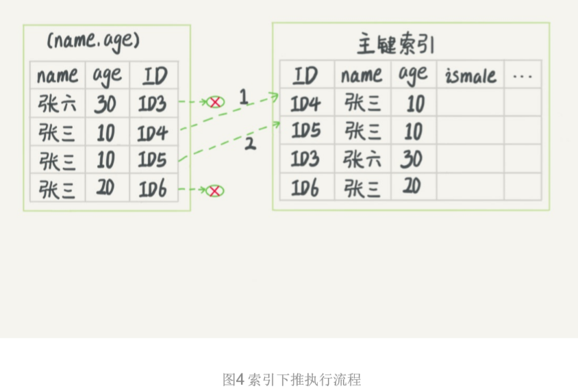

而MySQL 5.6 引入的索引下推优化（index condition pushdown)， 可以在索引遍历过程中，对索 引中包含的字段**先做判断**，直接过滤掉不满足条件的记录，减少回表次数

## 问题


# 06 | 全局锁和表锁 

根据加锁的范围，MySQL里面的锁大致可以分成全局锁、表级锁和行锁

## 全局锁 FTWRL

- 加全局读锁的方法，**Flush tables with read lock (FTWRL)。**


可以使用这个命令，之后其他线程的以下语句会被阻塞：数据**更新语句**（数据的增删改）、数据定义语句（包括
建表、**修改表结构**等）和更新类事务的提交语句。

- 还有mysqldump
- 还有set global readonly=true set global readonly=true

### 使用场景

全库逻辑备份

危险的地方：

- 如果你在主库上备份，那么在备份期间都不能执行更新，业务基本上就得停摆； 
- 如果你在从库上备份，那么备份期间从库不能执行主库同步过来的binlog，会导致主从延迟

如果不使用


备份结果里，用户A的数据状态是“账户余额没扣，但是用户课程表里面已经多了 一门课”。如果后面用这个备份来恢复数据的话，用户A就发现，自己赚了

结果：备份系统备份的得到的库**不是一个逻辑时间点**，这个视图是逻辑不一致的。

其实是有一个方法能够拿到一致性视图的：可重复读隔离级别下开启一个事务

### mysqldump

官方自带的逻辑备份工具是`mysqldump`（一致性读）

使用参数–single-transaction的时候，导数据**之前就会启动一个事务**，来确保拿到一致性视图。而由于MVCC的支持，这个过程中数据是 可以正常更新的。

一致性读是好，但前提是引擎要支 一致性读是好，但前提是引擎要支 持这个隔离级别。 持这个**隔离级别**。比如，对于MyISAM这种不支持事务的引擎，如果备份过程中有更新，总是 只能取到最新的数据，那么就破坏了备份的一致性。这时，我们就需要使用FTWRL命令了。

全库只读，为什么不使用 既然要全库只读，为什么不使用**set global readonly=true**的方式呢 的方式呢？

### set global readonly=true

建议你用FTWRL方式。

- 一是，在有些系统中，readonly的值会被用来做其他逻辑，比如用来**判断一个库是主库还是备库**。因此，修改global变量的方式影响面更大，我不建议你使用。 
- 二是，在**异常处理机制**上有差异。如果执行FTWRL命令之后由于客户端发生异常断开，那么 MySQL**会自动释放**这个全局锁，整个库回到可以正常更新的状态。而将整个库设置为 readonly之后，如果客户端发生异常，则数据库就会**一直保持readonly状态**，这样会导致整个 库长时间处于不可写状态，风险较高。

## 表级锁 

一种是表锁，一种是元数据锁（meta data lock，MDL)。

### 表锁

表锁的语法是 表锁的语法是 `lock tables … read/write `。 与FTWRL类似，可以用unlock tables主动释放锁， 也可以在**客户端断开**的时候自动释放。需要注意，lock tables语法除了会限制别的线程的读写外，也限定了**本线程**接下来的操作对象。

线程A

执行lock tables t1 read, t2 write; <font color=red >相当于write 是个锁</font>。

//**其他线程**写t1、读 写t2的语句都会被阻塞，只能读 t1。

//线程A在执行unlock tables之前，也只能执行**读t1、读写t2**的操 作。连写t1都不允许，自然也不能访问其他表。

### MDL（metadata lock)

MDL不需要显式使用，在访问一个表的时候会被自动加上

作用: 

​	保证读写的正确性。

当对一个表做增删改查操作的时候，加**MDL读锁**；当 要对表做结构变更操作的时候，加**MDL写锁**。

- 读锁之间**不互斥**，因此你可以有多个线程同时对一张表增删改查。

- 读写锁之间、写锁之间是**互斥**的，用来保证变更**表结构**操作的**安全性**。因此，如果有两个线
  程要同时给一个表加字段，其中一个要等另一个执行完才能开始执行。

> 事件：给一个小表加个字段，导致整个库挂了。

给一个表加字段，或者修改字段，或者加索引，需要**扫描全表**的数据


如果只有session C自己被阻塞还没什么关系，但是之后所有要在表t上新申请MDL读锁的请求也 会被session C阻塞。前面我们说了，所有对表的增删改查操作都需要先申请MDL读锁，就都被 锁住，**等于这个表现在完全不可读写了**

最终结果：如果某个表上的查询语句频繁，而且客户端有**重试机制**，也就是说超时后会再起一个新session 再请求的话，这个库的**线程很快就会爆满**。

事务中的MDL锁，在语句执行开始时申请，但是语句结束后并不会马上释 放，**而会等到整个事务提交后再释放。**

> 如何安全地给小表加字段？

首先我们要解决长事务，事务不提交，就会一直占着MDL锁

information_schema 库的 innodb_trx 表中，你可以**查到当前执行中的事务**。

要考虑先**暂停**DDL，或者**kill**掉这个长事务。

如果是表是一个热点表，虽然数据量不大，但是上面的请求很**频繁**，而你不得不加个字段，你该怎么做？


## 问题

备份一般都会在备库上执行，你在用–single-transaction方法做逻 辑备份的过程中，如果主库上的一个小表做了一个DDL，比如给一个表上加了一列。这时候，从 备库上会看到什么现象呢？


在备份开始的时候，为了确保RR（可重复读）隔离级别，再设置一次RR隔离级别(Q1); 

启动事务，这里用 WITH CONSISTENTSNAPSHOT确保这个语句执行完就可以得到一个一致性 视图（Q2)；

 设置一个保存点，这个很重要（Q3）；

 showcreate 是为了拿到表结构(Q4)，然后正式导数据 （Q5），回滚到SAVEPOINTsp，在这 里的作用是释放 t1的MDL锁 （Q6。当然这部分属于“超纲”，上文正文里面都没提到。

 DDL从主库传过来的时间按照效果不同，我打了四个时刻。题目设定为小表，我们假定到达后， 如果开始执行，则很快能够执行完成。


# 07 | 行锁功过：减少行锁对性能的影响

##  从两阶段锁说起


实际上事务B的update语句会被阻塞，直到事务A执行**commit**之后，事务B**才能继续**执行。 

**如果你的事务中需要锁多个行，要把 最可能造成锁冲突、最可能影响并发度的锁尽量往后放。**

比如：实现一个电影票在线交易业务


我们需要update两条记录，并insert一条记录

两个事务冲突的部分就是语句2了

根据两阶段锁协议，不论你怎样安排语句顺序，所有的操作需要的行锁都是在事务提交的时候才释放的。所以，如果你把语句2安排在最后，比如按照3、1、2这样的顺序，那么影院账户余额 **这一行的锁时间就最少**。这就最大程度地减少了事务之间的锁等待，提升了并发度。

## 死锁和死锁检测

当出现死锁以后，有两种策略：

- 一种策略是，直接进入等待，直到**超时**。这个超时时间可以通过参数innodb_lock_wait_timeout来设置。 
- 另一种策略是，**发起死锁检测**，发现死锁后，**主动回滚**死锁链条中的某一个事务，让其他事务得以继续执行。将参数innodb_deadlock_detect设置为on，表示开启这个逻辑。 

在InnoDB中，innodb_lock_wait_timeout的默认值是50s，

正常情况下我们还是要采用第二种策略，即：主动死锁检测，而且 innodb_deadlock_detect的默认值本身就是on。主动死锁检测在发生锁的时候，是能够快速发 现并进行处理的，但是它也是有额外负担的。 

每个新来的被堵住的线程，都要判断会不会由于自己的加入导致了死锁，这是一个时间复杂度是 O(n)的操作。假设有1000个并发线程要同时更新同一行，那么死锁检测操作就是100万这个量级 的。虽然最终检测的结果是没有死锁，但是这期间要消耗大量的CPU资源。因此，你就会看到 **CPU利用率很高，但是每秒却执行不了几个事务**。

## 怎么解决由这种热点行更新导致的性能问题呢？

- **一种头痛医头的方法，就是如果你能确保这个业务一定不会出现死锁，可以临时把死锁检 测关掉**意味着可能会出现大量的超时，这是业务有损的
- **另一个思路是控制并发度。**你会很快发现这个方法不太可行，因为客户端很多。我见过 一个应用，有600个客户端，这样即使每个客户端控制到只有5个并发线程，汇总到数据库服务 端以后，峰值并发数也可能要达到3000。
- 因此，这个并发控制要做在数据库服务端。如果你有中间件，可以考虑在中间件实现；如果你的 团队有能修改MySQL源码的人，也可以做在MySQL里面。基本思路就是，对于相同行的更新， 在进入引擎之前排队。这样在InnoDB内部就不会有大量的死锁检测工作了

没有数据库方面的专家，怎么样优化这个问题呢？

你可以考虑通过将一行改成逻辑上的多行来减少锁冲突。还是以影院账户为例，可以考虑放在多 条记录上，比如10个记录，影院的账户总额等于这10个记录的值的总和。这样每次要给影院账 户加金额的时候，随机选其中一条记录来加。这样每次冲突概率变成原来的1/10，可以减少锁等 待个数，也就减少了死锁检测的CPU消耗。 这个方案看上去是无损的，但其实这类方案需要根据业务逻辑做详细设计。如果账户余额可能会 减少，比如退票逻辑，那么这时候就需要考虑当一部分行记录变成0的时候，代码要有特殊处 理。

## 小结

涉及了两阶段锁协议、死锁和死锁检测这两大部分内容

我给你的建议是：如果你的事务中需要锁多个行，要把最可能造成锁冲突、最可能影响并 发度的锁的申请时机尽量往后放

但是，调整语句顺序并不能完全避免死锁。所以我们引入了死锁和死锁检测的概念，以及提供了 三个方案，来减少死锁对数据库的影响。减少死锁的主要方向，就是**控制访问相同资源的并发事** 务量。

## 问题

如果你要删除一个表里面的前10000行数据

- 第一种，直接执行delete fromTlimit 10000; 

- 第二种，在一个连接中循环执行20次 delete fromTlimit 500;

- 第三种，在20个连接中同时执行delete fromTlimit 500。

  

  ​	第二种方式是相对较好的即：在一个连接中循环执行20次 delete fromTlimit 500。 确实是这样的。

  第一种方式（即：直接执行delete fromTlimit 10000）里面，单个语句占用时间长，锁的时间也 比较长；而且大事务还会导致主从延迟。

  第三种方式（即：在20个连接中同时执行delete fromTlimit 500），会人为造成锁冲突。

# 08 | 事务到底是隔离的还是不隔离的？

```mysql
mysql> CREATE TABLE `t` ( 
    `id` int(11) NOT NULL, 
    `k` int(11) DEFAULT NULL, 
    PRIMARY KEY (`id`)
) ENGINE=InnoDB; 

insert into t(id, k) values(1,1),(2,2);

```


begin/start transaction 命令并不是一个事务的起点，在执行到它们之后的第一个操作InnoDB表 的语句，事务才真正启动。如果你想要**马上启动一个事务**，可以使用start transaction with consistent snapshot 这个命令。

还需要注意的是，在整个专栏里面，我们的例子中如果没有特别说明，都是默认 autocommit=1。（自动提交）

事务C没有显式地使用begin/commit，表示这个update语句本身就是一个事务， 语句完成的时候会**自动提交**。

结果：，如果我告诉你事务B查到的k的值是3，而事务A查到的k的值是1。

在MySQL里，有两个“视图”的概念：

- 一个是view。
- 另一个是InnoDB在实现MVCC时用到的一致性读视图，即consistent read view，用于支持 RC（Read Committed，读提交）和RR（Repeatable Read，可重复读）隔离级别的实现。

## “快照”在MVCC里是怎么工作的？

在可重复读隔离级别下，事务在启动的时候就“拍了个快照”。注意，这个**快照是基于整库**的。

InnoDB里面每个事务有一个唯一的事务ID，叫作transaction id。它是在事务开始的时候向 InnoDB的事务系统申请的，是按申请顺序严格递增的。

数据表中的一行记录，其实可能有多个版本(row)，每个版本有自己的rowtrx_id。

一个记录被多个事务连续更新后的状态。


实际上，图2中的三个虚线箭头，就是undo log；

而V1、V2、V3并**不是物理上真实存在的**，而 是每次需要的时候根据当前版本和undo log**计算**出来的。比如，需要V2的时候，就是通过V4依 次执行U3、U2算出来。

InnoDB是怎么定义那个“100G”的快照 的。

按照可重复读的定义，一个事务启动的时候，能够看到所有**已经提交**的事务结果。但是之后，这 个事务执行期间，其他事务的更新对它不可见。

在实现上， InnoDB为**每个事务构造了一个数组**，用来保存这个事务启动瞬间，当前正在“活 跃”的所有事务ID。“活跃”指的就是，**启动了但还没提交。**


InnoDB利用了“所有数据都有多个版本”的这个特性，实现了“秒级创建 快照”的能力。


你可能注意到了，在事务A查询的时候，其实事务B还**没有提交**，但是它生成的(1,3)这个版本已 经变成当前版本了。但这个版本对事务A必须是不可见的，否则就变成脏读了。


## 更新逻辑


你看图5中，事务B的视图数组是先生成的，之后事务C才提交，不是应该看不见(1,2)吗，怎么能 算出(1,3)来？

是的，如果事务B在更新之前查询一次数据，这个查询返回的k的值确实是1。

**更新数据都是先读后写的，而这个读，只能读当前的 值，称为“当前读”（current read）。**

**带lock in share mode，for update的SQL语句，是当前读**

所以，在执行事务B查询语句的时候，一看自己的版本号是101，最新数据的版本号也是101，是 自己的更新，可以直接使用，所以查询得到的k的值是3。


我们在上一篇文章中提到的“**两阶段锁协议**”就要上场了。事务C’没提交，也就是说(1,2) 这个版本上的**写锁还没释放**。而事务B是**当前读，必须要读最新版本**，而且必须加锁，因此就被 锁住了，必须等到事务C’释放这个锁，才能继续它的当前读。


可重复读的核心就是一致性读（consistent read）；而事务更新数据的时候，只能用当前读。如 果当前的记录的行锁被其他事务占用的话，就需要进入锁等待。

- 在可重复读隔离级别下，只需要在事务开始的时候创建一致性视图，之后事务里的其他查询 都共用这个一致性视图；
- 在读提交隔离级别下，每一个语句执行前都会重新算出一个新的视图。

这里需要说明一下，“start transaction with consistent snapshot; ”的意思是从这个语句开始，创 建一个持续整个事务的一致性快照。所以，在读提交隔离级别下，这个用法就没意义了，等效于 普通的start transaction。

## 下面是读提交时的状态图


## 小结

InnoDB的行数据有多个版本，每个数据版本有自己的rowtrx_id，每个事务或者语句有自己的一 致性视图。普通查询语句是一致性读，一致性读会根据rowtrx_id和一致性视图确定数据版本的 可见性。

-  对于可重复读，查询只承认在事务启动前就已经提交完成的数据；
-  对于读提交，查询只承认在语句启动前就已经提交完成的数据；

这是因为表结构没有对应的行数据，也没有 rowtrx_id，因此只能遵循当前读的逻辑。

MySQL 8.0已经可以把表结构放在InnoDB字典里了，也许以后会支持表结构的可重复 读。

## 问题


答案：


# 09 | 普通索引和唯一索引，应该怎么选择？

假设你在维护一个市民系统，每个人都有一个**唯一的身份证号**，而且业务代码已经保证了不会写 入两个重复的身份证号。如果市民系统需要按照身份证号查姓名，就会执行类似这样的SQL语 句：

```mysql
select name from CUser where id_card = 'xxxxxxxyyyyyyzzzzz';
```

一定会考虑在id_card字段上建索引。

身份证号字段比较大，我不建议你把身份证号当做主键

那么现在你有两个选择，要么给 id_card字段创建唯一索引，要么创建一个普通索引。如

我们就从这两种索引对查询语句和更新语句的性能影响来进行分析

## 查询过程

select id fromTwhere k=5。可以认为数据页内部通过二分法来定位记录

- 对于普通索引来说，查找到满足条件的第一个记录(5,500)后，需要查找下一个记录，直到碰 **到第一个不满足**k=5条件的记录。
- 对于唯一索引来说，由于索引定义了唯一性，查找到第一个满足条件的记录后，就会停止继续检索。

性能差距微乎其微。

InnoDB的数据是按**数据页**为单位来读写的。当找到k=5的记录的时候，它所在的数据页就都在**内存**里了。要多做的那一次“查找和判断下一条记录”的操作，就只需要一次指针 寻找和一次计算。

当然，如果k=5这个记录刚好是这个数据页的**最后一个记录**，那么要取下一个记录，必须读取下 一个数据页，这个操作会稍微复杂一些。

对于整型字段，一个数据页可以放近千个key，因此出现这种情况的概 率会很低。所以，我们计算平均性能差异时，仍可以认为这个操作成本对于现在的CPU来说可以 **忽略不计**。

## 更新过程（change buffer）


当需要更新一个数据页时，如果**数据页在内存中**就直接更新，而如果这个数据页还没有在内存中 的话，在不影响**数据一致性**的前提下，InooDB会将这些更新操作**缓存在change buffer**中，这样 就不需要从磁盘中读入这个数据页了。在下次查询需要访问这个数据页的时候，将**数据页读入内 存**，然后执行change buffer中与这个页有关的操作。通过这种方式就能保证这个数据逻辑的正 确性。

将change buffer中的操作**应用到原数据页**，得到最新结果的过程称为`merge`。除了**访问这个数据 页**会触发merge外，系统有后台线程会**定期merge**。在数据库**正常关闭**（shutdown）的过程中， 也会执行merge操作。数据读入内存是需要占用**buffer pool**的，所以这种方式还能够避免占用内存，提高内存利用率。

对于唯一索引来说，所有的更新操作都要先判断这个操作是否违反唯一性约束。比如，要插入 (4,400)这个记录，就要先判断现在表中是否已经存在k=4的记录，而这必须要将数据页读入内存 才能判断。如果都已经读入到内存了，那直接更新内存会更快，就没必要使用change buffer 了。

 因此，唯一索引的更新就**不能**使用change buffer，实际上也**只有普通索引**可以使用。


change buffer用的是buffer pool里的内存,change buffer的大小，可以通 过参数innodb_change_buffer_max_size来**动态设置**。这个参数设置为50的时候，表示change buffer的大小最多只能占用buffer pool的50%。

### 如果要在这张表中插入一个 新记录(4,400)的话，InnoDB的处理流程是怎样的

第一种情况是，这个记录要更新的目标页**在内存中**

- 对于唯一索引来说，找到3和5之间的位置，判断到**没有冲突**，插入这个值，语句执行结束；

- 对于普通索引来说，找到3和5之间的位置，插入这个值，语句执行结束。

  差别，只是一个判断，只会耗费微小的 CPU时间

第二种情况是，这个记录要更新的目标页**不在内存中**。

- 对于唯一索引来说，需要将数据页**读入内存**，判断到没有冲突，**插入这个值**，语句执行结束； 

- 对于普通索引来说，则是将更新记录在**change buffer**，语句执行就结束了。

  从磁盘读入内存涉及**随机IO**的访问，是数据库里面成本最高的操作之一。change buffer 因为**减少了**随机磁盘访问，所以对更新性能的提升是会很明显的。

## change buffer的使用场景

普通 索引的所有场景，使用change buffer都可以起到加速作用吗？

所以在一个数据页做merge之前，change buffer记录的变更越多（也就是这个页面 上要更新的次数越多），收益就越大。

对于**写多读少**的业务来说，页面在写完以后马上被访问到的概率比较小，此时change buffer的使用效果最好。这种业务模型常见的就是账单类、日志类的系统。

将更新先记 录在change buffer，但之后由于马上要访问这个数据页，会立即触发merge过程。这样随机访问 IO的次数不会减少，反而增加了change buffer的维护代价。所以，对于这种业务模式来 说，change buffer反而起到了副作用。

## 索引选择和实践

这两类索引在查询能力上 是没差别的，主要考虑的是对**更新性能**的影响。所以，我建议你尽量选择普通索引。

如果所有的**更新后面，都马上伴随着对这个记录的查询**，那么你应该`关闭change buffer`。而在 其他情况下，change buffer都能提升更新性能。

## change buffer 和 redo log

WAL 提升性能的核心机 制，也的确是尽量减少**随机读写**

k1 数据页再内存

k2 不在


然后写了一处磁盘（两次操作合在一起写了一次磁盘），而且还是顺序写的。

我们现在要执行 select *fromt where k in (k1, k2)。


**redo log 主要节省的是随 机<font color="red">写</font>磁盘的IO消耗（转成顺序写），而change buffer主要节省的则是随机<font color="red">读</font>磁盘的IO消 耗。**

## 小结

普通索引和唯一索引的选择开始，和你分享了数据的查询和更新过程，然后说明了 change buffer的机制以及应用场景，最后讲到了索引选择的实践。

唯一索引**用不上**change buffer的优化机制

如果碰上了大量插入数据慢、内存 命中率低的时候，可以给你多提供一个排查思路

## 问题

change buffer一开始是写内存的，那么如果这个时候机器掉电重启，会不 会导致change buffer丢失呢？change buffer丢失可不是小事儿，再从磁盘读入数据可就没有了 merge过程，就等于是数据丢失了。会不会出现这种情况呢？

答案是不会丢失，留言区的很多同学都回答对了。虽然是只更新内存，但是在事务提交的时候，我们把change buffer的操作也记录到**redo log**里了，所以崩溃恢复的时候，change buffer也能找回来。


# 10 | MySQL为什么有时候会选错索引？analyze table t

```mysql
CREATE TABLE `t` ( 
    `id` int(11) NOT NULL,
    `a` int(11) DEFAULT NULL,
    `b` int(11) DEFAULT NULL,
    PRIMARY KEY (`id`), 
    KEY `a` (`a`), KEY `b` (`b`) 
) ENGINE=InnoDB；
 ----往表t中插入10万行记录
delimiter ;;
create procedure idata()
begin
declare i int;
set i=1;
while(i<=100000)do
insert into t values(i, i, i);
set i=i+1;
end while;
end;;
delimiter ;
call idata();
```

## 情况一：

```
mysql> select * from t where a between 10000 and 20000;
```

你会说：a上有索引，肯定是要使用索引a的


也确实符合预期


session A：开启了一个事务

session B：把数据都删 除后，又调用了 idata这个存储过程，插入了10万行数据

这时候，session B的查询语句select *fromt where a between 10000 and 20000就**不会再选择索引a**了。我们可以通过慢查询日志（slowlog）来查看一下具体的执行情况。


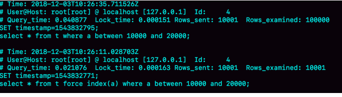

Q1扫描了10万行

Q2扫描了10001行

## 优化器的逻辑

选择索引是优化器的工作

是找到一个最优的执行方案，并用最小的代价去执行语句。在数据库 里面，**扫描行数**是影响执行代价的因素之一。扫描的行数越少，意味着访问磁盘数据的次数越 少，消耗的CPU资源越少。

### 扫描行数是怎么判断的？

真正开始执行语句之前，并**不能精确**地知道满足这个条件的记录有多少条，而只能根 据统计信息来估算记录数。

这个统计信息就是索引的**“区分度**”。显然，一个索引上不同的值越多，这个索引的区分度就越 好。而一个索引上**不同**的值的个数，我们称之为“**基数**”（cardinality）。也就是说，这个基数越大，索引的区分度越好。

show index方法，看到一个索引的基数


MySQL是怎样得到索引的基数的呢？

#### 采样统计

InnoDB默认会选择N个**数据页**，统计这些页面上的**不同值**，得到一个**平均值**，然后乘以这个**索引的页面数**，就得到了这个索引的**基数**。

而数据表是会**持续更新**的，索引统计信息也不会固定不变。所以，当**变更**的数据行数**超过1/M**的 时候，会自动触发**重新**做一次**索引统计**。


rows这个字段表示的是预计扫描行数。

而是优化器为什么放着扫描37000行的执行计划 不用，却选择了扫描行数是100000的执行计划呢？

如果使用索引a，每次从索引a上拿到一个值，都要回到主键索引上查出整行数据， 这个代价优化器也要算进去的。(**回表**)

至于 为什么会得到错误的扫描行数，这个原因就作为课后问题，留给你去分析了，

`analyze table t 来修正统计信息`

## 情况二

```
mysql> select * from t where (a between 1 and 1000) and (b between 50000 and 100000) 
```


这次优化器选择了索引b，而rows字段显示需要扫描的行 数是50198。 

之前优化器选择使用索引b，是因为它认为使用索引b可以**避免排序**（b本身是索引，已经是有序 的了，如果选择索引b的话，不需要再做排序，只需要遍历），所以即使扫描行数多，也判定为 代价更小。

从这个结果中，你可以得到两个结论： 

1. 扫描行数的估计值依然不准确；
2. 这个例子里MySQL又选错了索引。

## 解决方案

- 一种方法是，像我们第一个例子一样，采用`force index`强行选择一个索引。

缺点：一来这么写不优美，二来如果索引改了名字，这个语句 mysql> explain select * from t where (a between 1 and 1000) and (b between 50000 and 100000) order by b limit 1; 也得改，显得很麻烦。而且如果以后迁移到别的数据库的话，这个语法还可能会不兼容

数据库的问题最好还是在数据库内部来解决

- 第二种方法就是，我们可以考虑修改 语句，引导MySQL使用我们期望的索引。

order byb limit 1” 改 成 “order byb,a limit 1” ，语义的逻辑是相同的。

按照b,a排序，就意味着使用这两个索引**都需要排序**

- 第三种方法是，在有些场景下，我们可以新建一个更合适的索引，来提供给优化器做选 择，或**删掉误用的索引**。


## 小结

聊索引统计的更新机制，优化器存在选错索引的可能性（基数，回表，排序）

`analyze table来解决`

force index来强行指定索引，也可以通过修改 语句来引导优化器，还可以通过增加或者删除索引来绕过这个问题。

## 问题

过session A的配合， 让session B删除数据后又重新插入了一遍数据，然后就发现explain结果中，rows字段从10001 变成37000多。

而如果没有session A的配合，只是单独执行delete fromt 、call idata()、explain这三句话，会看 到rows字段其实还是10000左右。你可以自己验证一下这个结果。为什么呢？


但是，session A开启了事务并没有提交，所以之前插入的10万行数据是不能删除的。这样，之 前的数据每一行数据都有**两个版本**，旧版本是delete之前的数据，新版本是标记为deleted的数 据。

这样，索引a上的数据其实就有两份。 然后你会说，不对啊，主键上的数据也不能删，那没有使用force index的语句，使用explain命令 看到的扫描行数为什么还是100000左右？（潜台词，如果这个也翻倍，也许优化器还会认为选 字段a作为索引更合适）

 是的，不过这个是主键，主键是直接按照表的行数来估计的。而表的行数，优化器直接用的是 **showt able status**的值。

# 11 | 怎么给字符串字段加索引？

邮箱这样的字段上建立合理的索引


## 前缀索引

```mysql
alter table SUser add index index2(email(6));
```


**使用前缀索引，定义好长度，就可以做到既节省空间，又不用额外增加太多的查 询成本。**

我们要看一下4~7个字节的前缀索引


### 前缀索引对覆盖索引的影响

如果使用index1（即email整个字符串的索引结构）的话，可以利用覆盖索引，从index1查 到结果后直接就返回了，不需要回到ID索引再去查一次。而如果使用index2（即email(6)索引结 构）的话，就不得不回到ID索引再去判断email字段的值。

即使你将index2的定义修改为email(18)的前缀索引，要回到id索引再查一下，定义是否截断了完整信 息。

## 其他方式

假设你维护的数据库是一个市的公民信息系统，这时候如果对身份证号做长度为6的前缀索引的 话，这个索引的区分度就非常低了。

### 第一种方式是使用倒序存储。

```mysql
mysql> select field_list from t where id_card = reverse('input_id_card_string');
```

所以最后这6位很可能就提供了足够的区 分度。当然了，实践中你不要忘记使用count(distinct)方法去做个验证

### 第二种方式是使用hash字段

```mysql
mysql> alter table t add id_card_crc int unsigned, add index(id_card_crc);
```

每次插入新记录的时候，都同时用**crc32()**这个函数得到校验码填到这个新字段，两个不同的身份证号通过crc32()函数得到的结果可能是相同的，where部分要判断id_card的值是否精确相同。

索引的长度变成了4个字节，比原来小了很多。

1. 从占用的**额外空间**来看，倒序存储方式在主键索引上，不会消耗额外的存储空间，而hash字 段方法需要增加一个字段。当然，倒序存储方式使用4个字节的前缀长度应该是不够的，如 果再长一点，这个消耗跟额外这个hash字段也**差不多抵消**了。
2. 在**CPU消耗**方面，倒序方式每次写和读的时候，都需要额外调用一次reverse函数，而hash 字段的方式需要额外**调用一次**crc32()函数。如果只从这两个函数的**计算复杂度**来看的 话，**reverse函数**额外消耗的CPU资源会更小些。
3. 从查询效率上看，使用**hash**字段方式的查询性能相对更稳定一些。因为crc32算出来的值虽 然有冲突的概率，但是概率非常小，可以认为每次查询的平均扫描行数接近1。而倒序存储 方式毕竟还是用的**前缀索引**的方式，也就是说还是会增加扫描行数。

## 小结


## 问题


# 12 | 为什么我的MySQL会“抖”一下？

一条SQL语句，正常执行的时候特别快，但 是有时也不知道怎么回事，它就会变得特别慢

## 你的SQL语句为什么变“慢”了

- 当内存**数据页**跟**磁盘数据页**内容不一致的时候，我们称这个内存页为“**脏页**”。
- 内存数据写 入到磁盘后，内存和磁盘上的数据页的内容就一致了，称为“**干净页**”

平时执行很快的更新操作，其实就是在写内存和日志，而 MySQL偶尔“抖”一下的那个瞬间，可能就是在刷脏页（flush）。

## 4种情况会引发数据库的flush过程呢？

- 是InnoDB的redo log写满了,停止所有更新操作，把 checkpoint往前推进，redo log留出空间可以继续写。


- 是系统内存不足,而内存不够用的时候，就要淘汰 一些数据页，空出内存给别的数据页使用。如果淘汰的是“脏页”，就要先将脏页写到磁盘。

这时候难道不能直接把内存淘汰掉，下次需要请求的时候，从磁盘读入数据 页，然后拿redo log出来应用不就行了？

这里其实是从性能考虑的。如果刷脏页一定会写盘， 就保证了每个数据页有两种状态：


- 第三种场景是，生意不忙的时候，或者打烊之后。这时候柜台没事，掌柜闲着也是闲着，不如更新账本。

- 第四种场景, 是MySQL正常关闭的情况。这时候，MySQL会把内存的脏页都flush到磁 盘上，这样下次MySQL启动的时候，就可以直接从磁盘上读数据，启动速度会很快。

## 分析一下前 两种场景下的性能问题

- 第一种是“redo log写满了，要flush脏页”，这种情况是InnoDB要尽量避免的。因为出现这种情况 的时候，整个系统就**不能**再接受**更新**了，所有的更新都必须堵住。如果你从监控上看，这时候更新数会跌为0。
- 第二种是“内存不够用了，要先将脏页写到磁盘”，这种情况其实是**常态**。InnoDB用缓冲池 （buffer pool）管理内存，缓冲池中的内存页有三种状态：
  - 第一种是，还没有使用的；
  - 第二种是，使用了并且是干净页； 
  - 第三种是，使用了并且是脏页。

InnoDB的策略是尽量使用内存，因此对于一个长时间运行的库来说，未被使用的页面很少。

而当要读入的数据页没有在内存的时候，就必须到缓冲池中申请一个数据页。这时候只能把**最久不使用**的数据页从内存中淘汰掉：如果要淘汰的是一个**干净页**，就直接释放出来**复用**；但如果是 **脏页**呢，就必须将脏页先**刷到磁盘**，变成干净页后才能复用。 

所以，刷脏页虽然是常态，但是出现以下这两种情况，都是会明显影响性能的：

1. 一个查询要淘汰的脏页个数太多，会导致查询的响应时间明显变长；

2. 日志写满，更新全部堵住，写性能跌为0，这种情况对敏感业务来说，是不能接受的。

## InnoDB刷脏页的控制策略

InnoDB所在主机的**IO能力**，这样InnoDB才能知道需要全力刷脏页的时 候，可以刷多快。

到`innodb_io_capacity`这个参数了，我建议你设 置成磁盘的`IOPS`。磁盘的IOPS可以通过fio这个工具来测试，

因为没能正确地设置innodb_io_capacity参数，而导致的性能问题也比比皆是。**MySQL的写入速度很慢，TPS很低，**刷脏页刷得特别慢,甚至比脏页生成的速度还慢，这样就造成了脏页 累积，影响了查询和更新性能。

## 总不能一直是全力刷吧？

虽然我们现在已经定义了“全力刷脏页”的行为，但平时总不能一直是全力刷吧？我们就一起看看InnoDB怎么控制引擎按 照“全力”的百分比来刷脏页。

设计策略控制刷脏页的速度，会参考哪些因 素呢？

如果刷太慢，会出现什么情况？首先是内存脏页太多，其次是redo log写满。

InnoDB的刷盘速度就是要参考这两个因素：一个是**脏页比例**，一个是redo log**写盘**速度。

- innodb_io_capacity脏页比例上限，默认值是75%。%。InnoDB会根据当前的脏页 比例（假设为M）
- InnoDB每次写入的日志都有一个序号，当前写入的序号跟checkpoint对应的序号之间的差值， 我们假设为N


## 小结

我延续第2篇中介绍的WAL的概念，和你解释了这个机制后续需要的刷脏页操作和执行时机。利用WAL技术，**数据库将随机写转换成了顺序写**，大大提升了数据库的性能。

但是，由此也带来了内存脏页的问题。脏页会被后台线程自动flush，也会由于数据页淘汰而触 发flush，而刷脏页的过程由于会占用资源，可能会让你的更新和查询语句的响应时间长一些。 在文章里，我也给你介绍了控制刷脏页的方法和对应的监控方式。

## 问题


这时候系统不得不停止所有更新，去推进checkpoint。 这时，你看到的现象就是磁盘压力很小，但是数据库出现间歇性的性能下跌。


# 13 | 为什么表数据删掉一半，表文件大小不变？

表结构是存在以.frm为后缀的文件里，MySQL 8.0版本，则已经允许把表结构定义放在系统数据表中了。表数据既可以存在共享表空间里，也可以是单独的文件。这个行为是由参数 `innodb_file_per_table`控制的：


通过`drop table`命令，系统就会直接**删除这个文 件**。而如果是放在共享表空间中，即使表删掉了，空间也是不会回收的。

## 数据删除流程


我们要删掉R4这个记录，InnoDB引擎只会把R4这个记录**标记为删除**。

假设，我们要删掉R4这个记录，InnoDB引擎只会把R4这个记录标记为删除。如果之后要再插入 一个ID在300和600之间的记录时，可能会**复用这个位置**。

如果我们删掉了一个数据页上的所有记 录，整个数据页就可以被复用了

**数据页的复用跟记录的复用是不同的。**


用delete命令把整个表的数据删除呢？结果就是，所有的数据页都会被标记 为可复用。但是磁盘上，文件不会变小。

不止是删除数据会造成空洞，**插入数据也会**

如果数据是按照索引递增顺序插入的，那么索引是紧凑的。但如果数据是随机插入的，就可能造 成索引的**数据页分裂**。


页分裂完成后，page A的末尾就留下了空洞（注意：实际上，可能不止1 个记录的位置是空洞）。

**经过大量增删改的表，都是可能是存在空洞的**

而重建表，就可以达到这样的目的。

## 重建表

`alter table A engine=InnoDB`命令来重建表,MySQL会自 动完成转存数据、交换表名、删除旧表的操作。


在这个过程中，有新的数据要写入到 表A的话，就会造成数据丢失。因此，在整个DDL过程中，表A中**不能有更新**。也就是说，这个 DDL不是Online的。

## MySQL 5.6引入的Online DDL


alter语句在启动的时候需要获取MDL**写锁**，但是这个写锁在真正拷贝数据 之前就退化成**读锁**了。

为什么要退化呢？为了实现Online，MDL读锁不会阻塞增删改操作。 

那为什么不干脆直接解锁呢？为了保护自己，禁止其他线程对这个表同时做DDL。

上述的这些重建方法都会扫描原表数据和构建临时文件。对于很大的表来 说，这个操作是很**消耗IO和CPU资源**的。

如果想要比较安全的操作的话，我推荐你使用GitHub开源的gh-ost来做

## Online 和 inplace

我们把表A中的数据导出来的存放位置叫作tmp_table。这是一个临 时表，是在**server层**创建的。

根据表A重建出来的数据是放在“tmp_file”里的，这个临时文件是InnoDB在**内部创建出** 来的。整个DDL过程都在InnoDB内部完成。。对于server层来说，没有把数据挪动到临时表，是 一个“**原地**”操作，这就是“inplace”名称的来源。

所以，我现在问你，如果你有一个1TB的表，现在磁盘间是1.2TB，能不能做一个inplace的DDL 呢？ 答案是**不能**。因为，tmp_file也是要占用临时空间的。

alter table t engine=InnoDB,其实隐含的意思是：

```
alter table t engine=innodb,ALGORITHM=inplace;
```

跟inplace对应的就是拷贝表的方式了，用法是：

```
alter table t engine=innodb,ALGORITHM=copy;
```

表示的是强制拷贝表

要给InnoDB表的一个字段加全文索引

```
alter table t add FULLTEXT(field_name);
```

这个过程是inplace的，但会阻塞增删改操作，是**非Online**的。

如果说这两个逻辑之间的关系是什么的话，可以概括为：

- DDL过程如果是Online的，就一定是inplace的
- 反过来未必，也就是说inplace的DDL，有可能不是Online的。截止到MySQL 8.0，添加全文 索引（FULLTEXTindex）和空间索引(SPATIAL index)就属于这种情况。


## 小结

如果要收缩一个表，只是delete掉表里面不用的数据的话，表文件的大小是 不会变的，你还要通过alter table命令重建表，才能达到表文件变小的目的。

Online DDL的方式是可以考虑在业务低峰期使用的，

## 问题

假设现在有人碰到了一个“想要收缩表空间，结果适得其反”的情况，看上去是这样的：


# 14 | count(*)这么慢，我该怎么办？

## count(*)的实现方式

- MyISAM引擎把一个表的总行数**存在**了磁盘上，因此执行count(*)的时候会直接返回这个数， 效率很高；
- 而InnoDB引擎就麻烦了，它执行count(*)的时候，需要把数据一行一行地从引擎里面**读**出 来，然后累积计数。


如果加了where 条件 的话，MyISAM表也是不能返回得这么快的。

为什么要使用InnoDB，因为不论是在事务支持、并发能力还 是在数据安全方面，InnoDB都优于MyISAM。

## 为什么InnoDB不也把数字存起来呢？

这是因为即使是在同一个时刻的多个查询，由于多版本并发控制（MVCC）的原因

假设表t中现在有10000条记录，我们设计了三个用户并行的会话。


在代码上就是通过多版本并发 控制，也就是MVCC来实现的。每一行记录都要判断自己是否对这个**会话可见**，因此对于 count(*)请求来说，InnoDB只好把数据一行一行地读出依次判断，可见的行才能够用于计算“基 于这个查询”的表的总行数。

优化：

普通索引树比主键索引树小很多。MySQL优化器会找到最小的那棵树来遍历。

在保证逻辑正 确的前提下，尽量减少扫描的数据量，是数据库系统设计的通用法则之一。

TABLE_ROWS能 代替count(*)吗？

索引统计的值 是通过采样来**估算的**。实际上，TABLE_ROWS就是从这个采样估算得来的，因此它也很不准。 有多不准呢，官方文档说误差可能达到40%到50%。

- MyISAM表虽然count(*)很快，但是不支持事务； 
- *showtable status命令虽然返回很快，但是不准确；*
- *InnoDB表直接count(*)会遍历全表，虽然结果准确，但会导致性能问题。

## 用缓存系统保存计数

缓存系统可能会丢失更新。


## 在数据库保存计数

计数直接放到数据库里单独的一张计数表C中

这解决了崩溃丢失的问题，InnoDB是支持崩溃恢复不丢数据的。

于InnoDB要支持事务

## 不同的count用法


count(字段)<count(主键id)<count(1)≈count(*)

## 问题


从并发系统性能的角度 考虑，你觉得在这个事务序列里，应该先插入操作记录，还是应该先更新计数表呢？

因为更新计数表涉及到行锁的竞争，先插入再更新能最大程度地减少事务之间的锁等待，提升 并发度


# 15 | 答疑文章（一）：日志和索引相关问题

## 日志相关问题

### 在两阶段提交的不同瞬间，MySQL如果发生异常重启，是怎 么保证数据完整性的？


两个“commit”的概念：

- 他说的“commit语句”，是指MySQL语法中，用于提交一个事务的命令。一般跟begin/start transaction 配对使用。 
- 而我们图中用到的这个“commit步骤”，指的是事务提交过程中的一个小步骤，也是最后一 步。当这个步骤执行完成后，这个事务就提交完成了。 
- “commit语句”执行的时候，会**包含**“commit 步骤”。

崩溃恢复时的判断规则

1. 如果redo log里面的事务是完整的，也就是已经有了commit标识，则直接提交；

2. 如果redo log里面的事务只有完整的prepare，则判断对应的事务binlog是否存在并完整： 

   a. 如果是，则提交事务； 

   b. 否则，回滚事务。

### MySQL怎么知道binlog是完整的?

- statement格式的binlog，最后会有COMMIT；
- row格式的binlog，最后会有一个XID event。

### redo log 和 binlog是怎么关联起来的?

它们有一个共同的数据字段，叫XID。崩溃恢复的时候，会按顺序扫描redo log：

- 如果碰到既有prepare、又有commit的redo log，就直接提交；
- 如果碰到只有parepare、而没有commit的redo log，就拿着XID去binlog找对应的事务。

### 处于prepare阶段的redo log加上完整binlog，重启就能恢复，为什么要这么设计?

画了一张示意图，这里就没有redo log了。


### 那能不能反过来，只用redo log，不要binlog？

一个是归档。redo log是循环写，写到末尾是要回到开头继续写的。这样历史日志没法保 留，redo log也就起不到归档的作用。

MySQL系统高可用的基础，就是binlog复制。

有异构系统，这些系统就靠消费MySQL的binlog来更新 自己的数据。关掉binlog的话，这些下游系统就没法输入了。

括MySQL高可用在内的很多系统机制都依赖于binlog，所以“鸠占鹊巢”redo log还做不到。

### redo log一般设置多大？

所以，如果是现在常见的几个TB的磁盘的话，就不要太小气了，直接将redo log设置为4个文 件、每个文件1GB吧。

### 正常运行中的实例，数据写入后的最终落盘，是从redo log更新过来的 还是从buffer pool更新过来的呢？


## redo log buffer是什么？是先修改内存，还是先写redo log文件？

生成的日志都得先保存起来，但又不能在 还没commit的时候就直接写到redo log文件里。 所以，`redo log buffer`就是一块内存，用来先存redo日志的。

也就是说，在执行第一个insert的时 候，数据的内存被修改了，redo log buffer也写入了日志。 但是，真正把日志写到redo log文件（文件名是 ib_logfile+数字），是在执行`commit语句`的时候 做的。

## 问题


选项3，即：InnoDB认真执行了“把这个值修改成(1,2)"这个 操作，该加锁的加锁，该更新的更新。


MySQL认为读出来的值，只有一个确定的 (id=1), 而要写的是(a=3)，只从这两个信息是看不出来“不需要修改”的。


上面我们的验证结果都是在binlog_format=statement格式下进行的。

# 16 | “order by”是怎么工作的？

假设你要查询城市是“杭州”的所有人名字，并且按照姓名排序返回 前1000个人的姓名、年龄。

```mysql
CREATE TABLE `t` ( 
    `id` int(11) NOTNULL,
    `city` varchar(16) NOTNULL, 
    `name` varchar(16) NOTNULL,
    `age` int(11) NOTNULL, 
    `addr` varchar(128) DEFAULTNULL, 
    PRIMARY KEY (`id`),
    KEY `city` (`city`) 
) ENGINE=InnoDB;
```

可以这么写

```
select city,name,age from t where city='杭州' order by name limit 1000 ;
```

## 全字段排序


Extra这个字段中的“Using filesort”表示的就是需要排序，MySQL会给每个线程分配一块内存用于 排序，称为**sort_buffer**。


语句执行流程：

1. 初始化sort_buffer，确定放入name、city、age这三个字段； 

2. 从索引city找到第一个满足city='杭州’条件的主键id，也就是图中的ID_X； 

3. 到主键id索引取出整行，取name、city、age三个字段的值，存入sort_buffer中；

4. 从索引city取下一个记录的主键id； 

5. 重复步骤3、4直到city的值不满足查询条件为止，对应的主键id也就是图中的ID_Y；

6. 对sort_buffer中的数据按照字段name做快速排序； 

7. 按照排序结果取前1000行返回给客户端。

   

**sort_buffer_size**，就是MySQL为排序开辟的内存（sort_buffer）的大小。如果要排序的数据量 小于sort_buffer_size，排序就在内存中完成。但如果**排序数据量太大**，内存放不下，则不得不利用**磁盘临时文件**辅助排序。

你可以用下面介绍的方法，来确定一个排序语句是否使用了临时文件。


number_of_tmp_files表示的是，排序过程中使用的临时文件数

用归并排序算法：MySQL将需要排序的数据分成12份，每一份单独排序后存在这些临时文件中。然后把 这12个有序文件再合并成一个有序的大文件


## rowid排序


sort_buffer里面 要放的**字段数太多**，这样内存里能够同时放下的行数很少，要分成很多个临时文件，排序的性能 会很差。

```mysql
SETmax_length_for_sort_data = 16;
```

city、name、age 这三个字段的定义总长度是36，我把max_length_for_sort_data设置为16


需要说明的是，最后的“结果集”是一个逻辑概念，实际上MySQL服务端从排序后的sort_buffer中 依次取出id，然后到原表查到city、name和age这三个字段的结果，不需要在服务端再耗费内存 存储结果，是直接返回给客户端的。

图中的examined_rows的值还是4000，表示用于排序的数据是4000行。但是select @b- @a这个语句的值变成5000了。 因为这时候除了排序过程外，在排序完成后，还要根据id去原表取值。由于语句是limit 1000，因 此会多读1000行


从OPTIMIZER_TRACE的结果中，你还能看到另外两个信息也变了

- sort_mode变成了，表示参与排序的只有name和id这两个字段。
- number_of_tmp_files变成10了，是因为这时候参与排序的行数虽然仍然是4000行，但是每一 行都变小了，因此需要排序的总数据量就变小了，需要的临时文件也相应地变少了

## 全字段排序 VS rowid排序

**如果内存够，就要多利用内存，尽量减少磁盘访问。**

对于InnoDB表来说，rowid排序会要求回表多造成磁盘读，因此不会被优先选择

并不是所有的order by语句，都需要排序操作的。

如果能够保证从city这个索引上取出来的行，天然就是按照name递增排序的话就不用了。

```
alter table t add index city_user(city, name);
```


Extra字段中没有Using filesort了，询也不用把4000行全都读一遍，只要找到满足条件的前 1000条记录就可以退出了

覆盖索引是指，索引上的信息足够满足查询请求，不需要再 回到主键索引上去取数据。

针对这个查询，我们可以创建一个city、name和age的联合索引，对应的SQL语句就是：

```
alter table t add index city_user_age(city, name, age);
```


Extra字段里面多了“Using index”，表示的就是使用了覆盖索引，性能上会快很多。

## 问题


# 17 | 如何正确地显示随机消息？

## 内存临时表

```mysql
mysql> select word from words order by rand() limit 3;
```


Using temporary，表示的是需要使用临时表，Using filesort，表示的是需要执行 排序操作。

对于InnoDB表来说，执行**全字段排序**会减少磁盘访问，因此会被**优先选择**

对于内存表，回表过程只是简单地根据数据行的位置，直接访问内存得到数据，根本不会导致多访问磁盘。MySQL这时就会选择**rowid排序**


通过慢查询日志（slowlog）

```mysql
# Query_time: 0.900376 Lock_time: 0.000347 Rows_sent: 3 Rows_examined: 20003
SET timestamp=1541402277; 
select word from words order by rand() limit 3;
```

InnoDB表的主键删掉。么InnoDB会自己生成 一个长度为6字节的rowid来作为主键。

**order by rand()使用了内存临时表，内存临时表排序的时候使用了rowid排序方法。**

## 磁盘临时表

`tmp_table_size`这个配置限制了内存临时表的大小，默认值是16M。如果临时表大 小超过了tmp_table_size，那么内存临时表就会转成磁盘临时表。

磁盘临时表使用的引擎默认是InnoDB，是由参数internal_tmp_disk_storage_engine控制的。


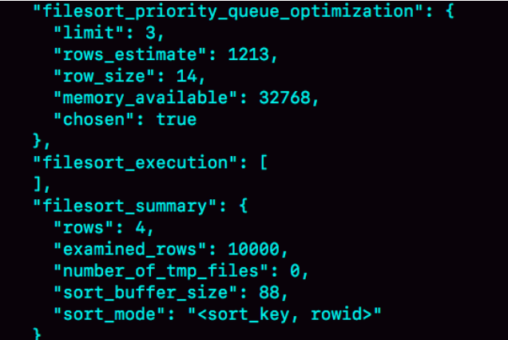

sort_mode里面显示的是rowid排序，这个是符合预期的，参与排序的是随机值R字段和rowid字 段组成的行。排序的是随机值R字段和rowid字段组成的行。

这时候你可能心算了一下，发现不对。R字段存放的随机值就8个字节，rowid是6个字节（至于 为什么是6字节，就留给你课后思考吧），数据总行数是10000，这样算出来就有140000字节， **超过了sort_buffer_size** 定义的 32768字节了。但是，number_of_tmp_files的值居然是0，难道`不需要用临时文件吗`？

采用是MySQL 5.6版本引入的一个新的排序算法，优先队列排序算法（堆排序），只要3个却得到了全部的排序。


为了最快地拿到当前堆的最大值，总是保持最大值在堆顶，因此这是一个最大堆。

filesort_priority_queue_optimization这个部分的 chosen=true，就表示使用了优先队列排序算法，这个过程不需要临时文件，因此对应的 number_of_tmp_files是0。

## 随机排序方法	

### 随机算法1


因为取max(id)和min(id)都是不需要扫描索引的，而第三步的select也可以用 索引快速定位，可以认为就**只扫描了3行**。但实际上，这个算法本身并不严格满足题目的随机要 求，因为ID中间可能有空洞，因此选择不同行的概率不一样，不是真正的随机。

### 随机算法2。


解决了算法1里面明显的概率不均匀问题，总共需要扫描C+Y+1行，

当然，随机算法2跟直接order by rand()比起来，执行代价还是小很多的。

要随机取3个word值呢，是 C+(Y1+1)+(Y2+1)+(Y3+1)

## 小结

如果你直接使用order by rand()，这个语句需要Using temporary和 Using filesort，查询的执行代 价往往是比较大的。所以，在设计的时候你要量避开这种写法。

比较规范的用法就是：尽量将业务逻辑写在业务代码中，让数据库只做“读 写数据”的事情。因此，这类方法的应用还是比较广泛的。

## 问题


```mysql
mysql> select * from t limit N, M-N+1;
```

再加上取整个表总行数的C行，这个方案的扫描行数总共只需要C+M+1行。最小n为0

# 18 | 为什么这些SQL语句逻辑相同，性能却差异巨大？

```mysql
mysql> CREATE TABLE `tradelog` ( 
    `id` int(11) NOT NULL, 
    `tradeid` varchar(32) DEFAULT NULL, 
    `operator` int(11) DEFAULT NULL, 
    `t_modified` datetime DEFAULT NULL,
    PRIMARY KEY (`id`), 
    KEY `tradeid` (`tradeid`), 
    KEY `t_modified` (`t_modified`) 
) ENGINE=InnoDB DEFAULT CHARSET=utf8mb4;
```

## 案例一：条件字段函数操作

要统计发 生在所有年份中7月份的交易记录总数

```
mysql> select count(*) from tradelog where month(t_modified)=7;
```

为什么条件是where t_modified='2018-7-1’的时候可以用上索引，而改成where month(t_modified)=7就不行。

方框上面的数字就是month()函数对应的值。


如果你的SQL语句条件用的是where t_modified='2018-7-1’的话，引擎就会按照上面绿色箭头的 路线，快速定位到 t_modified='2018-7-1’需要的结果。 

实际上，B+树提供的这个快速定位能力，来源于同一层兄弟节点的**有序性**。

**对索引字段做函数操作，可能会破坏索引值的有序性，因此优化器就决定放弃走树搜索功能。**

优化器并不是要放弃使用这个索引。

在这个例子里，放弃了树搜索功能，优化器可以选择遍历主键索引，也可以选择遍历索引 t_modified，优化器**对比索引大小后**发现，索引t_modified**更小**，遍历这个索引比遍历主键索引 来得更快。因此最终还是会选择索引t_modified。


key="t_modified"表示的是，使用了t_modified这个索引；

Extra字段的Using index，表示的 是使用了覆盖索引。

```mysql
mysql> select count(*) from tradelog where
-> (t_modified >= '2016-7-1' and t_modified<'2016-8-1') or
-> (t_modified >= '2017-7-1' and t_modified<'2017-8-1') or
-> (t_modified >= '2018-7-1' and t_modified<'2018-8-1');
```

## 案例二：隐式类型转换

```mysql
mysql> select * from tradelog where tradeid=110717; // 字段为字符串
```

select “10” > 9

1. 如果规则是“将字符串转成数字”，那么就是做数字比较，结果应该是1； 

2. 如果规则是“将数字转成字符串”，那么就是做字符串比较，结果应该是0。

在MySQL 中，字符串和数字做比较的话，是将**字符串**转换成**数字**。

这个语句相当于：

```mysql
mysql> select * from tradelog where CAST(tradid AS signed int) = 110717;
```

规则：对索引字段做函数操作，优化器会放弃走树搜 索功能。

## 案例三：隐式字符编码转换

另外一个表trade_detail，用于记录交易的操作细节。

```mysql
mysql> CREATE TABLE `trade_detail` (
`id` int(11) NOT NULL,
`tradeid` varchar(32) DEFAULT NULL,
`trade_step` int(11) DEFAULT NULL, /*操作步骤*/
`step_info` varchar(32) DEFAULT NULL, /*步骤信息*/
PRIMARY KEY (`id`),
KEY `tradeid` (`tradeid`)
) ENGINE=InnoDB DEFAULT CHARSET=utf8;

```

```mysql
mysql> select d.* from tradelog l, trade_detail d where d.tradeid=l.tradeid and l.id=2; /*语句Q
```


是从tradelog表中取tradeid字段，再去trade_detail表里查询匹配字段。


这两个表的字符集不同，一个是**utf8**，一个是 **utf8mb4**

字符集utf8mb4是utf8的超集，先把utf8字符串转成utf8mb4字符集，需要将被驱动数据表里的字段一个个地转换成utf8mb4

等同于：

```mysql
select * from trade_detail where CONVERT(traideid USING utf8mb4)=$L2.tradeid.value;
```

**对索引字段做函数操作，优化器会放弃走树搜索功能**

方法一：要优化语句

```mysql
alter table trade_detail modify tradeid varchar(32) CHARACTER SET utf8mb4 default null;
```

方法二：我主动把 l.tradeid转成utf8，就避免了被驱动表上的字符编码转换

```mysql
mysql> select d.* from tradelog l , trade_detail d where d.tradeid=CONVERT(l.tradeid USING utf8) and l.id = 2;
```

## 问题

有趣的场景

```mysql
mysql> CREATE TABLE `table_a` (
`id` int(11) NOT NULL,
`b` varchar(10) DEFAULT NULL,
PRIMARY KEY (`id`),
KEY `b` (`b`)
) ENGINE=InnoDB;
```


# 19 | 为什么我只查一行的语句，也执行这么慢？

```mysql
mysql> CREATE TABLE `t` (
`id` int(11) NOT NULL,
`c` int(11) DEFAULT NULL,
PRIMARY KEY (`id`)
) ENGINE=InnoDB;
```

其中有10万行数据的b的值是’1234567890’

```mysql
mysql> select * from table_a where b='1234567890abcd';
```

最理想的情况是，MySQL看到字段b定义的是varchar(10)，那肯定返回空呀。


## 第一类：查询长时间不返回

```mysql
mysql> select * from t where id=1;
```

一般碰到这种情况的话，大概率是表t被锁住了。

`show processlist`查看


### 等MDL锁

这个状态表示的是，现在有一个线程正在表t上请求或者持有MDL写锁，把select语句 堵住了。


这类问题的处理方式，就是找到谁持有MDL写锁，然后把它`kill掉。`


### 等flush


对表做flush操作的用 法，一般有以下两个：

```mysql
flush tables t with read lock;
flush tables with read lock;
```

正常这两个语句执行起来都很快，除非它们也被别的线程堵住了。


每行停一秒，这样这个语句默认要执行10万秒，在这期间表 t一直是被session A“打开”着。然后，session B的flush tables t命令再要去关闭表t，就需要等 session A的查询结束。这样，session C要再次查询的话，就会被flush 命令堵住了。

### 等行锁

经过了表级锁的考验，我们的select 语句终于来到引擎里了。


访问id=1这个记录时要加读锁，如果这时候已经有一个事务在这行记录上持有一个写锁


查出是谁占着这个写锁，sys.innodb_lock_waits 表查到。

```mysql
mysql> select * from t sys.innodb_lock_waits where locked_table=`'test'.'t'`\G
```


而干掉这个罪魁祸首的方式，就是 KILLQUERY 4或KILL 4。

不过，这里不应该显示“KILLQUERY 4”。这个命令表示停止4号线程当前正在执行的语句，而这 个方法其实是没有用的。因为占有行锁的是update语句，这个语句已经是之前执行**完成了的**， 现在执行KILLQUERY，无法让这个事务去掉id=1上的行锁。

KILL 4才有效，也就是说直接**断开这个连接**。这里隐含的一个逻辑就是，连接被断开的 时候，会**自动<font color=red>回滚</font> 这个连接里面正在执行的线程**，也就释放了id=1上的行锁。

## 第二类：查询慢

```mysql
mysql> select * from t where c=50000 limit 1;
```

字段c上没有索引，这个语句只能走id主键顺序扫描，因此需要扫描5万行。

 `set long_query_time=0`，将慢查询日志的时间阈值设置为0。


**坏查询不一定是慢查询**

slow log

```mysql
mysql> select * from t where id=1；
```


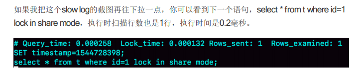


session B更新完100万次，生成了100万个回滚日志(undo log)。

带lock in share mode的SQL语句，是**当前读**

## 小结

执行“查一行”，可能会出现的被锁住和执行慢的例子。这其 中涉及到了表锁、行锁和一致性读的概念。

## 问题

我们在举例加锁读的时候，用的是这个语句，`select *fromt where id=1 lock in share mode`。由于id上有索引，所以可以直接定位到id=1这一行，因此读锁也是只加在了这一行上。 但如果是下面的SQL语句，

```mysql
begin;
	select * from t where c=5 for update;
commit;
```

这个语句序列是怎么加锁的呢？加的锁又是什么时候释放呢？

c没有索引，全表扫描，。有同学的回答中还说明了读提交隔离级别下，在语句执行完 成后，是只有行锁的。而且语句执行完成后，InnoDB就会把不满足条件的行行锁去掉。 当然了，c=5这一行的**行锁**，还是会等到commit的时候才释放的。

# 20 | 幻读是什么，幻读有什么问题？

```mysql
CREATE TABLE `t` (
`id` int(11) NOTNULL,
`c` int(11) DEFAULTNULL,
`d` int(11) DEFAULTNULL,
PRIMARY KEY (`id`),
KEY `c` (`c`)
) ENGINE=InnoDB;

insert into t values(0,0,0),(5,5,5),
(10,10,10),(15,15,15),(20,20,20),(25,25,25);
```

这个表除了主键id外，还有一个索引c，初始化语句在表中插入了6行数据。

## 幻读是什么？

只在id=5这一行加锁，导致binlog不一致


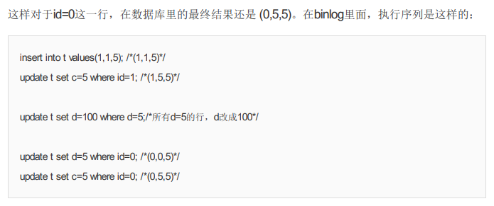

也就是说，即使把所有的记录都加上锁，还是阻止不了**新插入**的记录，这也是为什么“幻读”会被单独拿出来解决的原因。

再看看InnoDB怎么解决幻读的问题？

## 如何解决幻读？

InnoDB只好引入新的锁，也就是间隙锁(Gap Lock)。


行 select *fromt where d=5 for update的时候，就不止是给数据库中已有的6个记 录加上了行锁，还同时加了7个间隙锁。这样就确保了无法再插入新的记录


跟行锁有冲突关系的是“另外一个行锁”。

**跟间隙锁存在冲突关系的，是“往这个间隙中插入一个记录”这个操 作**。间隙锁之间都不存在冲突关系。

间隙锁和行锁合称`next-key lock`，每个next-key lock是前开后闭区间。

如果用select *fromt for update要把整个表所有记录锁起来，就形成了7个next-key lock，分别是 (-∞,0]、(0,5]、(5,10]、(10,15]、(15,20]、(20, 25]、(25, +supremum]。

间隙锁和next-key lock的引入，帮我们解决了幻读的问题，但同时也带来了一些“困扰”。

## 间隙锁的困扰


间隙锁的引入，可能会导致同样的语句锁住更大的范围，这其实是影响了并发度的。

间隙锁是在**可重复读隔离级别**下才会生效的，你如果把隔离级别设置为读提交的话， 就没有间隙锁了。但同时，你要解决可能出现的数据和日志不一致问题，需要把binlog格式设置 为`row`。

业务不需要可重复读的保证，这样考虑到读提交下操作数据的锁范围更小（没有间隙锁），这个选择是合理的

## 问题


这里session B和session C的insert 语句都会进入锁等待状态。

# 21 | 为什么我只改一行的语句，锁这么多？

我总结的加锁规则里面，包含了两个“原则”、两个“优化”和一个“bug”。

1. 原则1：加锁的基本单位是next-key lock。希望你还记得，next-key lock是前开后闭区间。 

2. 原则2：查找过程中访问到的对象才会加锁。

3. 优化1：索引上的**等值**查询，给**唯一**索引加锁的时候，next-key lock退化为行锁。 

   优化2：索引上的**等值**查询，向右遍历时且最后一个值**不**满足等值条件的时候，next-key lock退化为**间隙锁**。 

4. 一个bug：**唯一**索引上的**范围**查询会访问到不满足条件的第一个值为止。

```mysql
CREATE TABLE `t` (
`id` int(11) NOTNULL,
`c` int(11) DEFAULTNULL,
`d` int(11) DEFAULTNULL,
PRIMARY KEY (`id`),
KEY `c` (`c`)
) ENGINE=InnoDB;

insert into t values(0,0,0),(5,5,5),
(10,10,10),(15,15,15),(20,20,20),(25,25,25);
```

## 案例一：等值查询间隙锁

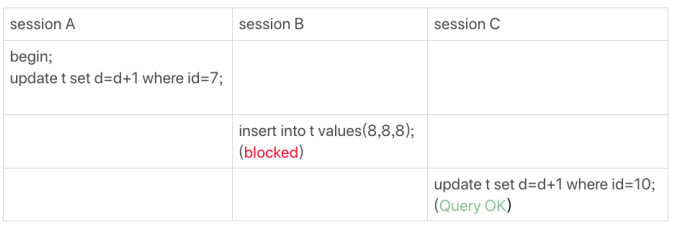


## 案例二：非唯一索引等值锁


- (0,5]加上next-key lock

- 要给(5,10]加next-key lock

- 退化成间隙锁(5,10)。

- 这个查询使用覆盖索引，并不需要访问主键索 引，所以主键索引上没有加任何锁，这就是为什么session B的update语句可以执行完成

Lock in share mode只锁覆盖索引，但是如果是**for update**就不一样 了。 执行 for update时，系统会认为你接下来要更新数据，因此会**顺便给主键索引上满足条件的 行加上行锁。**

## 案例三：主键索引范围锁


行锁id=10和next-key lock(10,15]。

多个bug

## 案例四：非唯一索引范围锁


索引c上的(5,10] 和(10,15] 这两个next-key lock。因为是for update 所以主键索引也加

c< 11 的锁就在(10,15]

因为InnoDB要扫到c=15，才知道不需要继续往后找了。

## 案例五：唯一索引范围锁bug


(10,15],(15,20]这个next-key lock也会被锁上

## 案例六：非唯一索引上存在"等值"的例子

我给表t插入一条新记录。

```mysql
mysql> insert into t values(30,10,30);
```


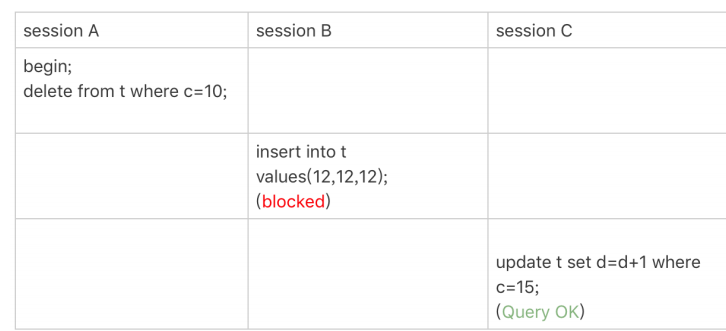


## 案例七：limit 语句加锁


因此在遍历到(c=10, id=30)这一行之 后，满足条件的语句已经有两条，循环就结束了。

**在删除数据的时候尽量加limit**

## 案例八：一个死锁的例子


session B的“加next-key lock(5,10] ”操作，实际上分成了两步，先是加(5,10)的间 隙锁，加锁成功；然后加c=10的行锁

我们在分析加锁规则的时候可以用next-key lock来分析。但是要知道，具体执行的时 候，是要分成**间隙锁和行锁两段来执行**的。

## 小结

limit 的好处

next-key lock实际上是由间隙锁加行锁实现

## 问题


select *from…for update 语句，优化器决定使用全表扫描，那么就会把主键索引上next-key lock全加上。

<=到底是间隙锁还是行锁？其实，这个问题，你要跟“执行过 程”配合起来分析。在InnoDB要去找“第一个值”的时候，是按照等值去找的，用的是等值判断 的规则；找到第一个值以后，要在索引内找“下一个值”，对应于我们规则中说的范围查找。


# 22 | MySQL有哪些“饮鸩止渴”提高性能的方法？

就偶尔会碰上这种场景。用户的开发负责人说，不管你用什么方案， 让业务先跑起来再说。

## 短连接风暴

正常的短连接模式就是连接到数据库后，执行很少的SQL语句就断开，下次需要的时候再重连。如果使用的是短连接，在业务高峰期的时候，就可能出现连接数突然暴涨的情况。

MySQL建立连接的过 程，成本是很高的。除了正常的网络连接三次握手外，还需要做**登录权限判断**和获得这个**连接的 数据读写权限**。

`max_connections`参数，连接数的上限，超过这个值，系统 就会拒绝接下来的连接请求，并报错提示“Too many connections”。**调高**max_connections的值，如果我们把它改得太大，让更 多的连接都可以进来，那么系统的**负载**可能会进一步**加大**，大量的资源耗费在权限验证等逻辑上，结果可能是适得其反，已经连接的线程拿不到CPU资源去执行业务的SQL请求。

### 第一种方法

先处理掉那些占着连接但是不工作的线程

置`wait_timeout`参数表示的是：一个线程空闲wait_timeout这么多秒之后，就会被 MySQL直接断开连接。

踢掉显示为sleep的线程，可能是有损的，下面的例子


而要看事务具体状态的话，你可以查 information_schema库的innodb_trx表。


这个结果里，trx_mysql_thread_id=4，表示id=4的线程还处在事务中。

**因此，如果是连接数过多，你可以优先断开事务外空闲太久的连接；如果这样还不够，再考虑断 开事务内空闲太久的连接。**

### 第二种方法

减少连接过程的消耗。

有的业务代码会在短时间内先大量申请数据库连接做备用，如果现在数据库确认是被连接行为打 挂了，那么一种可能的做法，是让数据库**跳过权限验证阶段**。

风险极高，MySQL 8.0版本里，如果你启用`–skip-grant-tables`参数，MySQL会默认把 --skip-networking参 数打开，表示这时候数据库只能被**本地**的客户端连接。

## 慢查询性能问题

1. 索引没有设计好；
2.  SQL语句没写好； 
3. MySQL选错了索引。

### 导致慢查询的第一种可能是，索引没有设计好。

过紧急创建索引来解决，Online DDL ，对于那种高峰期数据库已经被这个语句打挂了的情况，最高效的做法就是直接执行alter table 语句。

假设你现在的服务是一主一备，主库A、备库B，这个方案的 大致流程是这样的：


gh-ost这样的方案，更加稳 妥。但是在需要紧急处理时，上面这个方案的效率是最高的。

### 导致慢查询的第二种可能是，语句没写好。

我们可以通过改写SQL语句来处理。MySQL 5.7提供了query_rewrite功能，可以把输入的 一种语句改写成另外一种模式。

select *fromt where id + 1 = 10000，

```mysql
mysql> insert into query_rewrite.rewrite_rules(pattern, replacement, pattern_database) values ("select * from t where id + 1 = ?", "select * from t where id = ? - 1", "db1"); call query_rewrite.flush_rewrite_rules();
```


### MySQL选错了索引

这时候，应急方案就是给这个语句加上force index。

果是新项目的话，或者是修改了原有项目的 表结构设计，全量回归测试都是必要的。这时候，你需要工具帮你检查所有的SQL语句的返回结 果。比如，你可以使用开源工具pt-query-digest(https://www.percona.com/doc/perconatoolkit/3.0/pt-query-digest.html)

## QPS突增问题

由一个新功能的bug导致的

- 一种是由全新业务的bug导致的。假设你的DB运维是比较规范的，也就是说白名单是一个个 加的。这种情况下，如果你能够确定业务方会下掉这个功能，只是时间上没那么快，那么就 可以从数据库端直接把白名单去掉。

- 如果这个新功能使用的是单独的数据库用户，可以用管理员账号把这个用户删掉，然后断开 现有连接。这样，这个新功能的连接不成功，由它引发的QPS就会变成0。
- 查询重写功能，把压力最大的SQL语句直接重写成"select 1"返 回。

## 小结

这些处理手段中，既包括了粗暴地拒绝连接和断开连接，也有通过重写语句来绕过一些坑的方 法；既有临时的高危方案，也有未雨绸缪的、相对安全的预案。 

在实际开发中，我们也要尽量避免一些低效的方法，比如避免大量地使用短连接。同时，如果你做业务开发的话，要知道，连接异常断开是常有的事，你的代码里要有正确地**重连并重试的机制**。

 DBA虽然可以通过语句重写来暂时处理问题，但是这本身是一个风险高的操作，做好SQL审计 可以减少需要这类操作的机会。 其实，你可以看得出来，在这篇文章中我提到的解决方法主要集中在**server层。**

## 问题

今天，我留给你的课后问题是，你是否碰到过，在业务高峰期需要临时救火的场景？你又是怎么 处理的呢？


# 23 | MySQL是怎么保证数据不丢的？

只要redo log和binlog保证持久化到磁盘，就 能确保MySQL异常重启后，数据可以恢复。

## binlog的写入机制

事务执行过程中，先把日志写到`binlog cache`，事务提交的 时候，再把binlog cache写到binlog文件中。

一个事务的binlog是不能被拆开的，

 binlog_cache_size用于控制单个线程 内binlog cache所占内存的大小，超过了，就要暂存到磁盘。

事务提交的时候，执行器把binlog cache里的完整事务写入到binlog中，并清空binlog cache

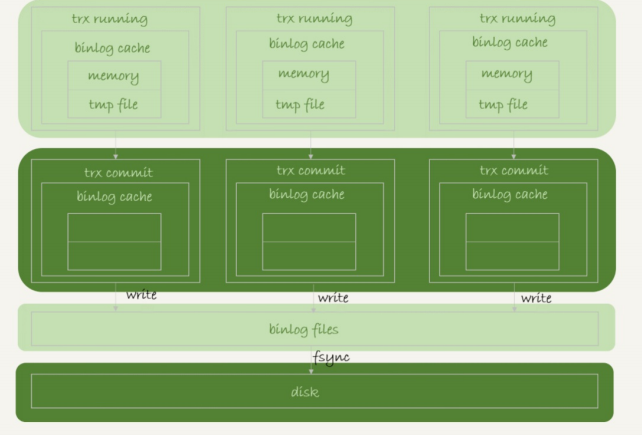

- 图中的**write**，指的就是指把日志写入到文件系统的page cache，并没有把数据持久化到磁 盘，所以速度比较快。 

-  图中的**fsync**，才是将数据持久化到磁盘的操作。一般情况下，我们认为fsync才占磁盘的 IOPS。

write 和fsync的时机，是由参数sync_binlog控制的：

1. sync_binlog=**0**的时候，表示每次提交事务都只write，**不**fsync； 
2. sync_binlog=**1**的时候，表示**每次**提交事务都会执行fsync； 
3. sync_binlog=**N(N>1)**的时候，表示每次提交事务都write，但累积N个事务后才fsync。

在出现IO瓶颈的场景里，设置为100~1000中的某个数值。

## redo log的写入机制

事务在执行过程中，生成的redo log是要先写到redo log buffer的。


nnoDB有一个**后台线程**，每隔1秒，就会把redo log buffer中的日志，调用write写到文件系统的 page cache，然后调用fsync持久化到磁盘。

一个没有提交的事务的redo log，也是可能已经持久化到磁 盘的。

除了后台线程每秒一次的轮询操作外，还有两种场景会让一个没有提交的事务的redo log写入到磁盘中。

- 一种是，redo log buffer占用的空间即将达到 **innodb_log_buffer_size一半**的时候， 后台线程会主动写盘。写盘动作只是write，而 没有调用fsync，也就是只留在了文件系统的**page cache**。


- 另一种是，并行的事务提交的时候，**顺带**将这个事务的redo log buffer持久化到磁 盘。

两阶段提交的时候说过，时序上redo log先prepare， 再写binlog， 最后再把redo log commit。

把`innodb_flush_log_at_trx_commit`设置成1，那么redo log在prepare阶段就要**持久化一次**， 因为有一个崩溃恢复逻辑是要依赖于prepare 的redo log，再加上binlog来恢复的。

说MySQL的“双1”配置，指的就是`sync_binlog`和`innodb_flush_log_at_trx_commit`都设 置成 1。也就是说，一个事务完整提交前，需要等待两次刷盘，一次是redo log（prepare 阶 段），一次是binlog。

## 组提交（group commit）机制

TPS是每秒两万的话，每秒就会写四 万次磁盘。但是，我用工具测试出来，磁盘能力也就两万左右，怎么能实现两万的TPS？

日志逻辑序列号（log sequence number，LSN）的概念。LSN是单调 递增的，用来对应**redo log**的一个个**写入点**。每次写入长度为**length**的redo log， LSN的值就会加 上length。

LSN也会写到InnoDB的数据页中，来确保数据页不会被多次执行重复的redo log。

三个并发事务(trx1, trx2, trx3)在prepare 阶段，都写完redo log buffer，LSN分别是50、120 和160。

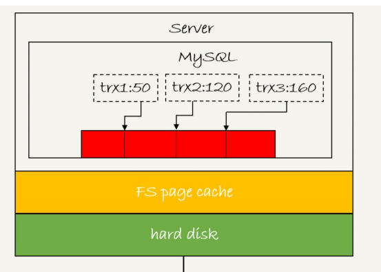


一次**组提交**里面，组员越多，节约磁盘IOPS的效果越好

第一个事务写完redo log buffer以后，接下来这个fsync越晚调用，组员可能 越多，节约IOPS的效果就越好。

MySQL有一个很有趣的优化：拖时间


不过通常情况下第3步执行得会很快，所以binlog的write和fsync间的间隔时间短，导致能集合到 一起持久化的binlog比较少，因此binlog的组提交的效果通常不如redo log的效果那么好。

想提升binlog组提交的效果，可以通过设置 binlog_group_commit_sync_delay和 binlog_group_commit_sync_no_delay_count来实现。


## WAL机制主要得益于两个方面：

1. redo log 和 binlog都是顺序写，磁盘的**顺序写**比随机写速度要快；

2. **组提交**机制，可以大幅度降低磁盘的IOPS消耗。

MySQL现在出现了性能瓶颈，而且瓶颈在IO 上，可以通过哪些方法来提升性能呢？

针对这个问题，可以考虑以下三种方法： 

1. 设置 binlog_group_commit_sync_delay和 binlog_group_commit_sync_no_delay_count参 数，**减少binlog的写盘次数**。这个方法是基于“额外的故意等待”来实现的，因此可能会增加语句的**响应时间**，但没有丢失数据的风险。 

2. 将sync_binlog 设置为大于1的值（比较常见是100~1000）。这样做的风险是，主机掉电时 会丢binlog日志。 

3. 将innodb_flush_log_at_trx_commit设置为2。这样做的风险是，主机掉电的时候会丢数据。 

   

我不建议你把innodb_flush_log_at_trx_commit 设置成0。因为把这个参数设置成0，表示redo log只保存在内存中，这样的话MySQL本身异常重启也会丢数据，风险太大。

而redo log写到文 件系统的page cache的速度也是很快的，所以将这个参数设置成2跟设置成0其实性能差不多， 但这样做MySQL异常重启时就不会丢数据了，相比之下风险会更小。

## 小结

update语句执行完成后，InnoDB只保证写完了redo log、内存，可能还没来得及将数据写到磁盘。

为什么binlog cache是每个线程自己维护的，而redo log buffer是全局共用的？

binlog是不能“被打断的”。一个事务的binlog必须连续 写，因此要整个事务完成后，再一起写到文件里。redo是数据page，所以可以一起

## 问题

你的生产库设置的是“双1”吗？ 如果平时是的话，你有在什么场景下 改成过“非双1”吗？你的这个操作又是基于什么决定的？


# 24 | MySQL是怎么保证主备一致的？

## MySQL主备的基本原理


在状态1中，虽然节点B没有被直接访问，但是我依然建议你把节点B（也就是备库）设置成只读 （readonly）模式


### 节点A到B这条线的内部流程是什么样的。


主库A内部有一个线程，专门用于服务备库B的这个长连接。一个事务日志同步的完整过程是这样的：


后来由于多线程复制方案的引入，sql_thread演化成为了多个线程

## binlog的三种格式对比

```mysql
mysql> show binlog events in 'master.000001';
```

查看binlog

### statement

binlog里面记录的就是SQL语句的原文


为了说明statement 和 row格式的区别，我们来看一下这条delete命令的执行效果图：


运行这条delete命令产生了一个warning，原因是当前binlog设置的是`statement`格 式，并且语句中有limit，所以这个命令可能是unsafe的。

在**主库** 执行这条SQL语句的时候，用的是**索引a**；而在**备库**执行这条SQL语句的时候，却使用了**索引 t_modified**。因此，MySQL认为这样写是有风险的。

### row


row格式 的binlog里没有了SQL语句的原文，而是替换成了两个event：Table_map和Delete_rows。

1. Table_map event，用于说明接下来要操作的表是test库的表t; 
2. Delete_rows event，用于定义删除的行为。

还需要借助`mysqlbinlog`工具，

```mysql
mysqlbinlog -vvdata/master.000001 --start-position=8900;
```


### mixed

- statement格式的binlog可能会导致主备不一致，

- row格式的缺点是，很占空间

- MySQL自己会判断这条SQL语句是否可能引起主备不一致

现在越来越多的场景要求把MySQL的binlog格式设置成row。

好处：**恢复数据**。


MariaDB的`Flashback`工具就是基于上面介绍的原理来回滚数据的。

```mysql
mysql> insert into t values(10,10, now());
```


居然是statement格式

再用mysqlbinlog工具来看看：


多记了一条命令：SET TIMESTAMP=1546103491。不论这个binlog是1分钟之后被备库执行，还是3天后用来恢复这个库的备份，这个insert 语句插入的行，值都是固定的。

所以，用binlog来恢复数据的标准做法是，用 mysqlbinlog工具解析出来，然后把解析结果整个发 给MySQL执行。

## 循环复制问题

图1中我画的是M-S结构，但实际生产上使用比较多的是双M结构


其实区别只是多了一条线，即：节点A和B 之间总是互为主备关系。这样在切换的时候就不用再修改主备关系。


## 小结

## 问题

我们说MySQL通过判断server id的方式，断掉死循环。但是，这个机 制其实并不完备，在某些场景下，还是有可能出现死循环。

- 在一个主库更新事务后，用命令set global server_id=x修改了server_id。等日志再传回来的时候，发现server_id跟自己的server_id不同，就只能执行了。
- trx1是在节点 B执行的，因此binlog上的 server_id就是B，binlog传给节点 A，然后A和A’搭建了双M结构，就会出现循环复制


# 25 | MySQL是怎么保证高可用的？


## 主备延迟

备库B执行完成 - A写入binlog =主备延迟

`show slave status`, seconds_behind_master，用于表示当前备库延迟了多少秒

计算方法:


主备延迟最直接的表现是，备库消费中转日志（relay log）的速度，比主库生产binlog 的速度要慢。

## 主备延迟的来

**备库所在机器的性能要比主库所在的机器性能差。**

所以，做这种部署 时，一般都会将备库设置为“非双1”的模式。

这种部署现在比较少了。因为主备可能发生切换，备库随时可能变成主库，所以主备库选 用相同规格的机器，并且做**对称部署**，是现在比较常见的情况。

### 做了对称部署以后，还可能会有延迟。这是为什么呢？

**第二种常见的可能了，即备库的压力大**

- **一主多从**。除了备库外，可以多接几个从库，让这些从库来分担读的压力
- 通过binlog输出到外部系统，比如Hadoop这类系统，让外部系统提供统计类查询的能力


### 这就是第三种可能了，即大事务。

因为主库上必须等事务执行完成才会写入binlog，再传给备库

不要**一次性**地用delete语句删除太多数据

一些归档类的数据，平时没有注意删除历史数据，所以会在晚上执行这些大量数据的删除操作。

另一种典型的大事务场景，就是**大表DDL**

处理方案 就是，计划内的DDL，建议使用gh-ost方案

### 如果主库上也不做大事务了，还有什么原因会导致主备延迟吗？

**备库的并行复制能力**

由于主备延迟的存在，所以在主备切换的时候，就相应的有不同的策略。

## 主备切换策略

### 可靠性优先策略


步骤2之后--->步骤5 是不可写的状态

### 可用性优先策略

可用性优先策略，且binlog_format=mixed时


主库A和备库B上出现了两行不一致的数据。

可用性优先策略，但设置`binlog_format=row，`


1. 使用row格式的binlog时，数据不一致的问题更容易被发现

2. 主备切换的可用性优先策略会导致数据不一致


有没有哪种情况数据的可用性优先级更高呢？

记录操作日志


### 可靠性，异常切换

主库A和备库B间的主备延迟是30分钟，这时候主库A掉电了，HA系统要切换B作为主 库。我们在主动切换的时候，可以等到主备延迟小于5秒的时候再启动切换，但这时候已经别无 选择了。


采用可靠性优先策略的话，你就必须得等到备库B的seconds_behind_master=0之后，才能切 换。。但现在的情况比刚刚更严重，并不是系统只读、不可写的问题了，而是系统处于完全不可用 的状态。因为，主库A掉电后，我们的连接还没有切到备库B。


## 小结

介绍了MySQL高可用系统的基础，就是主备切换逻辑。几种会导致主备延迟的情况，以及相应的改进方向。

## 问题

一般现在的数据库运维系统都有备库延迟监控，其实就是在备库上执行 show slave status，采集 seconds_behind_master的值。


什么情况？


# 26 | 备库为什么会延迟好几个小时？

备库并行复制能力。


我们要关注的是图中黑色的两个箭头。一个箭头代表了客户端写入主 库，另一箭头代表的是备库上sql_thread执行中转日志（relay log）。

在官方的5.6版本之前，MySQL只支持**单线程复制**，由此在主库并发高、TPS高时就会出现严重 的主备延迟问题。

其实说到底，所有的**多线程复制**机制，都是要把图1中只有一个线程的sql_thread，拆成多个线 程，也就是都符合下面的这个模型：


work线程的个数，就是由参数 slave_parallel_workers决定的。根据我的经验，把这个值设置为8~16之间最好，（32核物理机的 情况），毕竟备库还有可能要提供读查询，不能把CPU都吃光了。

coordinator在分发的时候，需要满足以下这**两个基本要求**：

1. 不能造成更新覆盖。这就要求更新同一行的两个事务，必须被分发到同一个worker中。
2.  同一个事务不能被拆开，必须放到同一个worker中。

**没写完**


# 27 | 主库出问题了，从库怎么办？


虚线箭头表示的是主备关系，也就是A和A’互为主备， 从库B、C、D指向的是主库A。一 主多从的设置

## 基于位点的主备切换(主发)

节点B设置成节点A’的从库，需要执行一条change master命令

```mysql
CHANGE MASTER TO
MASTER_HOST=$host_name
MASTER_PORT=$port
MASTER_USER=$user_name
MASTER_PASSWORD=$password
MASTER_LOG_FILE=$master_log_name
MASTER_LOG_POS=$master_log_pos
```

最后两个参数**主库**对应的**文件名**和**日志偏移量**。


```mysql
mysqlbinlog File --stop-datetime=T --start-datetime=T
```


end_log_pos后面的值“123”，表示的就是A’这个实例，在T时刻写入新的binlog的位置。 然后，我们就可以把123这个值作为$master_log_pos ，用在节点B的change master命令里。


两个都执行了，发生主键冲突

### 一种做法是

主动跳过一个事务。跳过命令的写法是：

```mysql
set global sql_slave_skip_counter=1;
start slave;
```

### 另外一种方式是

通过设置slave_skip_errors参数，直接设置跳过指定的错误。


## GTID

MySQL 5.6 版本引入了GTID，彻底解决了这两种操作都很复杂，而且容易出错

GTID的全称是Global Transaction Identifier，也就是全局事务IDD，是一个事务在**提交**的时候生成 的，是这个事务的唯一标识。它由两部分组成，格式是：

```
GTID=source_id:transaction_id
```

实例第一次启动时自动生成的，是一个全局唯一的值

gno是一个整数，初始值是1，每次提交事务的时候分配给这个事务，并加1。

MySQL里面我们说transaction_id就是指事务id，事务id是在事务**执行过程**中分配的，如 果这个事务回滚了，事务id也会递增，而这个是在事务**提交**的时候才会分配。

### GTID模式的启动

启动一个MySQL实例的时候，加上参数gtid_mode=on 和enforce_gtid_consistency=on

### GTID有两种生成方式

取决于session变量gtid_next的值


每个MySQL实例都维护了**一个GTID集合**，用来对应“这个实例执行过的所有事务”。


实例X是另外一个实例Y的从库，并且此时在实例Y上执行了下面这条插入语句：

```mysql
insert into t values(1,1);
```

在实例Y上的GTID是 “aaaaaaaa-cccc-dddd-eeee-ffffffffffff:10”

实例X作为Y的从库，就要同步这个事务过来执行，显然会出现**主键冲突**，导致实例X的同 步线程停止。这时，我们应该怎么处理呢？


可以看到实例X的Executed_Gtid_set里面，已经加入了这个GTID。

## 基于GTID的主备切换(备发)

### 主备场景

**备库B**要设置为**新主库A’**的从库的语法如下：

```mysql
CHANGE MASTER TO
MASTER_HOST=$host_name
MASTER_PORT=$port
MASTER_USER=$user_name
MASTER_PASSWORD=$password
master_auto_position=1 // GTID协议
```


**必须保证主库发给备库的日志是完整的**

这跟基于位点的主备协议不同。基于位点的协议，是由备库决定的，备库指定哪个位点，主库就 发哪个位点，**不做日志的完整性判断**。

### 一主多从的切换场景下

由于不需要找位点了，所以从库B、C、D只需要**分别执行**change master命令指向实例A’即可。

主库A’的自己生成的binlog中的GTID集合格式是： server_uuid_of_A’:1-M。

之前从库B的GTID集合格式是 server_uuid_of_A:1-N，切换之后，变 成了server_uuid_of_A:1-N, server_uuid_of_A’:1-M

## GTID和在线DDL

当前主库是X，并且都打开了GTID模 式。这时的主备切换流程可以变成下面这样：

- 在实例X上执行stop slave。
-  在实例Y上执行DDL语句。注意，这里并不需要关闭binlog。 
- 执行完成后，查出这个DDL语句对应的GTID，并记为 server_uuid_of_Y:gno。
-  到实例X上执行以下语句序列：

```mysql
set GTID_NEXT="server_uuid_of_Y:gno";
begin;
commit;
set gtid_next=automatic;
start slave;
```

- 实例Y的更新有binlog记录，同时也可以确保不会在实例X上执行这
  条更新。


实例Y的更新有binlog记录，同时也可以确保不会在实例X上执行这 条更新。

## 小结

你介绍了一主多从的主备切换流程，介绍了GTID的基本概念 和用法。

## 问题

你在GTID模式下设置主从关系的时候，从库执行start slave命令后，主库发现**需要的binlog已经 被删除掉**了，导致主备创建不成功。这种情况下，你觉得可以怎么处理呢？

# 28 | 读写分离有哪些坑？


## 怎么处理过期读

- 强制走主库方案； 
- sleep方案； 
- 判断主备无延迟方案；
-  配合semi-sync方案； 
- 等主库位点方案；
-  等GTID方案。

### 强制走主库方案

“所有查询都不能是过期读”的需求，比如一些 金融类的业务。这样的话，你就要放弃读写分离

### Sleep 方案

主库更新后，读从库之前先sleep一下。类似于执行一条select sleep(1)命令。

为了看起来更靠谱儿，我们可以换一种方式。

商品发布后，用Ajax（Asynchronous JavaScript +XML，异步JavaScript 和XML）直接把客户端输入的内容作为“新的商品”显**示在页面上**，而不是真正地去数据库做查 询。

### 判断主备无延迟方案

我们知道`show slave status`结果里的seconds_behind_master参数的 值，可以用来衡量主备延迟时间的长短。


#### **第一种确保主备无延迟的方法是**：

每次从库执行查询请求前，先判断 **seconds_behind_master**==**等于0**。如果还不等于0 ，那就必须等到这个参数变为0才能执行查询请求。

#### **第二种方法，对比位点确保主备无延迟**：


#### 第三种方法，对比GTID集合确保主备无延迟：


对比位点和对比GTID这两种方法，都要比判断seconds_behind_master是否为0更准确。

在执行查询请求之前，先判断从库是否同步完成的方法，相比于sleep方案，准确度确实提升了 不少，但还是没有达到“精确”的程度。为什么这么说呢？


如果这时候你在从库B上执行查询请求，按照我们上面的逻辑，从库认为已经**没有同步延迟**，但 还是**查不到trx3**的。严格地说，就是出现了过期读。

### 配合semi-sync


有同学问到：如果主库掉电的时候，有些binlog还来不及发给从库，会 不会导致系统数据丢失？

semi-sync配合前面关于位点的判断

但是，semi-sync+位点判断的方案，只对**一主一备**的场景是成立的。

另外一个潜在的问题：业务更新的高峰期，主库的位 点或者GTID集合更新很快，那么上面的两个位点等值判断就会一直不成立，很可能出现从库上 迟迟无法响应查询请求的情况。


其实 并不需要等到“主备完全同步”。

semi-sync配合判断主备无延迟的方案，存在两个问题：

- 一主多从的时候，在某些从库执行查询请求会存在过期读的现象；

- 在持续延迟的情况下，可能出现过度等待的问题。

### 等主库位点方案

```mysql
select master_pos_wait(file, pos[, timeout]);
```

1. 它是在从库执行的；

2. 参数file和pos指的是主库上的文件名和位置；

3. timeout可选，设置为正整数N表示这个函数最多等待N秒。


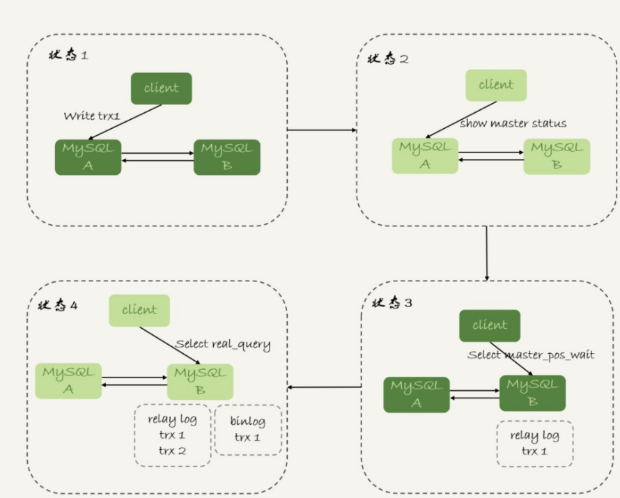

按照我们设定不允许过期读的要求，就只有两种选择，一种是超时放弃，一种是转到主库 查询。具体怎么选择，就需要业务开发同学做好**限流策略了**。

### GTID方案

```mysql
select wait_for_executed_gtid_set(gtid_set, 1);
```


在前面等位点的方案中，我们执行完事务后，还要**主动去主库**执行show master status。而 MySQL 5.7.6版本开始，允许在执行完更新类事务后，把这个事务的GTID返回给客户端，这样 等GTID的方案就可以**减少一次查询**。


trx1事务更新完成后，从返回包直接获取这个事务的GTID

将参数`session_track_gtids`设置为**OWN_GTID**，然后通过API接口 `mysql_session_track_get_first`从返回包解析出GTID的值即可。

MySQL并没有提供这类接口的SQL用法，是提供给程序的 API

为了让客户端在事务提交后，返回的GITD能够在客户端显示出来，我对MySQL客户端代 码做了点修改，


## 小结

即使是最后等待位点和等待GTID这两个方案，虽然看上去比较靠谱儿，但仍然存在需要权衡的 情况。如果所有的从库都延迟，那么请求就会全部落到主库上，这时候会不会由于压力突然增 大，把主库打挂了呢？

但话说回来，过期读在本质上是由一写多读导致的。在实际应用中，可能会有别的不需要等待就可以水平扩展的数据库方案，但这往往是用牺牲写性能换来的，也就是需要在读性能和写性能中取权衡。

## 问题

GTID的方案，现在你要对主库的 一张大表做DDL，可能会出现什么情况呢？为了避免这种情况，你会怎么做呢？

这条语句在主库上要执行10分钟，提交后传到备库就要10分钟（典型的大事务）。

那 么，在主库DDL之后再提交的事务的GTID，去备库查的时候，就会等10分钟才出现。 这样，这个读写分离机制在这10分钟之内都会超时，然后走主库。 

这种预期内的操作，应该在业务**低峰期**的时候，确保主库能够支持所有业务查询，然后把读请求都切到主库，再在主库上做DDL。等备库延迟追上以后，再把读请求切回备库。

使用gh-ost方案来解决这个问题也是不错的选择。

# 29 | 如何判断一个数据库是不是出问题了？

执行个select 1就好了

## select 1判断

只能说明这个库的进程还在，并不能说明主库没问题。

```mysql
set global innodb_thread_concurrency=3
```


控制InnoDB的并发线程上限。

session D里面，select 1是能执行成功的，但是查询表t的语句会被堵住。也就是 说，如果这时候我们用select 1来检测实例是否正常的话，是检测不出问题的。

innodb_thread_concurrency设置为64~128之间的值。这时，你 一定会有疑问，并发线程上限数设置为128够干啥，线上的并发连接数动不动就上千了。

**并发连接和并发查询。**showprocesslist的结果里，看到的几千个连 接，指的就是并发连接。而“**当前正在执行**”的语句，才是我们所说的并发查询。

这也是为什么我们需要设置innodb_thread_concurrency参数的原 因。

**在线程进入锁等待以后，并发线程的计数会减一**，也就是说等行锁（也包括间隙 锁）的线程是不算在128里面的。

因为，进入锁等待的线程已经不吃CPU了；


由于所有线程都处于等待状态，此 时占用的CPU却是0，而这明显不合理。所以，我们说InnoDB在设计时，遇到进程进入锁等待的 情况时，将并发线程的计数减1的设计，是合理而且是必要的。

## 查表判断

```
mysql> select * from mysql.health_check;
```

下一个问题，即：空间满了以后，这种方法又会变得不好使。

更新事务要写binlog，而一旦binlog所在磁盘的空间占用率达到100%

## 更新判断

```
mysql> update mysql.health_check set t_modified=now()
```

把数据库A和B的主备关系设计为双M结构， 所以在备库B上执行的检测命令，也要发回给主库A

主库A和备库B都用相同的更新命令，就可能出现行冲突

为了让主备之间的更新不产生冲突，我们可以在mysql.health_check表上存入多行数据，并用 A、B的server_id做主键。

更新判断是一个相对比较常用的方案了，不过依然存在一些问题。其中，“判定慢”一直是让DBA 头疼的问题。

IO利用率100%表示系统的IO是在工作的，**每个请求都有机会获得IO**资源，执行 自己的任务。而我们的检测使用的update命令，需要的资源很少，所以可能在拿到IO资源的时 候就可以提交成功，并且在超时时间N秒未到达之前就返回给了检测系统。

## 内部统计

内部每一次IO请求的时间，那我们判断 数据库是否出问题的方法就可靠得多了。

，MySQL 5.6版本以后提供的performance_schema库，就在file_summary_by_event_name 表里统计了每次IO请求的时间。

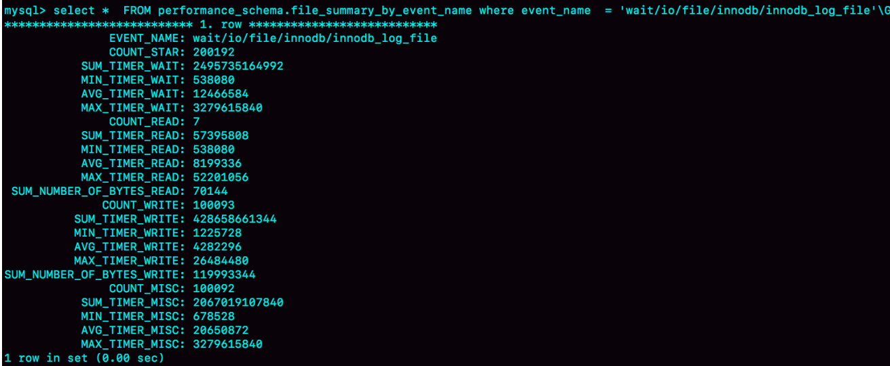

详情看原文

## 小结

我个人比较倾向的方案，是优先考虑update系统表，然后再配合增加检测performance_schema 的信息。

## 问题

今天，我想问你的是：业务系统一般也有高可用的需求，在你开发和维护过的服务中，你是怎么 判断服务有没有出问题的呢

于服务状态和服务质量的监控

**状态**的监控，一般都可以用**外部系统**来实现；而服务的**质量**的监控，就要通过**接口**的**响应时间**来统计。

了healthCheck来检测，其实跟我们文中提到的select 1的模 式类似。

# 30 | 答疑文章（二）：用动态的观点看加锁

## 复习一下加锁规则


```mysql
CREATE TABLE `t` (
`id` int(11) NOTNULL,
`c` int(11) DEFAULTNULL,
`d` int(11) DEFAULTNULL,
PRIMARY KEY (`id`),
KEY `c` (`c`)
) ENGINE=InnoDB;

insert into t values(0,0,0),(5,5,5),
(10,10,10),(15,15,15),(20,20,20),(25,25,25);
```

## 不等号条件里的等值查询

```mysql
begin; 
select * from t where id>9 and id<12 order by id desc for update;
```

主键索引上的 (0,5]、(5,10]和(10, 15)

id=15这一行，并没有被加上行锁，为什么呢？用到了优化2


通过**树搜索的方式**定位记录的时候，用的是“等值查询”的方法。

重要是：desc ，12要定位，是等值

## 等值查询的过程

```mysql
begin;
select id from t where c in(5,20,10) lock in share mode;
```

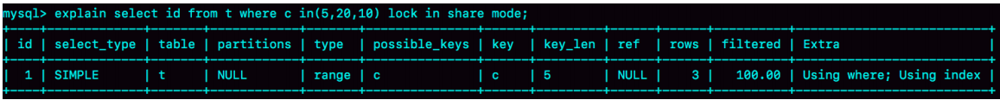

这条in语句使用了索引c并且rows=3，说明这三个值都是通过**B+树搜索定位**的。


**从(5,25)中去掉c=15的行锁**

**强调**这个过程：这些锁是“在执行过程中一个一个加的”，而不是一次性加上去的。

理解了这个加锁过程之后，我们就可以来分析下面例子中的死锁问题了

如果同时有另外一个语句，是这么写的：

```mysql
select id from t where c in(5,20,10) order by c desc for update;
```


## 怎么看死锁？

执行`show engine innodb status`命令

有一节LATESTDETECTED DEADLOCK，就是记录的最后一次死锁信息。


1. 这个结果分成三部分： 

   - (1) TRANSACTION，是第一个事务的信息；

   -  (2) TRANSACTION，是第二个事务的信息；

   -  WE ROLL BACKTRANSACTION(1)，是最终的处理结果，表示回滚了第一个事务。

2. 第一个事务的信息中：


## 怎么看锁等待？


此时`show engine innodb status`的结果


## update的例子


session A的加锁范围是索引c上的 (5,10]、(10,15]、(15,20]、(20,25]和 (25,supremum]。


## 小结

分析加锁范围时，一定要配合语句执行逻辑来进行

介绍了怎么看showengine innodb status输出结果 中的事务信息和死锁信息

上面我们提到一个很重要的点：所谓“间隙”，其实根本就是由“这个间隙右边的那个记录”定义 的。

## 问题

一个空表有间隙吗？这个间隙是由谁定义的？你怎么验证这个结论呢？

```
begin;
select * from t where id>1 for update;
```

加锁的范围就是next-key lock (-∞, supremum]。

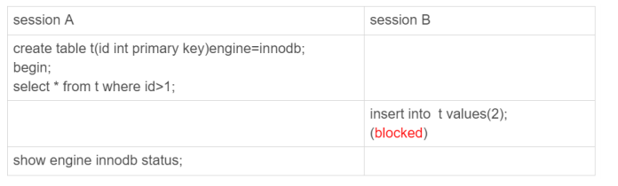


# 31 | 误删数据后除了跑路，还能怎么办？

和MySQL相关的误删数据，做下分类：

1. 使用delete语句误删数据**行**； 
2. 使用drop table或者truncate table语句误删数据**表**；
3. 使用drop database语句误删数据**库**；
4.  使用rm命令误删整个MySQL**实例**。

## 行

Flashback工具通过闪 回把数据恢复回来。

原理：修改binlog的内容,然后重放

前提：需要确保binlog_format=row和 binlog_row_image=FULL。

**需要说明的是，我不建议你直接在主库上执行这些操作。**

数据状态的变更往往是有关联的。

我们不止要说误删数据的事后处理办法，更重要是要做到事前预防。

1.  把`sql_safe_updates`参数设置为on。这样一来，如果我们忘记在delete或者update语句中写 where条件，或者where条件里面没有包含索引字段的话，这条语句的执行就会报错。
2. . 代码上线前，必须经过SQL审计。

binlog里面就只有一个truncate/drop 语句，这些信息是**恢复不出**数据的。执行这三个命令时，记录的binlog还是 statement格式。用truncate /drop table和drop database，下面有个方案

## 误删库/表

要想恢复数据，就需要使用全量备份，加增量日志的方式了。


1. 可以在使用mysqlbinlog命令时，加 上一个–database参数，用来指定误删表所在的库。

2. 在应用日志的时候，需要跳过误操作的binlog：

   

使用mysqlbinlog方法恢复数据还是不够快，主要原因有两个：

1. 如果是误删表，最好就是只恢复出这张表，也就是只重放这张表的操作，但是mysqlbinlog工 具并**不能**指定只**解析一个表**的日志；
2. 用mysqlbinlog解析出日志应用，应用日志的过程就只能是单线程。我们在第26篇文章中介 绍的那些并行复制的方法，在这里都**用不上**。

**一种加速的方法是**

用备份恢复出临时实例，个临时实例设置成线上备库的从库


## 延迟复制备库

延迟复制的备库是一种特殊的备库，通过 CHANGE MASTER TOMASTER_DELAY =N命令， 可以指定这个备库持续保持跟主库有N秒的延迟。

把N设置为3600，这就代表了如果主库上有数据被误删了，并且在1小时内发现了这个误 操作命令，这个命令就还没有在这个延迟复制的备库执行。这时候到这个备库上执行stop slave，再通过之前介绍的方法，跳过误操作命令，就可以恢复出需要的数据。

## 预防误删库/表的方法

第一条建议是：账号分离。

只给业务开发同学DML权限，而不给truncate/drop权限，有DDL需 求的话，也可以通过开发管理系统得到支持

第二条建议是：制定操作规范

在删除数据表之前，必须先对表做改名操作。然后，观察一段时间，确保对业务无影响以后 再删除这张表。

改表名的时候，要求给表名加固定的后缀（比如加_to_be_deleted)，然后删除表的动作必须 通过管理系统执行。并且，管理系删除表的时候，只能删除固定后缀的表。

## rm删除数据

MySQL集群来说，最不怕的就是rm删除数据了


## 问题

回忆下你亲身经历过的误删数据事件吧，你用了什么方法来恢复数据呢？你 在这个过程中得到的经验又是什么呢？

# 32 | 为什么还有kill不掉的语句？

有两个kill命令：

一个是`kill query+线程id`，表示终止这个线程中正在执行的语句；

一 个是`kill connection +线程id`，这里connection可**缺省**，表示断开这个线程的**连接**，当然如果这个线程有语句正在执行，也是要先停止正在执行的语句的。

## 收到kill以后，线程做什么？


