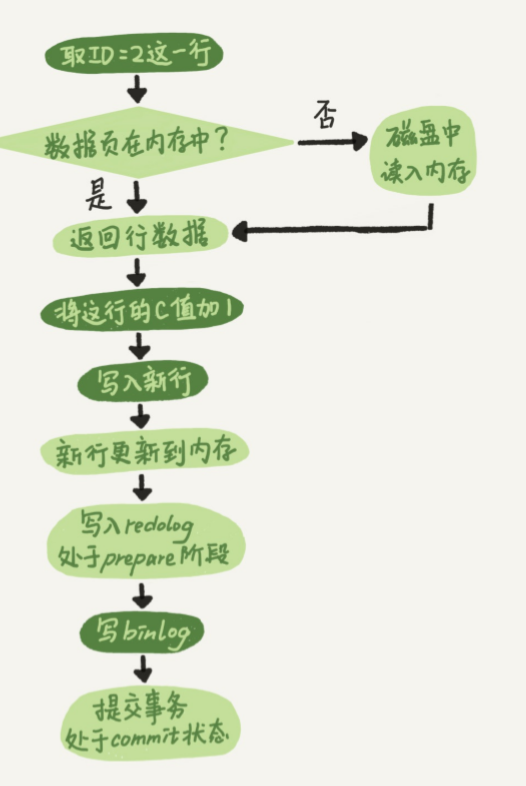
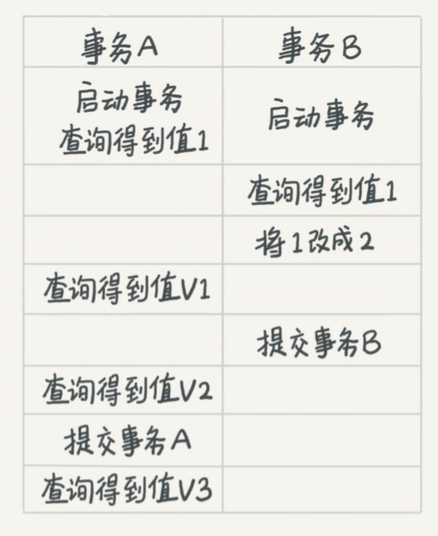

# 01 | 基础架构：查询的执行


MySQL可以分为**Server层**和**存储引擎**层两部分

Server层包括连接器、查询缓存、分析器、优化器、执行器等，涵盖MySQL的大多数核心服务 功能，以及所有的内置函数（如日期、时间、数学和加密函数等），所有跨存储引擎的功能都在这一层实现，比如存储过程、触发器、视图等。

## 连接器   

### 内容

负责跟客户端**建立连接**、获取**权限**、**维持**和**管理**连接

户名密码认证通过，连接器会到权限表里面查出你**拥有的权限**。之后，这个连接里面的权限判断逻辑，都将依赖于此时**读**	权限。

一个用户成功建立连接后，即使你用管理员账号对这个用户的权限做了修改，也**不会**影响已经**存在连接的权限**。修改完成后，只有再新建的连接才会使用新的权限设置。

### show processlist：空闲连接

- 如果太长时间没动静，连接器就会**自动**将它**断开**,`wait_timeout`默认值是8小时
- 被断开之后，再次发送请求，收到一个错误提醒： Lost connection to MySQL server during query。这时候如果你要继续，就需要**重连**

长连接：是指连接成功后，如果客户端持续有请求，则一直使用同一个连接。

短连接：则是指每次执行完很少的几次查询就断开连接，下次查询再重新建立一个

### <font color=red>尽量使用长连接</font>

​	使用长连接可能会发现，**内存涨得特别快**，

​		MySQL在执行过程中临时使用的内存是**管理在连接对象**里面**的**。这些资源会在**连接断开**的时候**才释放**。所以如果长连接累积下来，可能导致内存占用太大，被系统强行杀掉（OOM），从现 象看就是MySQL异常重启了。

**下两种方案**

1. 定期断开长连接
2. 可以在每次执行一个比较大的操作后，通过执行 `mysql_reset_connection`来重新初始化连接资源，这个过程**不需要**重连和重新做权限验证， 但是会将连接恢复到刚刚创建完时的状态

### 查询缓存

一个查询请求后，先到查询缓存。之前执行过 的语句及其结果可能会以key-value对的形式，被直接缓存在**内存**中。

key是查询的语句，value是 查询的结果。

**但是大多数情况下我会建议你不要使用查询缓存，为什么呢？因为查询缓存往往弊大于 但是大多数情况下我会建议你不要使用查询缓存，为什么呢？因为查询缓存往往弊大于利。** 

查询缓存的**失效**非常**频繁**(一条更新，全表缓存失效)

按需查缓存

```mysql
mysql> select SQL_CACHE * from T where ID=10；
```

## 分析器 

从你输入的"select"这个关键字识别出来，这是一个查询语句。

## 优化器

优化器是在表里面有多个索引的时候，**决定使用哪个索引**

或者在一个语句有多表关联（join） 的时候，**决定各个表的连接顺序**

## 执行器

先判断一下你对这个表T有没有执行查询的**权限**，如果有权限，就打开表继续执行。打开表的时候，执行器就会**根据表的引擎定义**，去使用这个引擎提供的**接口**。

## 问题?

如果表T中没有字段k，而你执行了这个语句 select * from T where k=1, 那 肯定是会报“不存在这个列”的错误： “Unknown column ‘k’ in ‘where clause’”。你觉得这个错误是 在我们上面提到的哪个阶段报出来的呢？

# 02 | 日志系统：更新语句是如何执行	

MySQL可以恢复到半个月内任意一秒的状态

在一个表上有更新的时候，跟这个表有关的查询缓存会失效，不建议使用查询缓存的原因。

与查询流程不一样的是，更新流程还涉及两个重要的日志模块

**redo log（重做日志）和 binlog（归档日志）**

##  重要的日志模块：redo log


粉板和账本配合的整个过程，其实就是MySQL里经常说到的**WAL技术**

InnoDB引擎就会先把记录写到redo log（粉板）里 面，并**更新内存**，这个时候更新就算完成了


write pos是当前**记录**的位置，一边写一边后移，写到第3号文件末尾后就回到0号文件开头。 

checkpoint是当前要**擦除**的位置，也是往后推移并且循环的，擦除记录前**要把记录更新到数据文件**。

有了redo log，InnoDB就可以保证即使数据库发生异常重启，**之前提交的记录都不会丢失**，这个 能力称为`crash-safe` 。

## 重要的日志模块：binlog

redo log是 InnoDB引擎特有的日志，而**Server层**也有自己的日志，称为binlog（归档日志）。

两种日志有以下三点不同

1. redo log是InnoDB引擎特有的；binlog是MySQL的**Server层**实现的，所有引擎都可以使用。
2. redo log是**物理日志**，记录的是“在某个数据页上做了什么修改”；binlog是**逻辑日志**，记录的 是这个语句的原始逻辑，比如“给ID=2这一行的c字段加1 ”。

3. redo log是**循环写**的，空间固定会用完；binlog是可以追加写入的。“追加写”是指binlog文件 写到一定大小后会切换到下一个，并不会覆盖以前的日志。


## update语 句时的内部流程




将redo log的写入拆成了两个步骤：prepare和 commit，这就是"两阶段提交"。

## 两阶段提交

binlog会记录所有的逻辑操作，并且是采用“**追加写**”的形式

系统会定期做整库备份。

当需要恢复到指定的某一秒时，比如某天下午两点发现中午十二点有一次误删表，需要找回数据，那你可以这么做：

- 首先，找到**最近的一次全量备份**，如果你运气好，可能就是昨天晚上的一个备份，从这个备份恢复到临时库； 
- 然后，从备份的时间点开始，将**备份的binlog依次取出来**，重放到中午误删表之前的那个时 刻。

为什么日志需要“两阶段提交”？


可以看到，如果不使用“两阶段提交”，那么数据库的状态就有可能和用它的日志恢复出来的库的 **状态不一致**。

简单说，redo log和binlog都可以用于表示事务的提交状态，而两阶段提交就是让这两个状态保持逻辑上的一致。

## 小结


## 问题？

前面我说到定期全量备份的周期“取决于系统重要性，有 的是一天一备，有的是一周一备”。那么在什么场景下，一天一备会比一周一备更有优势呢？或 者说，它影响了这个数据库系统的哪个指标？

好处是“最长恢复时间”更短

系统的对应指标就是 @尼古拉斯·赵四 @慕塔 提到的RTO（恢复目标时间）。

更频繁全量备份需要消耗更多存储空间，所以这个RTO是成本换来 的，就需要你根据业务重要性来评估了。

# 03 | 事务隔离

## 隔离性与隔离级别

脏读（dirty read）、不可重复读（nonrepeatable read）、幻读（phantom read）的问题，为了解决这些问题，就有了“隔离级别”的概 念。





数据库里面会创建一个视图，访问的时候以视图的逻辑结果为准。

1. 在“**可重复读**”隔离 级别下，这个视图是在**事务启动时**创建的，整个事务存在期间都用这个视图。
2. 在“**读提交**”隔离级 别下，这个视图是在每个**SQL语句开始执行的**时候创建的。这里需要注意的是，
3. “**读未提交**”隔离 级别下直接返回记录上的最新值，**没有视图概念**；而“串行化”隔离级别下直接用**加锁**的方式来避 免并行访问。

## 	事务隔离的实现 

​	实际上每条记录在**更新的时候都会同时记录一条回滚操作**


同一条记录在系统中可以存在多个版本，就是数据库的多版本并发控制（MVCC）。对于read-view A，**要得到1**，就**必须**将当前 值**依次**执行图中所有的回滚操作得到。

什么时候删除呢？答案是，在不需要的时候才删除。

就是当系统里没有比这个回滚日志更早的read-view的时候

尽量不要使用长事务

- 导致大量占用存储空间。
- 长事务还占用锁资源，也可能拖垮整个库


## 事务的启动方式

set autocommit=0，自动提交关掉。

1. 随便跑一个业务逻辑，通过 general_log 的日志来确认。一般框架如果会设置这个值，也就会提供参数来控制行为，你的目标就是把它改成 1。

2. 只读事务可以去掉

3.  SET MAX_EXECUTION_TIME 命令，来控制每个语句执行的最长时间，避免单个语句意外执行太长时间。

   

## 问题

我给你留一个问题吧。你现在知道了系统里面应该避免长事务，如果你是业务开发负责人同时也
是数据库负责人，你会有什么方案来避免出现或者处理这种情况呢？

# 04 | 深入浅出索引


- 主键索引的叶子节点存的是整行数据。在InnoDB里，主键索引也被称为**聚簇索引**（clustered index）。
- 非主键索引的叶子节点内容是主键的值。在InnoDB里，非主键索引也被称为二级索引 （secondary index）。

显然，主键长度越小，普通索引的叶子节点就越小，普通索引占用的空间也就越小。 .

## 索引维护


## 问题


重建索引k的做法是**合理**的，可以达到省空间的目的。但是，重建主键的过程**不合理**,都会将整个表重建。。


## SQL查询语句的执行流程：


## 覆盖索引	

由于覆盖索引可以减少树的搜索次数，显著提升查询性能，所以使用覆盖索引是一个常用 由于覆盖索引可以减少树的搜索次数，显著提升查询性能，所以使用覆盖索引是一个常用的性能优化手段

## 最左前缀原则

字段顺序排序的

在建立联合索引的时候，如何安排索 在建立联合索引的时候，如何安排索引内的字段**顺序**

要考虑的原则就是**空间**

## 索引下推


而MySQL 5.6 引入的索引下推优化（index condition pushdown)， 可以在索引遍历过程中，对索 引中包含的字段**先做判断**，直接过滤掉不满足条件的记录，减少回表次数

## 问题


