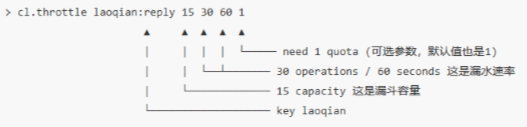
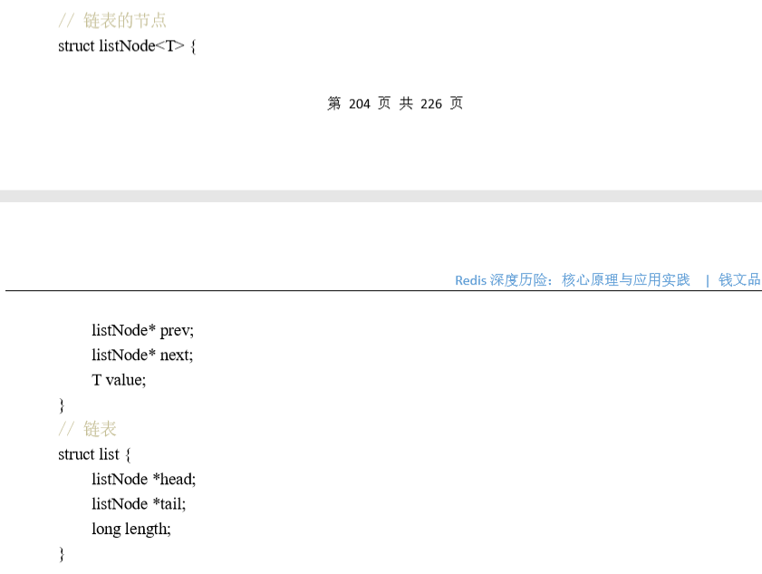

# 目录（好多要以后看）


[TOC]


# Redis 基础数据结构

## string (字符串)

使用 JSON 序列化成字符串，然后将序列化后的字符串塞进 Redis 来缓存。同样，取用户信息会经过一次反序列化的过程


Redis 的字符串是**动态字符串**，是可以修改的字符串，内部结构实现上类似于 Java 的 ArrayList，采用**预分配冗余空间**的方式来减少内存的频繁分配，如图中所示，内部为当前字符串实际分配的空间 capacity 一般要高于实际字符串长度 len。当字符串长度小于 1M 时，扩容都是加倍现有的空间，如果超过 1M，扩容时一次只会多扩 1M 的空间。需要注意的是字符串最大长度为 512M。

计数  如果 value 值是一个整数，还可以对它进行自增操作。自增是有范围的，它的范围是 signed long 的最大最小值，超过了这个值，Redis 会报错。

## list (列表)  

Redis 的列表相当于 Java 语言里面的 LinkedList，注意它是链表而不是数组。这意味着 list 的插入和删除操作非常快，时间复杂度为 O(1)，但是索引定位很慢，时间复杂度为 O(n)，这点让人非常意外。

当列表弹出了最后一个元素之后，该数据结构自动被删除，内存被回收。

Redis 的列表结构常用来做异步队列使用。将需要延后处理的任务结构体序列化成字符串塞进 Redis 的列表，另一个线程从这个列表中轮询数据进行处理。

### 慢操作


### 快速列表


如果再深入一点，你会发现 Redis 底层存储的还不是一个简单的 linkedlist，而是称之为快速链表 quicklist 的一个结构。  

首先在列表元素较少的情况下会使用一块连续的内存存储，这个结构是 ziplist，也即是压缩列表。它将所有的元素紧挨着一起存储，分配的是一块连续的内存。当数据量比较多的时候才会改成 quicklist。因为普通的链表需要的附加指针空间太大，会比较浪费空间，而且会加重内存的碎片化。比如这个列表里存的只是 int 类型的数据，结构上还需要两个额外的指针 prev 和 next 。所以 Redis 将链表和 ziplist 结合起来组成了 quicklist。也就是将多个 ziplist 使用双向指针串起来使用。这样既满足了快速的插入删除性能，又不会出现太大的空间冗余。 

## hash (字典)

Redis 的字典相当于 Java 语言里面的 HashMap，它是无序字典。


 **rehash 的方式不一样**：Java 的 HashMap 在字典很大时，rehash 是个耗时的操作，需要一次性全部 rehash。Redis 
为了高性能，不能堵塞服务，所以采用渐进式 rehash 策略。


渐进式 rehash 会在 rehash 的同时，**保留新旧两个 hash 结构**，查询时会同时查询两个 hash 结构，然后在后续的**定时任务中以及 hash 的子指令**中，循序渐进地将旧 hash 的内容一点点迁移到新的 hash 结构中。 

当 hash 移除了最后一个元素之后，该数据结构自动被删除，内存被回收。 

hash 结构也可以用来存储用户信息，不同于字符串**一次性**需要全部**序列化整个对象**，hash 可以对用户结构中的每个字段单独存储。这样当我们需要获取用户信息时可以进行部分获取。而以整个字符串的形式去保存用户信息的话就只能一次性全部读取，这样就会比较浪费网络流量。  

hash 也有缺点，hash 结构的**存储消耗**要**高**于单个字符串，到底该使用 hash 还是字符串，需要根据实际情况再三权衡。 

hash 结构中的单个子 key 也可以进行**计数**，它对应的指令是 **hincrby**，和 incr 使用基本一样

## set (集合)

相当于 Java 语言里面的 HashSet，它内部的键值对是**无序的唯一**的。它的内部实现相当于一个特殊的字典，字典中所有的 value 都是一个值 NULL。

## zset (有序列表)

类似于 Java 的 SortedSet 和 HashMap 的结合体，，一方面它是一个 **set**，保证了内部 value 的唯一性，另一方面它可以给每个 value 赋予一个 **score**，代表这个 value 的排序权重。它的内部实现用的是一种叫着**「跳跃列表」**的数据结构。

### 跳跃列表

 zset 要支持随机的插入和删除

我们先看一个普通的链表结构。 


# 应用 1：分布式锁 

## 分布式锁 

 > set lock:codehole true ex 5 nx OK 
 >
 > ... 
 >
 > - do something critical
 >
 >  ... 
 >
 > del lock:codehole 

上面这个指令就是 setnx 和 expire **组合在一起的原子指令**，它就是分布式锁的奥义所在。

## 	超时问题 

Redis 的分布式锁不能解决超时问题，如果在加锁和释放锁之间的**逻辑执行的太长**，以至于超出了锁的超时限制，就会出现问题。

 set 指令的 value 参数设置为一个**随机数**，释放锁时先**匹配随机数**是否一致，然后**再删除** key。但是匹配 value 和删除 key 不是一个原子操作，Redis 也
没有提供类似于 delifequals 这样的指令，这就需要使用 **Lua 脚本**来处理了，因为 Lua 脚本可以保证连续多个指令的原子性执行。

## 可重入

需要对客户端的 set 方法进行包装，使用线程的 Threadlocal 变量存储当前持有锁的计数

以上还不是可重入锁的全部，精确一点还需要考虑内存锁计数的过期时间，代码复杂度将会继续升高。老钱不推荐使用可重入锁，它加重了客户端的复杂性，在编写业务方法时注意在逻辑结构上进行调整完全可以不使用可重入锁。

**基于 ThreadLocal 和引用计数**

```java
public class RedisWithReentrantLock {
            private ThreadLocal<Map> lockers = new ThreadLocal<>();
            private Jedis jedis;

            public RedisWithReentrantLock(Jedis jedis) {
                this.jedis = jedis;
            }

            private boolean _lock(String key) {
                return jedis.set(key, "", "nx", "ex", 5L) != null;
            }

            private void _unlock(String key) {
                jedis.del(key);
            }

            private Map<String, Integer> currentLockers() {
                Map<String, Integer> refs = lockers.get();
                if (refs != null) {
                    return refs;
                }
                lockers.set(new HashMap<>());
                return lockers.get();
            }

            public boolean lock(String key) {
                Map refs = currentLockers();
                Integer refCnt = refs.get(key);
                if (refCnt != null) {
                    refs.put(key, refCnt + 1);

                    return true;
                }

                boolean ok = this._lock(key);
                if (!ok) {
                    return false;
                }
                refs.put(key, 1);
                return true;
            }

            public boolean unlock(String key) {
                Map refs = currentLockers();
                Integer refCnt = refs.get(key);
                if (refCnt == null) {
                    return false;
                }
                refCnt -= 1;
                if (refCnt > 0) {
                    refs.put(key, refCnt);
                } else {
                    refs.remove(key);
                    this._unlock(key);
                }
                return true;
            }

            public static void main(String[] args) {
                Jedis jedis = new Jedis();
                RedisWithReentrantLock redis = new RedisWithReentrantLock(jedis);
                System.out.println(redis.lock("codehole"));
                System.out.println(redis.lock("codehole"));
                System.out.println(redis.unlock("codehole"));
                System.out.println(redis.unlock("codehole"));
            }
        }
```

# 应用 2：延时队列 （锁冲突处理

## 队列空了怎么办？


- 符 b 代表的是 blocking

阻塞读在队列没有数据的时候，会立即进入休眠状态，一旦数据到来，则立刻醒过来。消息的延迟几乎为零。用 `blpop/brpop` 替代前面的 `lpop/rpop`，就完美解决了上面的问题。

## 空闲连接自动断开 

如果线程一直阻塞在哪里，Redis 的客户端连接就成了闲置连接，闲置过久，服务器一般会主动断开连接，减少闲置资源占用。这个时候 blpop/brpop 会抛出异常来。 

**所以编写客户端消费者的时候要小心，注意捕获异常，还要重试。...** 

## 锁冲突处理

1、直接抛出异常，通知用户稍后重试； 

2、sleep 一会再重试； 

3、将请求转移至延时队列，过一会再试； 

### 延时队列的实现

1. 延时队列可以通过 Redis 的 zset(有序列表) 来实现。我们将**消息序列化**成一个字符串作为 zset 的 **value**，这个消息的到期处理时间作为 **score**，然后用多个线程**轮询 zset 获取到期的任务进行处理**，多个线程是为了保障可用性，万一挂了一个线程还有其它线程可以继续处理。因为有多个线程，所以需要考虑并发争抢任务，确保任务不能被多次执行。 
2. **zrem 方法**（移除有序集 `key` 中的一个或多个成员，不存在的成员将被忽略。
3. Redis 的 **zrem 方法**是多线程多进程争抢任务的关键，它的返回值决定了当前实例有没有抢到任务，因为 loop 方法可能会被多个线程、多个进程调用，同一个任务可能会被多个进程线程抢到，通过 zrem 来决定**唯一的属主**。  同时，我们要注意一定要对 handle_msg 进行异常捕获，避免因为个别任务处理问题导致循环异常退出。以下是 Java 版本的延时队列实现，因为要使用到 Json 序列化，所以还需要 fastjson 库的支持。 

**源文件查看代码**

> 总结：(先把锁序列化成zset，加个延迟时间，多线程去拿`zrangeByScore(queueKey, 0, System.currentTimeMillis(), 0, 1);` 时间为0的时候的，然后被删除`zrem`,然后是实现延迟 了。）**多个进程取到之后再使用 zrem 进行争抢**

**多个进程取到之后再使用 zrem 进行争抢**那些没抢到的进程都是白取了一次任务，这是浪费。可以考虑使用 lua scripting 来优化一下这个逻辑，将
zrangebyscore 和 zrem 一同挪到服务器端进行原子化操作，这样多个进程之间争抢任务时就不会出现这种浪费了

# 应用 3：位图（签到）

## 基本使用

位图数据结构，这样每天的签到记录只占据一个位，365 天就是 365 个位，46 个字节 (一个稍长一点的字符串) 就可以完全容纳下，这就大大
节约了存储空间。 

位图不是特殊的数据结构，它的内容其实就是普通的字符串，也就是 byte 数组。我们可以使用**普通**的 get/set 直接获取和设置整个位图的内容，也可以使用位图操作 `getbit/setbit` 等将 byte 数组看成**「位数组」**来处理。 


## 统计和查找

**统计**指令 `bitcount` 和位图**查找**指令 `bitpos`，bitcount 用来统计指定位置范围内 **1** 的个数，bitpos 用来查找指定范围内出现的第一个 **0 或 1**。  

范围参数[start, end]，start 和 end 参数是字节索引，也就是说指定的位范围必须是 8 的倍数，


## 魔术指令 bitfield 

 bitfield 有三个子指令，分别是 `get/set/incrby`，它们都可以对指定位片段进行读写，但是最多**只能处理 64 个连续的位**，如果
超过 64 位，就得使用多个子指令，bitfield 可以一次执行多个子指令。 


**溢出策略子指令 overflow**：bitfield 指令提供了溢出策略子指令 overflow，用户可以选择溢出行为，默认是折返 (wrap)，还可以选择失败 (fail) 报错不执行，以及饱和截断 (sat)，超过了范围就停留在最大最小值。overflow 指令只影响接下来的第一条指令，这条指令执行完后溢出策略会变成默认值折返 (wrap)。 


# 应用 4： HyperLogLog

- UV的方案一：当一个请求过来时，我们使用 sadd 将用户 ID 塞进去就可以了**（面几千万的 UV，你需要一个很大**
  **的 set 集合来统计，这就非常浪费空间。）**
- UV的方案二：

HyperLogLog 提供不精确的去重计数方案，PV但是UV 不一样，它要**去重**。（**标准误差是 0.81%，**）

## 使用方法

HyperLogLog 提供了两个指令 `pfadd 和 pfcount`


## pfmerge 适合什么场合用？ 


## 注意事项

## 原理（不懂）

# 应用 5： 布隆过滤器 

场景：推送不重复的抖音视频。

# 应用 6： 简单限流 （自己学）

优点：能够精确的统计次数。

缺点：就是zset的数据结构会越来越大

求打造成一个zset数组，当每一次请求进来的时候，value保持唯一（唯一用户），而score可以用当前时间戳表示，因为score我们可以用来计算当前时间戳之内有多少的请求数量。

zremrangeByScore：删除时间窗口以外的请求

每一个行为到来时，都维护一次时间窗口。将时间窗口外的记录全部清理掉，只保留窗口内的记录。zset 集合中只有 score 值非常重要，value 值没有特别的意义，只需要保证它是唯一的就可以了。 

```java
public class SimpleRateLimiter {
    private Jedis jedis;

    public SimpleRateLimiter(Jedis jedis) {
        this.jedis = jedis;
    }

    public boolean isActionAllowed(String userId, String actionKey, int period, int maxCount) {
        String key = String.format("hist:%s:%s", userId, actionKey);
        long nowTs = System.currentTimeMillis();
        Pipeline pipe = jedis.pipelined();
        pipe.multi();
        // value 没有实际的意义，保证唯一就可以
        pipe.zadd(key, nowTs, "" + nowTs);
        pipe.zremrangeByScore(key, 0, nowTs - period * 1000);
        Response<Long> count = pipe.zcard(key);
        pipe.expire(key, period + 1);
        pipe.exec();
        pipe.close();
        return count.get() <= maxCount;
    }

    public static void main(String[] args) {
        Jedis jedis = new Jedis();
        SimpleRateLimiter limiter = new SimpleRateLimiter(jedis);
        for (int i = 0; i < 20; i++) { //相当于请求
            System.out.println(limiter.isActionAllowed("laoqian", "reply", 60, 5));
        }
    }
}
```

# 应用 7： 漏斗限流 

## 前面还有，不会

## Redis-Cell

Redis 4.0 提供了一个限流 Redis 模块，它叫 redis-cell。该模块也使用了漏斗算法，并提供了`原子的限流指令`。有了这个模块，限流问题就非常简单了。 

该模块只有 1 条指令 `cl.throttle`，参数和返回值



上面这个指令的意思是允许「用户老钱回复行为」的频率为每 60s 最多 30 次(漏水速率)，漏斗的初始容量为 15，也就是说一开始可以连续回复 15 个帖子，然后才开始受漏水速率的影响。我们看到这个指令中漏水速率变成了 2 个参数，替代了之前的单个浮点数。


# 应用 8： GeoHash（不支持删除

GeoHash 算法将**二维**的经纬度数据映射到**一维**的整数，这样所有的元素都将在挂载到一条线上，距离靠近的二维坐标映射到一维后的点之间距离也会很接近。当我们想要计算「附近的人时」，首先将目标位置映射到这条线上，然后在这个一维的线上获取附近点就行了。  


在使用 Redis 进行 Geo 查询时，我们要时刻想到它的内部结构实际上只是一个 **zset(skiplist)。**

通过 zset 的 score 排序就可以得到坐标附近的其它元素 (实际情况要复杂一些，不过这样理解足够了)，通过将 score 还原成坐标值就可以得到元素的原始坐标。 

|                                  |                   |
| -------------------------------- | ----------------- |
| **增加**                         | geoadd            |
| **距离**                         | geodist           |
| **获取元素位置**                 | geopos            |
| **获取元素的 hash 值**           | geohash           |
| **附近的公司**                   | georadiusbymember |
| **了根据坐标值来查询附近的元素** | georadius         |

##   geoadd


## geodist （距离）


## geopos（元素位置）


## geohash


## georadiusbymember（附近的）


## georadius 附近的二维


## 注意：


# 应用 9： Scan （浅谈字典）

## 1.0 比较


## 2.0 使用


## 3.0 字典的结构


## 4.0 scan 遍历顺序

采用高位进位加法来遍历，避免槽位的遍历重复和遗漏

普通加法和高位进位加法的**区别** 高位进位法从**左**边加，进位往右边移动，同普通加法正好相反。但是最终它们都会遍历 所有的槽位并且没有重复。

## 5.0字典扩容

rehash 数组长度进行取模运算


## 6.0 渐进式 rehash

它会同时保留旧数组和新数组，然后在定时任务中以及后续对 hash 的指令操作中渐渐 地将旧数组中挂接的元素迁移到新数组上。这意味着要操作处于 rehash 中的字典，需要同 时访问新旧两个数组结构。如果在旧数组下面找不到元素，还需要去新数组下面去寻找。

## 7.0更多的 scan 指令

如 zscan 遍历 zset 集合元素，hscan 遍历 hash 字典的元素、sscan 遍历 set 集 合的元素。

因为 hash 底层就是字典，set 也是一个特殊的 hash(所有的 value 指向同一个元素)，

## 8.0大 key 扫描

这样的对象对 Redis 的集群数据迁移带来了很 大的问题，因为在集群环境下，如果某个 key 太大，会数据导致迁移卡顿。

## 9.0那如何定位大 key 呢？

`redis-cli -h 127.0.0.1 -p 7001 –-bigkeys` 

如果你担心这个指令会大幅抬升 Redis 的 ops 导致线上报警，还可以增加一个休眠参 数。

 `redis-cli -h 127.0.0.1 -p 7001 –-bigkeys -i 0.1` 

上面这个指令每隔 100 条 scan 指令就会休眠 0.1s，ops 就不会剧烈抬升，但是扫描的 时间会变长。

# 原理 1：线程 IO 模型

Redis 单线程如何处理那么多的并发客户端连接？

select 系列的事件轮询 API，非阻塞 IO。

## 非阻塞 IO


## 事件轮询 (多路复用)


解决 非阻塞 IO 问题，：

​	线程要读数据，结果读了一部分就返回了，线程如何知道 何时才应该继续读。

​	当数据到来时，线程如何得到通知。

​	缓冲区满 了，写不完，剩下的数据何时才应该继续写，线程也应该得到通知。

### select系统

​	如果**没有任何事件**到来，那么就最多 等待 timeout 时间，线程处于阻塞状态。

​	一旦期间有任何**事件到来**，就可以立即返回。

​	**时间过 了**之后还是没有任何事件到来，也会立即返回。

​	也会立即返回。**拿到事件后**，线程就可以继续挨个处理**相应** 的事件。

​	处理完了，线程就进入了一个死循环

现代操作系统的多路复用 API 已经不再使用 select 系统调用，而 改用 `epoll(linux)`和 kqueue(freebsd & macosx)，因为 select 系统调用的性能在描述符特别多时性能会非常差。

## 指令队列.

每个客户端都关联一个指令队列

客户端的指令通过队列来排队进行 顺序处理，先到先服务。

## 响应队列

避免 select 系统调用立即返回写事件，结果发现没什么数据可以 写。出这种情况的线程会飙高 CPU。

## 定时任务

Redis 的定时任务会记录在一个称为最小堆的数据结构中

Redis 都会将最小堆里面已经到点的任务立即进行处 理。

处理完毕后，将最快**要执行的任务**还需要的时间**记录**下来，这个时间就是 select 系统调 用的 **timeout** 参数。因为 Redis 知道未来 timeout 时间内，**没有**其它定时任务需要处理，所以 可以安心**睡眠** timeout 的时间。

Nginx 和 Node 的事件处理原理和 Redis 也是类似的


# 原理 2： 通信协议 

Redis 的作者认为数据库系统的瓶颈一般不在于网络流量，而是数据库自身内部逻辑处理上。所以即使 Redis 使用了**浪费流量**的文本协议，依然可以取得极高的访问性能。

## RESP(Redis Serialization Protocol) 

- 优势：在于实现异常简单，解析性能极好。 


**小结** 
		Redis 协议里有大量冗余的回车换行符，但是这不影响它成为互联网技术领域非常受欢迎的一个文本协议。有很多开源项目使用 RESP 作为它的通讯协议。在技术领域性能并不总是一切，还有**简单性、易理解性和易实现性**，这些都需要进行适当权衡

# 原理 3：持久化 

| 快照RDB                    | AOF 日志                                        |
| -------------------------- | ----------------------------------------------- |
| 内存数据的二进制序列化形式 | 内存数据修改的指令记录文本（定期进行 AOF 重写） |

## 快照原理 

内存快照要求 Redis 必须进行文件 IO 操作，可文件 IO 操作是**不能**使用多路复用 API。

Redis 使用**操作系统**的**多进程 COW**(Copy On Write) 机制来实现快照持久化

> fork(多进程) 

1. 调用 glibc 的函数 **fork** 产生一个子进程，快照持久化完全交给子进程来处理，父进程继续处理客户端请求。
2. 子进程刚刚产生时，它和父进程**共享内存**里面的代码段和数据段。

这是 Linux 操作系统的机制，为了节约内存资源，所以尽可能让它们共享起来。在进程分离的一瞬间，内存的
增长几乎没有明显变化。 

数据段是由很多操作系统的页面组合而成，当父进程对其中一个页面的数据进行修改时，会将被共享的页面**复制**一份分离出来，然后对这个复制的页面进行**修改**。这时子进程相应的页面是没有变化的，还是进程产生时那一瞬间的数据。 

子进程因为数据没有变化，它能看到的内存里的数据在进程产生的一瞬间就凝固了，再也不会改变，这也是为什么 Redis 的持久化叫「快照」的原因+

## AOF 原理 

AOF 日志存储的是 Redis 服务器的顺序指令序列，AOF 日志只记录对内存进行**修改**的指令记录。 

Redis 会在收到客户端修改指令后，先进行**参数校验**，如果没问题，就立即将该指令文本存储到 AOF 日志中，也就是先存到**磁盘**，然后再执行指令

> AOF 重写

`bgrewriteaof` 指令用于对 AOF 日志进行瘦身

原理： 开辟一个**子进程**对内存进行**遍历**转换成一系列 Redis 的操作指令

> fsync

实际上是将**内容写**到了内核为文件描述符分配的一个**内存缓存**中，然后内核会**异步**将脏数据**刷回到磁盘**的

Linux 的 glibc 提供了 `fsync(int fd)函数`可以将指定文件的内容**<font color=red>强制</font>**从内核缓存刷到磁盘

只要 Redis 进程实时调用 fsync 函数就可以保证 aof 日志不丢失。(**性能不好**)

​	Redis 通常是每隔 1s 左右执行一次 fsync 操作


## Redis 4.0 混合持久化 


# 原理 4：管道 

是实际上 Redis 管道 (Pipeline) 本身并**不是** Redis 服务器直接提供的技术，这个技术本质上是由**客户端**提供的

## Redis 的消息交互


## 管道压力测试

Redis 自带了一个压力测试工具 `redis-benchmark`


```shell
redis-benchmark -t set -q 
```


## 深入理解管道本质


# 原理 5： 事务

| MysqL                     | Redis              |
| ------------------------- | ------------------ |
| begin、commit 和 rollback | multi/exec/discard |

 Redis 的事务根本**不能算「原子性」**，而仅仅是满足了事务的「隔离性」，隔离性中的串行化——当前执行的事务有着**不被**其它事务**打断**的权利。 

## Watch

分布式锁是一种**悲观锁**， watch 的机制，是一种**乐观锁**


# 原理 6： PubSub 


## PubSub 缺点

1. 一个消费者突然**挂掉**了，生产者会继续**发送消息**，另外两个消费者可以持续收到消息。但是挂掉的消费者重新连上的时候，这断连期间生产者发送的消息，对于这个消费者来说就是**彻底丢失**了。 
2. PubSub 的消息是**不会持久化**的

# 原理 7： 小对象压缩 (64)

## (ziplist)

如果内部元素比较**少**，使用二维结构反而浪费空间，还不如使用**	**进行存储


**<font color=red >hash 结构的任意 entry 的 value 值超过了 64</font>**


## 内存回收机制


## 内存分配算法

**第三方**内存分配库去实现。目前 Redis 可以使用 jemalloc(facebook) 库来管理内存，也可以切换到 tcmalloc(google)。因为 jemalloc 相比 tcmalloc 的性能要稍好一些，所以Redis 默认使用了 jemalloc。 

```shell
127.0.0.1:6379> info memory
```

#  原理 8： 主从同步


1. Redis 系统并不满足「一致性 ]
2. Redis 满足「可用性」
3. Redis 保证「最终一致性

## 增量同步 


Redis 同步的是指令流，**主**节点会将那些对自己的状态**产生修改**性影响的指令记录在本地的**内存 buffer** 中，然后**异步**将 buffer 中的指令同步到**从**节点，**从**节点一边执行**同步**的指令流来达到和主节点**一样的状态**，一遍**向主**节点**反馈**自己同步到哪里了 (偏移量)

Redis 的复制内存 buffer 是一个定长的**环形**数组，如果数组内容**满了**，就会从头开始**覆盖**前面的内容。 

需要更加复杂的同步机制 —— 快照同步。 

## 快照同步

主库上进行一次 **bgsave** 将当前内存的数据全部**快照到磁盘**文件中。

发送到从节点，全量加载

加载之前先数据清空。加载完毕后通知主节点继续进行**增量同步**


## 无盘复制 

特别是当系统正在进行 AOF 的 **fsync** 操作时如果**发生快照**，**fsync** 将会被**推迟**执行，这就会严重**影响**主节点的**服务效率**。 

所以从 Redis 2.8.18 版开始支持无盘复制。所谓无盘复制是指**主**服务器直接通过**套接字将快照内容发送到从**节点，生成快照是一个遍历的过程，**主**节点会**一边遍历内**存，**一遍将序列化的内容发送到从节点**，从节点还是跟之前一样，先将接收到的内容存储到磁盘文件中，再进行**一次性**加载。 

# 集群 1：Sentinel 哨兵

## 消息丢失


```shell
min-slaves-to-write 1 #主节点必须至少有一个从节点在进行正常复制，否则就停止对外写服务，丧失可用性

min-slaves-max-lag 10 #如果 10s 没有收到从节点的反馈，就意味着从节点同步不正常
```

# 集群 2：分而治之 —— Codis


# 集群 3：众志成城 —— Cluster

1. Codis 的不同，它是<font color=red>去中心化</font>
2. 集群有三个 Redis 节点
3. 每个节点负责整个集群的一**部分**数据
4. 之间通过一种特殊的**二进制协议**相互交互集群信息。 


数据划分为 16384 的 slots

客户端来连接集群时,会得到一份集群的**槽位配置**信息。这样当客户端要查找某个 key 时，可以直接定位到目标节点。 

同时因为槽位的信息可能会存在客户端与服务器不一致的情况，还需要纠正机制来实现槽位信息的**校验调整**。 

## 槽位定位算法

Cluster 默认会对 key 值使用 crc32 算法进行 hash 得到一个整数值，然后用这个整数值对 16384 进行取模来得到具体槽位

## 跳转

客户端向一个错误的节点发出了指令，该节点会发现指令的 key 所在的槽位并不归自己管理，这时它会向客户端发送一个特殊的**跳转指令**携带目标操作的节点地址，告诉客户端去连这个节点去获取数据。 

## 迁移（同步）

工具 `redis-trib` 

> 迁移过程 


**从源节点获取内容 => 存到目标节点 => 从源节点删除内容**

迁移过程是**同步**

如果迁移过程中突然出现网络故障，整个 slot 的迁移只进行了一半。这时两个节点依旧处于**中间过渡状态**。待下次迁移工具重新连上时，会提示用户继续进行迁移。 


## 容错 

Redis Cluster 可以为每个主节点设置若干个从节点，单主节点故障时，集群会自动将其中某个从节点提升为主节点。如果某个主节点没有从节点，那么当它发生故障时，集群将**完全处于不可用状态** Redis 也提供了一个参数 `cluster-require-full-coverage` 可以允许部分节点故障，其它节点还可以继续提供对外访问。 

## 网络抖动

Redis Cluster 提供了一种选项 cluster-node-timeout，表示当某个节点持续 **timeout** 的时间失联时，才可以认定该节点出现故障，需要进行主从切换。如果没有这个选项，网络抖动会导致主从频繁切换 (数据的重新复制)。

## 可能下线 (PFAIL-Possibly Fail) 与确定下线 (Fail) 

Redis 集群节点采用 Gossip 协议来广播自己的状态以及自己对整个集群认知的改变

## 缺点

Cluster 不支持事务，Cluster 的 mget 方法相
比 Redis 要慢很多，被拆分成了多个 get 指令，Cluster 的 rename 方法不再是原子的，它
需要将数据从原节点转移到目标节点

## 槽位迁移感知 

一个是 moved，一个是 asking


# 拓展 1： Stream

Redis5.0 最大的新特性就是多出了一个数据结构 Stream


它有一个消息链表，将所有加入的消息都**串**起来，每个消息都有一个唯一的 ID 和对应的内容。消息是**持久化**的，Redis 重启后，内容还在

**Stream** 都有**唯一**的名称，它就是 Redis 的 key，在我们首次使用 `xadd` 指令追加消息时自动创建

每个**消费组**会有个游标 **last_delivered_id** 在 Stream 数组之上往前移动(**xgroup create 进行创建**),指定ID,状态都是独立的，相互不受影响。挂接多个**消费者** (Consumer)，这些消费者之间是**竞争**关系，任意一个消费者读取了消息都会使游标last_delivered_id **往前**移动。每个消费者有一个组内**唯一**名称。 

**消费者** (Consumer) 内部会有个状态变量 `pending_ids`,记录了当前已经被客户端读取的消息，但是还没有 **ack**。ack了就减少，pending_ids 变量在 Redis 官方被称之为 **PEL**，也就是 Pending Entries List，这是一个很**核心的数据结构**，它用来确保客户端至少消费了消息一次，而不会在网络传输的中途丢失了没处理

## 消息 ID 

消息 ID 的形式是 timestampInMillis-sequence，例如 1527846880572-5，它表示当前的消息在毫米时间戳 1527846880572 时产生，并且是该毫秒内产生的第 5 条消息。消息 ID 可以由服务器自动生成，也可以由客户端自己指定，但是形式必须是整数-整数，而且必须是后面加入的消息的 ID 要**大于**前面的消息 ID。

## 增删改查


## 独立消费

当 Stream 没有新消息时，甚至可以阻塞等待。Redis 设计了一个单独的消费指令 `xread`，可以将 Stream 当成普
通的消息队列 (list) 来使用。使用 xread 时，我们可以完全**忽略消费组** (Consumer Group) 的存在，就好比 Stream 就是一个普通的列表 (list)。 


## 创建消费组 


指令在文档pdf


## 消费

- 消费组的组内消费，需要提供消费**组名称**、消费者**名称**和起始消息 **ID**
- 可以阻塞等待新消息

 读到新消息后，对应的消息 ID 就会进入消费者的 PEL(**正在处理的消息)** 结构里，客户端处理完毕后使用 xack 
指令通知服务器，本条消息已经处理完毕，该消息 ID 就会从 PEL 中移除。 


[Redis 深度历险：核心原理与应用实践  | 钱文品 著 
 第 157 页 共 226 页]() 

## Stream 消息太多怎么办? 

- 指令又不会删除消息，它只是给消息做了个**标志位**。 
- 提供了一个**定长** Stream 功能
- 

## 消息如果忘记 ACK 会怎样

就会导致 PEL 列表不断增长，如果有很多消费组的话，那么这个 PEL 占用的**内存就会放大**。 


## PEL 如何避免消息丢失?

在客户端消费者读取 Stream 消息时，Redis 服务器将消息回复给客户端的过程中，客户端突然**断开了连接**，消息就丢失了。但是 **PEL** 里已经**保存**了发出去的消息 ID。待客户端重新连上之后，可以**再次收到** PEL 中的消息 ID 列表。不过此时 xreadgroup 的起始消息 ID 不能为参数>，而必须是任意有效的消息 ID，一般将参数设为 0-0，表示读取所有的 PEL 消息以及自 last_delivered_id 之后的新消息。 

## Stream 的高可用 

- **Sentinel** 和 **Cluster** 集群环境下 Stream 是可以支持**高可用**
- 不过鉴于 Redis 的指令复制是**异步**的，在 failover 发生时，Redis 可能会丢失极小部分数据，这点 Redis 的其
  它数据结构也是一样的

# 拓展 2： Info 指令 


## Redis 每秒执行多少次指令？ 


## Redis 连接了多少客户端


## Redis 内存占用多大 ? 


## 复制积压缓冲区多大？(重要）


- 复制积压缓冲区大小非常重要，它严重影响到主从复制的效率
- 

# 拓展 3：再谈分布式锁


# 拓展 4： 过期策略 

## 过期的 key 集合

过期时间的 key 放入到一个**独立的字典**中，**定时遍历**之外，它还会使用惰性策略来删除过期的 key，所谓**惰性策略**就是在客户端访问这个 key 的时候，redis 对 key 的过期时间进行检查，如果过期了就立即删除。定时删除是集中处理，惰性删除是零散处理。 

## 定时扫描策略 


## 从库的过期策略 

1. 从库不会进行过期扫描，
2. 主库在 key 到期时，会在 AOF 文件里增加一条 del 指令，同步到所有的从

# 拓展 5：优胜劣汰 —— LRU 


## LRU 算法 

实现 LRU 算法除了需要 **key/value 字典外**，还需要附加**一个链表**，链表中的元素按照一定的**顺序进行排列**。当空间满的时候，会**踢掉**链表**尾部**的元素。当字典的某个元素**被访问**时，它在链表中的位置会被**移动到表头**。所以链表的元素排列顺序就是元素**最近被访问的时间顺序**。 

位于链表尾部的元素就是不被重用的元素，所以会被踢掉。位于表头的元素就是最近刚刚被人用过的元素，所以暂时不会被踢

## 近似 LRU 算法 

Redis 使用的是一种近似 LRU 算法，不使用 LRU 算法，是因为需要消耗大量的**额外的内存**，需要对现有的数据结构进行较大的改造。

Redis 为实现近似 LRU 算法，它给每个 key 增加了一个**额外的小字段**，这个字段的长度是 24 个 bit，也就是**最后一次**被访问的<font color=red >**时间戳**</font>。 

当 Redis 执行写操作时，发现内存**超出** maxmemory，就会执行一次 LRU 淘汰算法。采样出 5(可以配置) 个 key，然后淘汰掉最
旧的 key，如果淘汰后内存还是超出 maxmemory，那就继续**随机采样淘汰**，直到内存低于 maxmemory 为止。

# 拓展 6：懒惰删除

不过 Redis 内部实际上并不是只有一个主线程，它还有**几个异步线程**专门用来处理一些耗时的操作

## Redis 为什么要懒惰删除(lazy free)？ 


## flush


## 异步队列 


## AOF Sync 也很慢 


# 拓展 8：居安思危 —— 保护 Redis

## 指令


## 端口安全 

1.  Redis 的配置文件中指定监听的 IP 地址

2. 增加 Redis 的密码访问限制


## SSL 代理 

 Redis 官方推荐使用 spiped 工具

这张图是使用 spiped 对 ssh 
通道进行二次加密 (因为 ssh 通道也可能存在 bug)。 


# 拓展 9：Redis 安全通信

用普通 tcp 直接访问，因为跨机房所以传输数据会暴露在公网，这非常**不安全**


spiped 原理 

让我们放大细节，仔细观察 spiped 实现原理。spiped 会在客户端和服务器各启动一个 spiped 进程


安装看原文

# 源码 1： 探索「字符串」内部结构 

Redis 的字符串叫着「**SDS**」，也就是 Simple Dynamic String。它的结构是一个**带长度信息的字节数组**


- 似于 Java 语言的 ArrayList 结构，需要比实际的内容长度多分配一些**冗余**空间。capacity 表示所分配**数组的长度**，len 表示字符串的**实际长度**。
- 如果数组**没有冗余**空间，那么追加操作必然涉及到**分配新数组**，然后将**旧**内容**复制**过来，再 append 新内容。如果字符串的长度非常长，这样的**内存分配**和**复制开销**就会非常**大**。 
- SDS 结构使用了**范型 T**，，为什么不直接用 int 呢，这是因为当字符串比较短时，len 和 capacity 可以使用 byte 和 short 来表示
- 长度不得超过 512M 字节，创建字符串时 len 和 capacity **一样长**，不会多分配冗余空间，这是因为绝大多数场景下我们不会使用 append 操作来修改字符
  串。 

## embstr vs raw

> 长度特别短时：emb 
>

> 长度超过 44 时：
>
> *为什么44？*


**一个字符串**的最小空间占用为 19 字节 (16+3)。 一个字符8个字节

 


# 源码 2： 探索「字典」内部 

1.  hash 结构

2. 所有 key 和 value 也组成了一个全局字典

3. 带过期时间的 key 集合

4. zset 集合中存储 value 和 score 值的映射关系（**`ziplist`或者`skiplist`**）

   

dict 扩容缩容时，需要分配新的 hashtable，然后进行**渐进式搬迁**，这时候两个 hashtable 存储的分别是旧的 hashtable 和新的 hashtable。待搬迁结束后，旧的 hashtable 被删除，新的 hashtable 取而代之。 

hashtable 的结构和 Java 的 HashMap 几乎是一样的，都是通过分桶的方式解决 hash 冲突。

## 渐进式 rehash 

Redis 使用渐进式 rehash 小步搬迁，虽然慢一点，但是肯定可以搬完。 

1. 搬迁操作埋伏在当前字典的后续指令中(来自客户端的 **hset/hdel** 指令等)，
2. Redis 还会在**定时任务**中对字典进行主动搬迁。 

## hash 函数

Redis 的字典默认的 hash 函数是 **siphash**。siphash 算法即使在输入 key 很小的情况下，也可以产生随机性特别好的输出，而且它的性能也非常突出。

## 扩容条件

- 当 hash 表中元素的**个数**<font color=red>等于</font>第**一维**数组的**长度**时，就会开始扩容，扩容的新数组是原数组大小的 2 倍。
- **bgsave** 的时候，为了减少内存页的过多分离 (Copy On Write)，Redis 尽量**不去扩容** (dict_can_resize)，
- 元素的**个数**已经达到了第**一维**数组**长度的 5 倍**，就会强制扩容。 

## 缩容条件 

缩容的条件是元素个数低于数组长度的 **10%**。缩容不会考虑 Redis 是否正在做 bgsave。 

## set 的结构 

只不过所有的 value 都是 NULL

# 源码 3： 探索「压缩列表」内部 

压缩列表是一块连续的内存空间，元素之间**紧挨着存储**，没有任何冗余空隙。

支持双向遍历


## 添加

插入一个新的元素就需要调用 realloc **扩展内存**。取决于内存分配器算法和当前的 ziplist 内存大小，realloc **可能会重新分配新的内存空间**，并将之前的内容一次性拷贝到**新的地址**，**也可能**在原有的地址上进行**扩展**，这时就不需要进行旧内容的内存拷贝。 

## 级联更新 


每个 entry 都会有一个 **prevlen** 字段存储**前一个** entry 的长度。如果内容**小**于 **254 字节**，prevlen 用 **1 字节**存储，否则就是 **5 字节**。这意味着如果某个 entry 经过了修改操作从 253 字节变成了 254 字节，那么它的下一个 entry 的 prevlen 字段就要更新，从 1 个字节扩展到 5 个字节；如果这个 entry 的长度本来也是 253 字节，那么后面 entry 的 prevlen 字段还得继续更新。

 如果 ziplist 里面每个 entry 恰好都存储了 253 字节的内容，那么第一个 entry 内容的修改就会导致后续所有 entry 的级联更新，这就是一个比较耗费计算资源的操作。 

## IntSet 小整数集合（没看懂）

intset 是紧凑的数组结构


# 源码 4：探索「快速列表」内部



考虑到链表的附加空间相对太高，prev 和 next 指针就要占去 16 个字节 (64bit 系统的指针是 8 个字节)，另外每个节点的内存都是单独分配，会加剧内存的碎片化，影响内存管理效率。

- 使用 **quicklist** 代替了 ziplist 和 linkedlist
- quicklist 是 ziplist 和 linkedlist 的混合体

> 》debug object codehole 


## 每个 ziplist 存多少元素？ 

 quicklist 内部默认单个 ziplist 长度为 8k 字节，超出了这个字节数，就会新起一个 
ziplist。ziplist 的长度由配置参数 list-max-ziplist-size 决定

## 压缩深度

quicklist 默认的压缩深度是 **0**，也就是不压缩。压缩的实际深度由配置参数 listcompress-depth 决定。为了支持快速的 push/pop 操作，quicklist 的首尾两个 ziplist 不压缩，此时深度就是 1。如果深度为 2，就表示 quicklist 的首尾第一个 ziplist 以及首尾第二个 ziplist 都不压缩

# 源码 5：探索「跳跃列表」内部结构 

`zset` 是一个复合结构，一方面它需要一个 hash 结构来存储 value 和 score 的对应关系，另一方面需要提供按照 score 来排序的功能，还需要能够指定 score 的范围来获取 value 列表的功能，这就需要另外一个结构「**跳跃列表**」。 


## 基本结构 


## 查找过程 


## 随机层数 

对于每一个新插入的节点，抛硬币，布尔(random()

## 删除过程 

删除过程和插入过程类似，都需先把这个「**搜索路径**」找出来。然后对于每个层的相关
节点都重排一下前向后向指针就可以了。同时还要注意更新一下最高层数 maxLevel。 

## 更新过程 

**先删除**这个元素，**再插入**这个元素，需要经过**两次路径搜索**。Redis 就是这么干的。 不过 Redis 遇到 score 值改变了就直接删除再插入，不会去判断位置是否

## 如果 score 值都一样呢

 zset 的排序元素不只看 score 值，如果 score 值相同还需要再比较 **value 值 (字符串比较**)。

## 元素排名是怎么算出来的？（不懂

Redis 在 skiplist 的 forward 指针上进行了优化，给每一个 **forward 指针都增加了 span 属性**，span 是「跨度」的意思，表示从前一个节点沿着当前层的 forward 指针跳到当前这个节点中间会**跳过多少个节点**。Redis 在插入删除操作时会小心翼翼地更新 span 值的大小。 

这样当我们要计算一个元素的排名时，只需要将「搜索路径」上的经过的所有节点的跨度 span 值进行**叠加**就可以算出元素的最终 rank 值。 

## score 值的变化微小，不会带来位置上的调整时，是不是可以直接修改 

score 后就返回？ 


# 源码 6：探索「紧凑列表」内部（listpack

新的数据结构 listpack，它是对 ziplist 结构的改进，在存储空间上会更加节省，而且结构上也比 ziplist 要**精简**

少了一个 `zltail_offset` 


## 级联更新

`listpack` 的设计彻底消灭了 ziplist 存在的级联更新行为，

## 取消ziplist

因为有很多兼容性的问题需要考虑，ziplist 在 Redis 数据结构中使用太广泛了，替换起来复杂
度会非常之高。它目前只使用在了新增加的 `Stream` 数据结构中。 

# 源码 7：极度深寒 —— 探索「基数树」内部


