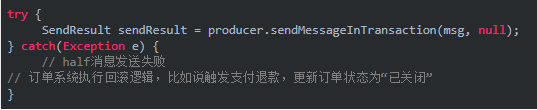
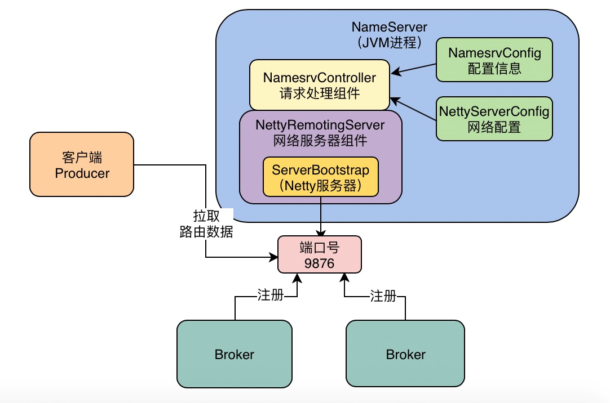

## 51 精益求精：深入研究一下Broker是如何持久化存储消息的？


1. 为什么Broker数据存储机制是一个MQ最为核心的环节？
2. CommitLog数据存储机制
3. MessageQueue对应的ConsumeQueue物理位置存储机制
4. 基于CommitLog顺序写+OS Cache+异步刷盘的高吞吐消息写入的机制
5. 同步刷盘和异步刷盘各自的优缺点：高吞吐写入+丢失数据风险，写入吞吐量下降+数据不丢失

## 53 精益求精：基于DLedger技术的Broker主从同步原理到底是什么？

实际上DLedger是**基于Raft协议来进行Leader Broker选举的**

投票自己作为Leader，然后把这个投票发送给其他Broker

第一轮选举中 : 都在投票给自己，所以第一轮选举是失败的

每个人会进入一个随机时间的休眠


这就是Raft协议中选举leader算法的简单描述，简单来说，他确保有人可以成为Leader的核心机制就是一轮选举不出来Leader的话，就让大家随机休眠一下，先苏醒过来的人会投票给自己，其他人苏醒过后发现自己收到选票了，就会直接投票给那个人。


### **DLedger是如何基于Raft协议进行多副本同步的**

**数据同步会分为两个阶段，一个是uncommitted阶段，一个是commited阶段**

Follower Broker的DLedgerServer收到uncommitted消息之后，必须返回一个ack给Leader Broker的DLedgerServer，然后如果Leader Broker收到超过半数的Follower Broker返回ack之后，就会将消息标记为committed状态。

基于Raft协议实现的两阶段完成的数据同步机制

### Leader Broker崩溃了怎么办？


### 总结

1. Broker高可用架构原理回顾：多副本同步+Leader自动切换

2. 基于DLedger技术管理CommitLog

3. Broker集群启动时，基于DLedger技术和Raft协议完成Leader选举

4. Leader Broker写入之后，基于DLedger技术和Raft协议同步给Follower Broker

5. 如果Leader Broker崩溃，则基于DLedger和Raft协议重新选举Leader

   

   

## 采用Raft协议进行主从数据同步，会影响TPS吗？

基于DLedger技术写入本地CommitLog中

Broker自己直接写入CommitLog是没什么区别的。

### 区别：

Leader Broker上的DLedger在收到一个消息，将uncommitted消息写入自己本地存储之后，还需要基于Raft协议的算法，去采用两阶段的方式把uncommitted消息同步给其他Follower Broker，必须要**超过一半**的Follower ，消息返回ack，此时Leader Broker才能返回**ACK给生产者**  只不过是uncommitted状态，但是新选举的Leader Broker可以根据剩余Follower Broker上这个消息的状态去进行数据恢复，比如把消息状态调整为committed。

## 消费者是如何获取消息处理以及进行ACK的？

### 集群模式消费 vs 广播模式消费

一个消费和都消费

### 重温MessageQueue、CommitLog、ConsumeQueue之间的关系

对于Topic的各个MessageQueue而言，就是通过各个ConsumeQueue文件来存储属于MessageQueue的消息在CommitLog文件中的物理地址，就是一个offset偏移量，我在下面的图中标识出来了这个地址应用的关系。


### Push模式 vs Pull模式

实际上，这两个消费模式本质是一样的，都是消费者机器主动发送请求到Broker机器去拉取一批消息下来

消费模式通常都是基于他的Push模式来做的，因为Pull模式的代码写起来更加的复杂和繁琐，而且Push模式底层本身就是基于消息拉取的方式来做的，只不过时效性更好而已。

Push模式的实现思路我这里简单说一下：当消费者发送请求到Broker去拉取消息的时候，如果有新的消息可以消费那么就会立马返回一批消息到消费机器去处理，处理完之后会接着立刻发送请求到Broker机器去拉取下一批消息。

所以消费机器在Push模式下会处理完一批消息，立马发起请求拉取下一批消息，消息处理的时效性非常好

### Broker是如何将消息读取出来返回给消费机器的

Broker->MessageQueue->ConsumeQueue->offset->CommitLog 

CommitLog中的物理offset偏移量，然后到CommitLog中根据offset读取消息数据

### 消费者机器如何处理消息、进行ACK以及提交消费进度？


## 57根据什么策略从Master或Slave上拉取消息

### Broker读写分离架构

如果Master Broker机器觉得自己负载比较高，就会告诉消费者机器，下次可以从Slave Broker机器去拉取

### CommitLog基于os cache提升写性能

就是依靠这个写入CommitLog时先进入os cache缓存（os自己有后台线程，异步缓存中的CommitLog文件刷入磁盘），而不是直接进入磁盘的机制，就可以实现broker写CommitLog文件的性能是**内存写级别**的，这才能实现broker超高的消息接入吞吐量。

### ConsumeQueue文件也是基于os cache的

写入的时候也都是优先进入os cache中的，30万条消息的offset就只有5.72MB而已

读取一个磁盘文件的时候，也会缓存起来

几乎可以说就是跟读内存里的数据的性能是一样的，通过这个就可以保证数据消费的高性能以及高吞吐


### 什么时候会从os cache读？什么时候会从磁盘读？

消费者机器一直快速的在拉取和消费处理，紧紧的跟上了生产者写入broker的消息速率，那么你每次拉取几乎都是在拉取最近人家刚写入CommitLog的数据，那几乎都在os cache里。

### Master Broker什么时候会让你从Slave Broker拉取数据


## 如何基于Netty扩展出高性能网络通信架构的？

## Reactor主线程与长短连接

Broker里用什么东西代表跟Producer之间建立的这个长连接呢

**SocketChannel**


### 为什么这套网络通信框架会是高性能以及高并发的

所以最终的效果就是：

- Reactor主线程在端口上监听Producer建立连接的请求，建立长连接
- Reactor线程池并发的监听多个连接的请求是否到达
- Worker请求并发的对多个请求进行预处理
- 业务线程池并发的对多个请求进行磁盘读写业务操作

## 基于mmap内存映射实现磁盘文件的高性能读写

JDK NIO包下的MappedByteBuffer的map()函数

Broker中就是大量的使用mmap技术去实现CommitLog这种大磁盘文件的高性能读写优化的。

传统


### RocketMQ是如何基于mmap技术+page cache技术优化的？ 

磁盘文件映射到内存中

mmap技术在进行文件映射的时候，一般有大小限制，在1.5GB~2GB之间，所以RocketMQ才让CommitLog单个文件在1GB，ConsumeQueue文件在5.72MB，不会太大。


对了！就是上面的图里，似乎只有一次数据拷贝的过程，他就是从PageCache里拷贝到磁盘文件里而已！这个就是你使用mmap技术之后，相比于传统磁盘IO的一个性能优化。

### 预映射机制 + 文件预热机制


## 阶段性复习：一张思维导图带你梳理 RocketMQ 的底层实现原理


## 发送消息零丢失方案：RocketMQ事务消息的实现流程分析

如果发送half消息成功了，但是没收到响应呢？2没有响应的情况，会有补偿，调用我们的回调接口，如果4网络问题，重启mq和重新执行补偿回调


## 事物消息的代码实现细节


### 假如half消息发送失败，或者没收到half消息响应怎么办



一直没有收到half消息发送成功？

half消息放在内存里，或者写入本地磁盘文件，后台开启一个线程去检查，如果一个half消息超过比如10分钟都没有收到响应，那就自动触发回滚逻辑。

## half成功了，执行本地事务？本地没有返回commit或者rollback，如何进行回调？


## 异步刷盘 vs 同步刷盘

即默认是异步刷盘的

### 主从架构模式避免磁盘故障导致的数据丢失？

必须让一个Master Broker有一个Slave Broker去同步他的数据，而且你一条消息写入成功，必须是让Slave Broker也写入成功，保证数据有多个副本的冗余


## 73 消息零丢失方案总结


## 重复消费问题

第一个方案就是业务判断法，也就是说你的订单系统必须要知道自己到底是否发送过消息到MQ去，消息到底是否已经在MQ里了。

基于Redis缓存的幂等性机制，状态判断法（系统挂了可能不幂等）

消费端

## 如果优惠券系统的数据库宕机，如何用死信队列解决这种异常场景？

**可以返回RECONSUME_LATER状态**

我现在没法完成这批消息的处理，麻烦你稍后过段时间再次给我这批消息让我重新试一下！

### RocketMQ是如何让你进行消费重试的？

比如你的消费组的名称是“VoucherConsumerGroup”，意思是优惠券系统的消费组，那么他会有一个“%RETRY%VoucherConsumerGroup”这个名字的重试队列，我们看下图的示意。

默认最多是重试16次！

messageDelayLevel=1s 5s 10s 30s 1m 2m 3m 4m 5m 6m 7m 8m 9m 10m 20m 30m 1h 2h

**如果连续重试16次还是无法处理消息，然后怎么办？**

然后这批消息会自动进入死信队列。

比如我们可以专门开一个后台线程，就是订阅“%DLQ%VoucherConsumerGroup”这个死信队列，对死信队列中的消息，还是一直不停的重试。

## 79 订单数据库同步的消息乱序问题

场景：


- 让属于同一个订单的binlog进入一个MessageQueue
- 获取binlog的时候也得有序！（生产者）
- Consumer有序处理一个订单的binlog（多个就加锁）
- 万一消息处理失败了可以走重试队列吗？不能进重试队列，只能设置为稍后再消费这批消息

## 如何基于RocketMQ的数据过滤机制，提升订单数据库同步的处理效率

在发送消息的时候，给消息设置tag和属性


消费数据的时候根据tag和属性进行过滤


## 生产案例：基于延迟消息机制优化大量订单的定时退款扫描问题！


这种方式就比你用后台线程扫描订单的方式要好的多了，一个是对每个订单你只会在他创建30分钟后查询他一次而已，不会反复扫描订单多次。


另外就是如果你的订单数量很多，你完全可以让订单扫描服务多部署几台机器，然后对于MQ中的Topic可以多指定一个MessageQueue，这样每个订单扫描服务的机器作为一个Consumer都会处理一部分订单的查询任务

代码实现**83 基于订单定时退款场景，来分析RocketMQ的延迟消息的代码实现**

## 在RocketMQ的生产实践中积累的各种一手经验总结

### 灵活的运用 tags来过滤数据

一个Topic代表了一类业务消息数据，然后对于这类业务消息数据，如果你希望继续划分一些类别的话，可以在发送消息的时候设置tags。

### 基于消息key来定位消息是否丢失

设置一个消息的key为订单id：message.setKeys(orderId)，这样这个消息就具备一个key了。

接着这个消息到broker上，会基于key构建hash索引，这个hash索引就存放在IndexFile索引文件里。

命令查;mqadmin queryMsgByKey -n 127.0.0.1:9876 -t SCANRECORD -k orderId

### 消息零丢失方案的补充

一般假设MQ集群彻底崩溃了，你生产者就应该把消息写入到本地磁盘文件里去进行持久化，或者是写入数据库里去暂存起来，等待MQ恢复之后，然后再把持久化的消息继续投递到MQ里去。

### 提高消费者的吞吐量

部署更多的consumer机器,Topic的MessageQueue得是有对应的增加,consumer机器有5台，然后MessageQueue只有4个，那么意味着有一个consumer机器是获取不到消息的。

然后就是可以增加consumer的线程数量，可以设置consumer端的参数：consumeThreadMin、consumeThreadMax，这样一台consumer机器上的消费线程越多，消费的速度就越快。

还可以开启消费者的批量消费功能

### 要不要消费历史消息

一个是从Topic的第一条数据开始消费，一个是从最后一次消费过的消息之后开始消费。对应的是：CONSUME_FROM_LAST_OFFSET，CONSUME_FROM_FIRST_OFFSET

刚开始就从Topic的第一条消息开始消费，但是以后每次重启，你都是从上一次消费到的位置继续往后进行消费的。


## RocketMQ集群如何进行权限机制的控制

就是说规定好订单团队的用户，只能使用“OrderTopic”，然后商品团队的用户只能使用“ProductTopic”，大家互相之间不能混乱的使用别人的Topic。

每个Broker的配置文件里需要设置aclEnable=true这个配置，开启权限控制

## 集群进行消息轨迹的追踪？

#### broker的配置文件里开启**traceTopicEnable=true**

启动这个Broker的时候会自动创建出来一个内部的Topic，就是**RMQ_SYS_TRACE_TOPIC**，这个Topic就是用来存储所有的消息轨迹追踪的数据的。

#### enableMsgTrace参数，他设置为true，

就是说可以对消息开启轨迹追踪。

## 百万消息积压问题

### 允许丢失： 消费端都不要了

恢复之后，就可以根据你的线上Topic的MessageQueue的数量来看看如何后续处理。

### 正常情况

假如你的Topic有20个MessageQueue，然后你只有4个消费者系统在消费，那么每个消费者系统会从5个MessageQueue里获取消息，所以此时如果你仅仅依靠4个消费者系统是肯定不够的，毕竟MQ里积压了百万消息了。


所以此时你可以临时申请16台机器多部署16个消费者系统的实例，然后20个消费者系统同时消费，每个人消费一个MessageQueue的消息，此时你会发现你消费的速度提高了5倍，很快积压的百万消息都会被处理完毕。


但是这里你同时要考虑到你的消费者系统底层依赖的NoSQL数据库必须要能抗住临时增加了5倍的读写压力，因为原来就4个消费者系统在读写NoSQL，现在临时变成了20个消费者系统了。


### 只有4个MessageQueue，然后你就只有4个消费者系统呢

获取到消息然后不写入NoSQL，而是直接把消息写入一个新的Topic，这个速度是很快的，因为仅仅是读写MQ而已。


然后新的Topic有20个MessageQueue，然后再部署20台临时增加的消费者系统，去消费新的Topic后写入数据到NoSQL里去，这样子也可以迅速的增加消费者系统的并行处理能力，使用一个新的Topic来允许更多的消费者系统并行处理。


## 集群崩溃设计高可用方案

如果你MQ突然崩溃了，MQ的那个系统中设计高可用的降级方案，**这个降级方案通常的思路是，你需要在你发送消息到MQ代码里去try catch捕获异常，如果你发现发送消息到MQ有异常，此时你需要进行重试。**

超过3次还是失败，这条重要的消息写入到本地存储中去，可以是写入数据库里，也可以是写入到机器的本地磁盘文件里去，或者是NoSQL存储中去**（把消息写入存储中暂存时，一定要保证他的顺序）**

MQ集群恢复了，你必须有一个后台线程可以把之前持久化存储的消息都查询出来，然后依次按照顺序发送到MQ集群里去，这样才能保证你的消息不会因为MQ彻底崩溃会丢失。

## Kafka到RocketMQ

双写 

让他同时往Kafka和RocketMQ中去写入消息，然后多写几天，起码双写要持续个1周左右，因为MQ一般都是实时数据，里面数据也就最多保留一周

双读

所有的Consumer系统都需要同时从Kafka和RocketMQ里获取消息，分别都用一模一样的逻辑处理一遍。

但是对于RocketMQ里获取到的消息，你可以用一样的逻辑处理，但是不能把处理结果具体的落入数据库之类的地方。

要统计每个MQ当日读取和处理的消息的数量，这点非常的重要，同时对于RocketMQ读取到的消息处理之后的结果，可以写入一个临时的存储中。

## 源码 nameserver的创建

脚本 再到 jvm 命令的启动类，找到mq命令行，加载两个重要的配置，namesrv 和netty 的配置


## NameServer是如何初始化基于Netty的网络通信架构的？

再satrt 里面的init 的 的netty 的

ServerBootstrap 他就是代表了一个Netty网络服务器，通过这个东西，最终可以让Netty监听一个端口号上的网络请求。

Netty服务器启动了，开始监听端口号9876了




## Broker启动的时候是如何初始化自己的核心配置的


**核心配置类解析和填充信息**


 基于SaaS 云平台的bpm系统，面向多个租户使用的医药的供应链web项目，根据商品来设置商贸模式，设置促销模式，进行了一物一码的级别的药品流向掌控和出入库记录，解决医药行业上的问题

- 项目技术：Springboot， Mybatis，Mysql，Redis 等
- 项目职责：

   进行设计系统的商贸模式，通过模式属性 类型等来解决药品的应收应付问题；

   商品的出入库，根据采购，销售单生成相应出入库单，对账单和及时库存，库存盘点的业务；

- 项目亮点：

   进行saas的改造，对sql进行数据字段隔离和数据源隔离；

   分析并处理线上的OOM问题，进行 相应JVM的优化和代码优化；

   采用设计模式设计思想处理批量提交和审批的流程的功能等；

```
1.工作经历-学校的经验不要写上去了
2.专业技能，保证写上去的自己都熟悉，不熟悉的不要写
3.bgm系统和窗帘下单系统可以合并为一个系统，名字叫做 窗帘交易saas云服务

窗帘交易saas云服务，是一个解决窗帘从分销，预订，生产，交货问题的一站式服务。系统采用数据隔离实现多租户模式，支持各租户个性化配置自己的系统，
系统支持给各销售员分配推广码，客户扫推广码关注公众号，可根据自身需要定制窗帘大小款式进行下单，下单成功销售员可获得提成，系统可自动找到相应的厂家
生产窗帘，并支持给生产工人生产码，工人扫生产码系统根据工人流水线和订单自动计算工人提成，生产完成后发快递给客户验收。
职责和亮点自己补充

数字充值平台系统
该系统主要业务为给下游系统提供API代理充值话费、腾讯、爱奇艺等数字账号，日均百万订单。下游企业在数字平台注册并配置好产品和给账户充值金额后，可通过数字平台的api进行大批量充值，数字平台
收到下游的订单，会自动根据配置的策略轮训找到相应的上游进行充值，直到成功或者全部上游轮训完毕。系统采用spring cloud + mybatis plus + redis基础框架，mysql + sharding jdbc按月表实现。
我主要负责下单流程的开发工作
工作亮点:同一个下游下单时，为保证账户余额不被多扣，开始的时候会按下游账户粒度进行加锁，但是每个下单流程处理需要100-200毫秒，以至于同一个下游最多支持7 TPS，因为我对该流程进行了无锁优化，
把下游的账户金额放到redis，下单时使用incrby + lua命令对redis账户金额验证，如果扣减后余额为正数则lua返回成功，如果为负数则回滚并返回失败。充值成功后，原本也是需要加锁对账户余额进行扣款，我优化成
插入待扣款表，再使用定时任务批量对每个下游账户进行扣款和批量批量生成流水，优化后同一下游tps从7提高到200，大大提升了性能


对于超时的订单，会有定时任务去定时查询状态 需要确认上游状态
超时的情况，这边会记录为异常，定时任务会定期去查询
如果上游返回不存在，会重新发起请求

待扣款表有个状态记录是否已经扣款。已经扣成功的会定期把数据删了
每次查500条未扣款的就行了 
一分钟执行一次定时任务，每个定时执行10次扣款动作
一分钟每起码能处理500条
一小时就是30w
今天单台机器，就50w笔订单了 有三台，8c16g的机器
```


