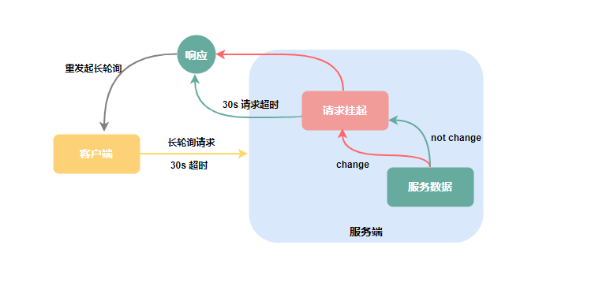
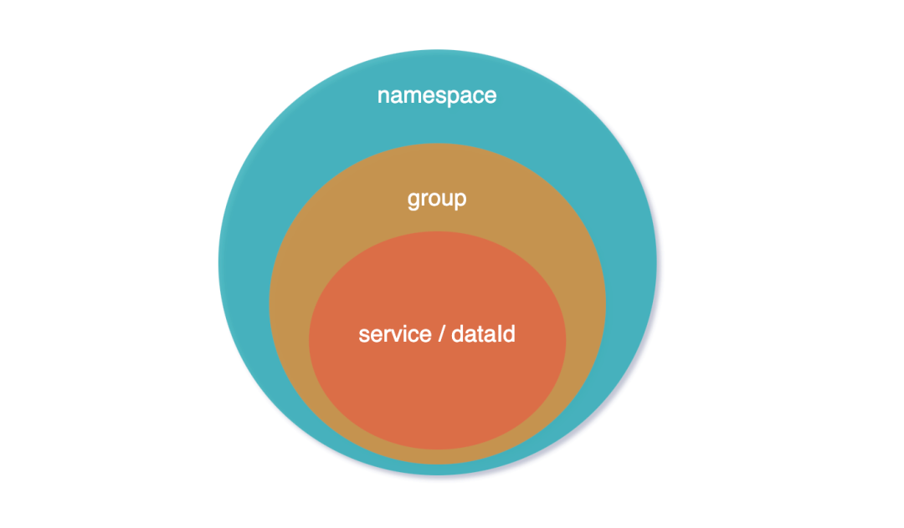
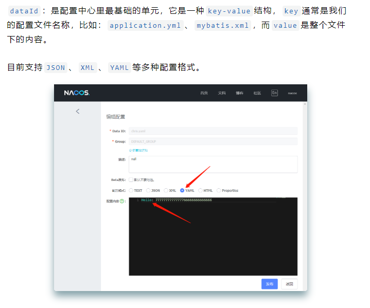
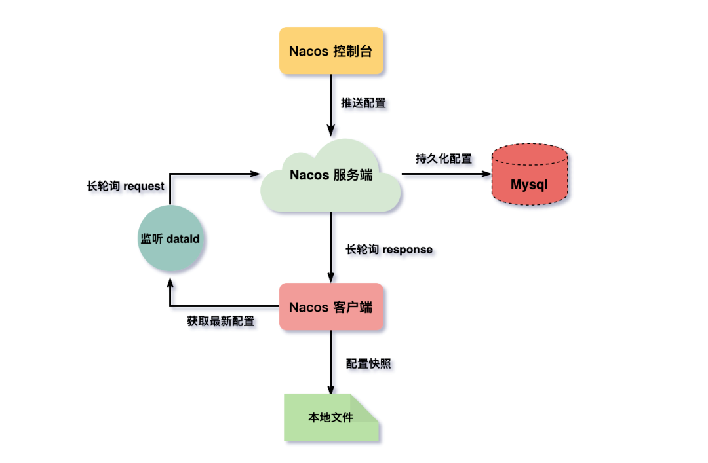

# Nacos配置中心交互模型

https://mp.weixin.qq.com/s/i_skVFvqXhVFN52gbhLUGA

## **推模型**

客户端与服务端建立`TCP`长连接，当服务端配置数据有变动，立刻通过建立的长连接将数据推送给客户端。

优势：长链接的优点是实时性，一旦数据变动，立即推送变更数据给客户端，而且对于客户端而言，这种方式更为简单，只建立连接接收数据，并不需要关心是否有数据变更这类逻辑的处理。

弊端：长连接可能会因为网络问题，导致不可用，也就是俗称的`假死`。连接状态正常，但实际上已无法通信，所以要有的心跳机制`KeepAlive`来保证连接的可用性，才可以保证配置数据的成功推送。

## **拉模型**

客户端主动的向服务端发请求拉配置数据，常见的方式就是轮询，比如每3s向服务端请求一次配置数据。

轮询的优点是实现比较简单。但弊端也显而易见，轮询无法保证数据的实时性，什么时候请求？间隔多长时间请求一次？都是不得不考虑的问题，而且轮询方式对服务端还会产生不小的压力。

## 长轮询

开篇我们就给出了答案，`nacos`采用的是客户端主动拉`pull`模型，应用长轮询（`Long Polling`）的方式来获取配置数据



```
Nacos`配置中心的几个核心概念：`dataId`、`group`、`namespace
```





## 架构设计



Nacos 2.0.1版本源码分析


