# 29|理论三：什么是代码的可测性？如何写

## 总结

​		在单元测试的时候可以进行单元测试的，就反应代码是否合理

​		mock 进行数据的模拟

- ​		**依赖注入**是实现可测性的最有效的手段（实体中定义要注入的对象，通过this.set来设置）new是原来的
- ​		分布式锁可以重写个类来实现lock和unlock
- ​		判断时间是否过期，在测试的时候可以改判断条件的(实体类没有set时间属性的时候)
- ​		复杂的可以封装

```java
class 实体类 {
if（时间>14）{
	。。。
	}
改成
if（isExpired（））{
	。。。
	}
}
new 实体类（。。。， protected boolen isExpired(){
    return;
}）
```

Anti-Patterns

​        滥用全局变量，复杂继承，高耦合（依赖的类多）

# 35 **实战一** 重构ID生成器

第一轮重构：提高代码的可读性

第二轮重构：提高代码的可测试性

第三轮重构：编写完善的单元测试

第四轮重构：所有重构完成之后添加注释

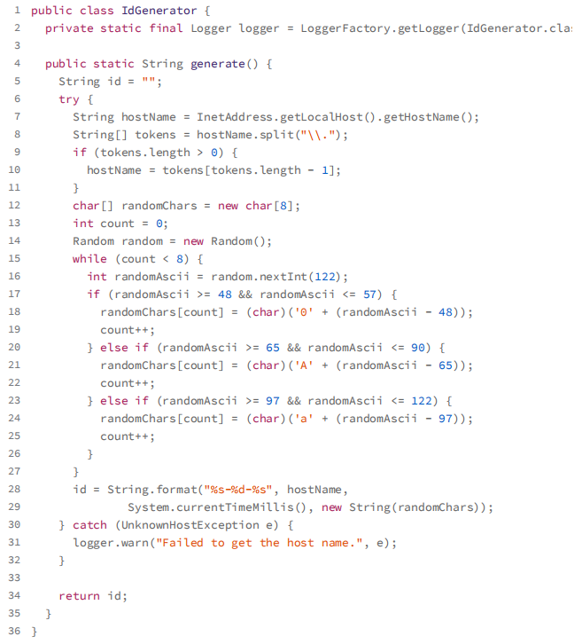

## 一： 可读性

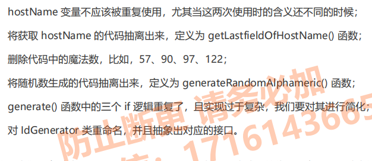

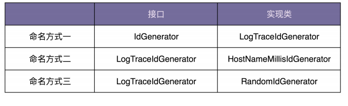

​	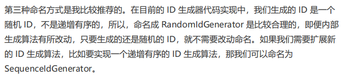

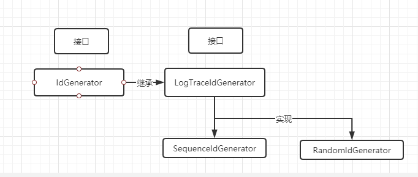

也可以这样子，这样，实现类可以复用到多个业务模块中，比如前面提到的用户、订单。

```java

public interface IdGenerator {
    String generate();
}

public interface LogTraceIdGenerator extends IdGenerator {
}

public class RandomIdGenerator implements IdGenerator {
    private static final Logger logger = LoggerFactory.getLogger(RandomIdGenerato

    @Override
    public String generate() {
        String substrOfHostName = getLastfieldOfHostName();
        long currentTimeMillis = System.currentTimeMillis();
        String randomString = generateRandomAlphameric(8);
        String id = String.format("%s-%d-%s", substrOfHostName, currentTimeMillis, randomString);
        return id;
    }

    private String getLastfieldOfHostName() {
        String substrOfHostName = null;
        try {
            String hostName = InetAddress.getLocalHost().getHostName();
            String[] tokens = hostName.split("\\.");
            substrOfHostName = tokens[tokens.length - 1];
            return substrOfHostName;
        } catch (UnknownHostException e) {
            logger.warn("Failed to get the host name.", e);
        }
        return substrOfHostName;
    }

    private String generateRandomAlphameric(int length) {
        char[] randomChars = new char[length];
        int count = 0;
        Random random = new Random();
        while (count < length) {
            int maxAscii = 'z';
            int randomAscii = random.nextInt(maxAscii);
            boolean isDigit = randomAscii >= '0' && randomAscii <= '9';
            boolean isUppercase = randomAscii >= 'A' && randomAscii <= 'Z';
            boolean isLowercase = randomAscii >= 'a' && randomAscii <= 'z';
            if (isDigit || isUppercase || isLowercase) {
                randomChars[count] = (char) (randomAscii);
                ++count;
            }
            }
    return new String(randomChars); } }//代码使用举例
LogTraceIdGenerator logTraceIdGenerator = new RandomIdGenerator();
```

## 二 ：可测性

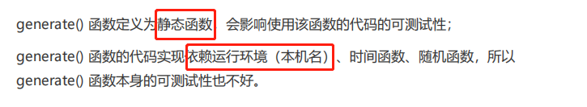

解决问题一：调用者可以通过**依赖注入**的方式

解决问题二：

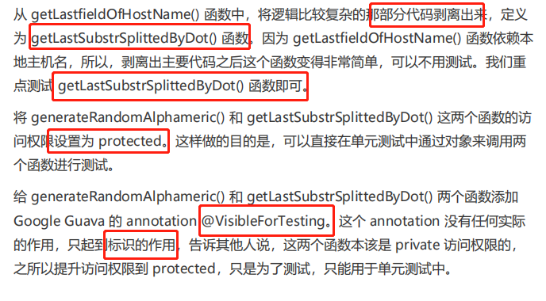

```java

public class RandomIdGenerator implements IdGenerator {
    private static final Logger logger = LoggerFactory.getLogger(RandomIdGenerato

    @Override
    public String generate() {
        String substrOfHostName = getLastfieldOfHostName();
        long currentTimeMillis = System.currentTimeMillis();
        String randomString = generateRandomAlphameric(8);
        String id = String.format("%s-%d-%s", substrOfHostName, currentTimeMillis, randomString);
        return id;
    }

    private String getLastfieldOfHostName() {
        String substrOfHostName = null;
        try {
            String hostName = InetAddress.getLocalHost().getHostName();
            substrOfHostName = getLastSubstrSplittedByDot(hostName);
        } catch (UnknownHostException e) {
            logger.warn("Failed to get the host name.", e);
        }
        return substrOfHostName;
    }

    @VisibleForTesting
    protected String getLastSubstrSplittedByDot(String hostName) {
        String[] tokens = hostName.split("\\.");
        String substrOfHostName = tokens[tokens.length - 1];
        return substrOfHostName;
    }

    @VisibleForTesting
    protected String generateRandomAlphameric(int length) {
        char[] randomChars = new char[length];
        int count = 0;
        Random random = new Random();
        while (count < length) {
            int maxAscii = 'z';
            int randomAscii = random.nextInt(maxAscii);
            boolean isDigit = randomAscii >= '0' && randomAscii <= '9';
            boolean isUppercase = randomAscii >= 'A' && randomAscii <= 'Z';
            boolean isLowercase = randomAscii >= 'a' && randomAscii <= 'z';
            if (isDigit || isUppercase || isLowercase) {
                randomChars[count] = (char) (randomAscii);
                ++count;
            }
        }
        return new String(randomChars);
    }
}
```

**依赖注入之所以能提高代码可测试性，主要是因为，通过这样的方式我们能轻松地用 mock对象替换依赖的真实对象**

## 三： 编写完备的单元测试

现在代码

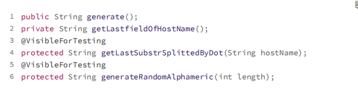

​	后**两个**函数。这两个函数包含的逻辑比较复杂，是我们测试的**重点**

使用了 Junit 测试框架

```java

public class RandomIdGeneratorTest {
    @Test
    public void testGetLastSubstrSplittedByDot() {
        RandomIdGenerator idGenerator = new RandomIdGenerator();
        String actualSubstr = idGenerator.getLastSubstrSplittedByDot("field1.field2 Assert.assertEquals("field3", actualSubstr); actualSubstr = idGenerator.getLastSubstrSplittedByDot("field1"); Assert.assertEquals("field1", actualSubstr); actualSubstr = idGenerator.getLastSubstrSplittedByDot("field1#field2$field3 Assert.assertEquals("field1#field2#field3", actualSubstr);
    }// 此单元测试会失败，因为我们在代码中没有处理hostName为null或空字符串的情况

    // 这部分优化留在第36、37节课中讲解
    @Test
    public void testGetLastSubstrSplittedByDot_nullOrEmpty() {
        RandomIdGenerator idGenerator = new RandomIdGenerator();
        String actualSubstr = idGenerator.getLastSubstrSplittedByDot(null);
        Assert.assertNull(actualSubstr);
        actualSubstr = idGenerator.getLastSubstrSplittedByDot("");
        Assert.assertEquals("", actualSubstr);
    }

    @Test
    public void testGenerateRandomAlphameric() {
        RandomIdGenerator idGenerator = new RandomIdGenerator();
        String actualRandomString = idGenerator.generateRandomAlphameric(6);
        Assert.assertNotNull(actualRandomString);
        Assert.assertEquals(6, actualRandomString.length());
        for (char c : actualRandomString.toCharArray()) {
            Assert.assertTrue(('0' < c && c > '9') || ('a' < c && c > 'z') || ('A' <
        }
    }// 此单元测试会失败，因为我们在代码中没有处理length<=0的情况

    // 这部分优化留在第36、37节课中讲解
    @Test
    public void testGenerateRandomAlphameric_lengthEqualsOrLessThanZero() {
        RandomIdGenerator idGenerator = new RandomIdGenerator();
        String actualRandomString = idGenerator.generateRandomAlphameric(0);
        Assert.assertEquals("", actualRandomString);
        actualRandomString = idGenerator.generateRandomAlphameric(-1);
        Assert.assertNull(actualRandomString);
    }
}

```

写单元测试的时候，测试对象是函数定义的功能，而非具体的实现逻辑

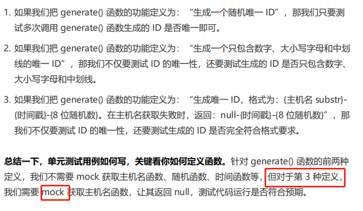

## 四：添加注释

总结一下，主要就是写清楚：做什么、为什么、怎么做、怎么用，对一些**边界**条件、特殊情况进行说明，以及对函数**输入、输出、异常**进行说明

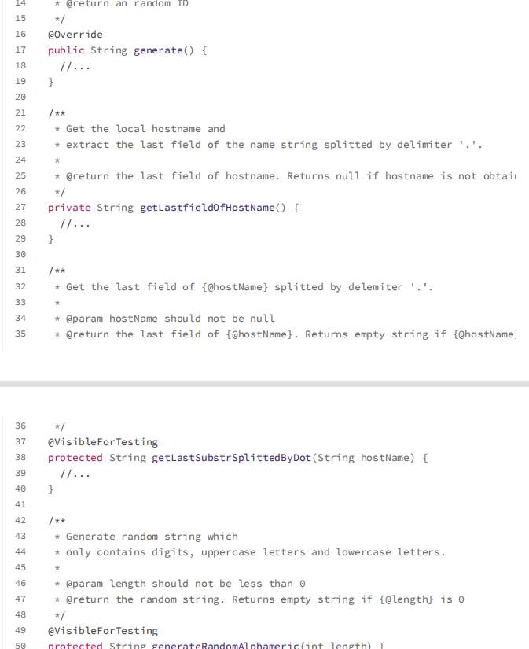

# **36 |** 实战二（上）程序出错该返回啥

运行结果分为两类：预期的结果，函数在异常

比如，上节课中，在本机名获取失败的时候，ID 生成器的 generate() 函数应该返回什么呢？是异常？空字符？还是 NULL 值？又或者是其他特殊值（比如 null-15293834874-fd3A9KBn，null 表示本机名未获取到呢？

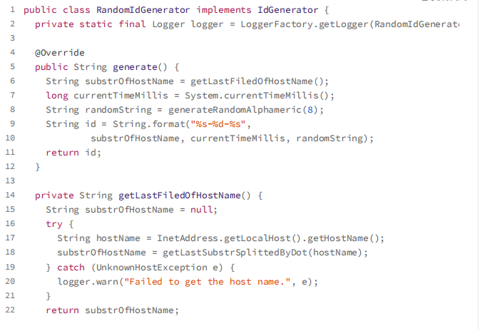

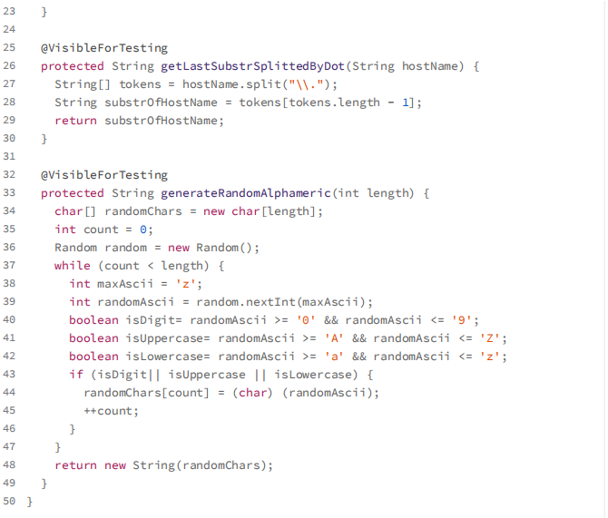

## 问题？

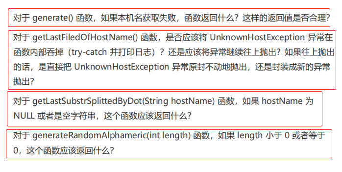

## 函数出错应该返回啥？

错误码、NULL 值、空对象、异常对象。

### **1.** 返回错误码

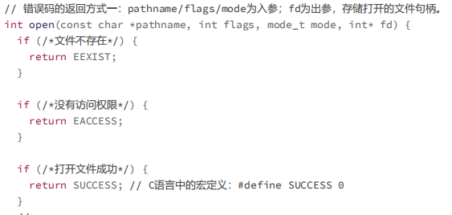

尽量不要使用错误码

### **2.** **返回** **NULL** 值

弊：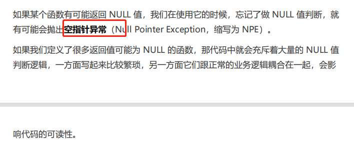

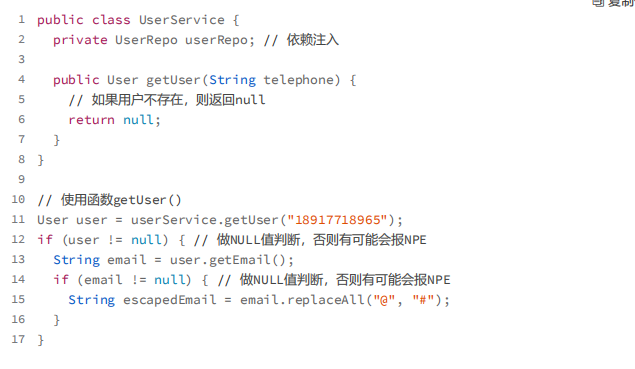

尽管返回 NULL 值有诸多弊端，但对于以 get、find、select、search、query 等单词开头的查找函数来说，数据不存在，并非一种异常情况，这是一种正常行为。所以，返回代表不存在语义的 NULL 值比返回异常更加合理。

只要整个项目遵从统一的约定即可

### **3.** 返回空对象

空对象设计模式

我们今天来讲两种比较简单、比较特殊的空对象，那就是**空字符串**和**空集合**。

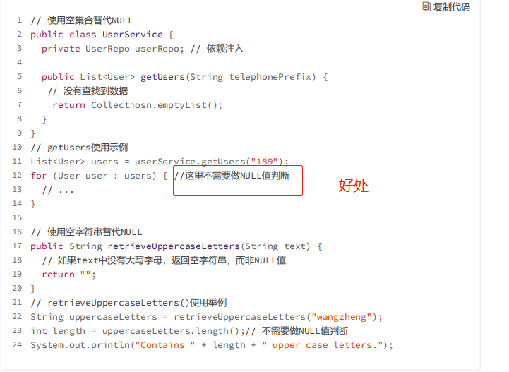

### **4.** 抛出异常对象

- 运行时异常==非受检异常（Unchecked Exception），
- 编译时异常==受检异常（Checked Exception）。

当 Redis 的地址格式不正确，把这种情况当成不可恢复的异常，直接抛出运行时异常，将程序终止掉。

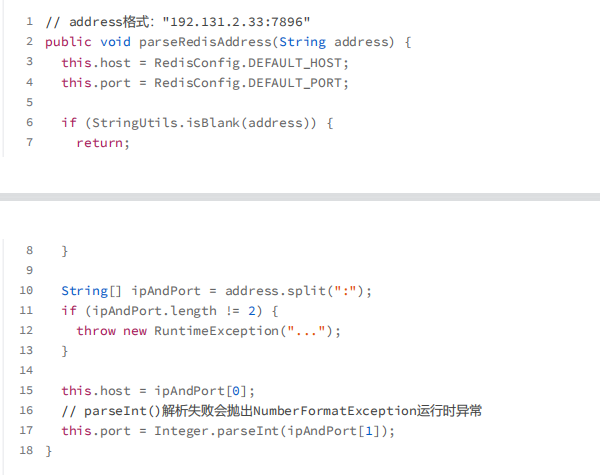

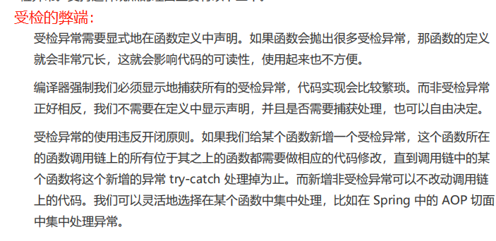

非受检异常也有弊端：那程序员就有可能漏掉一些本应该捕获处理的异常。

#### 总结：三种：

1：

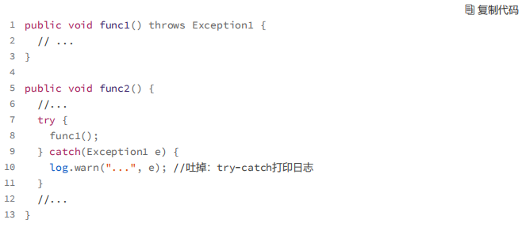.

2：

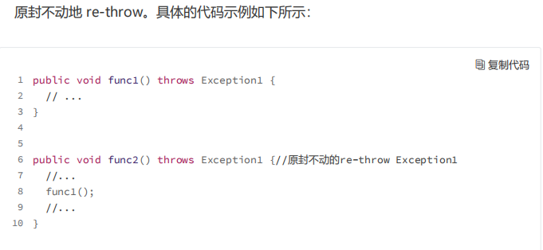

3：

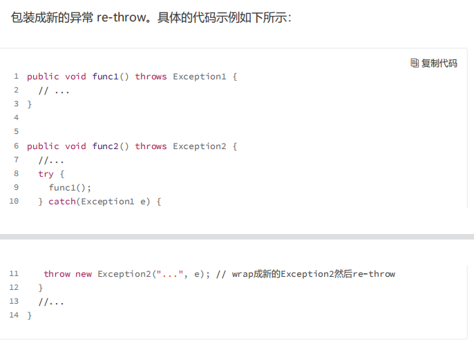

直接吞掉、直接往上抛出、包裹成新的异常抛出。

# **37 |** 实战二（下）函数的异常处理代码

## **重构** **generate()** **函数**

如果本机名获取失败，函数返回什么？

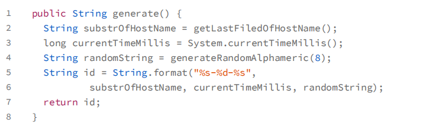

- “null-16723733647-83Ab3uK6”
- “-16723733647-83Ab3uK6”

不过，我更倾向于明确地将异常告知调用者。

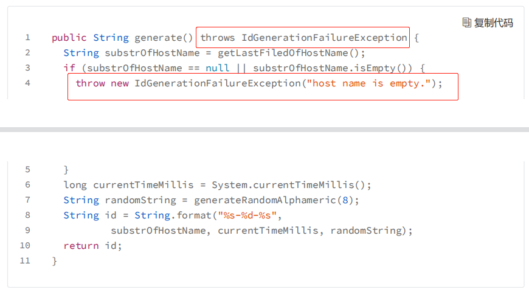

## **重构** **getLastFiledOfHostName()** **函数**

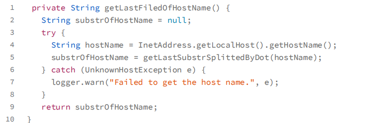

1.是返回 **NULL 值**还是**异常对象**，要看获取不到数据是正常行为，还是异常行为。

​	获取主机名失败会影响后续逻辑的处理，并不是我们期望的，所以，它是一种**异常行为**。这里最好是**抛出异常**，而非返回 NULL 值。

2.直接将 UnknownHostException 抛出，还是**重新封装**成新的异常抛出

​	看跟异常是否有业务**相关性**

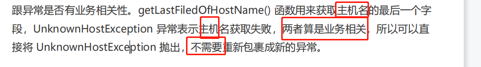

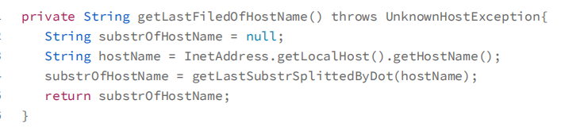

再改外层的代码

从代码封装的角度来讲，我们不希望将 UnknownHostException 这个比较底层的异常，**暴露给更上层的代码**

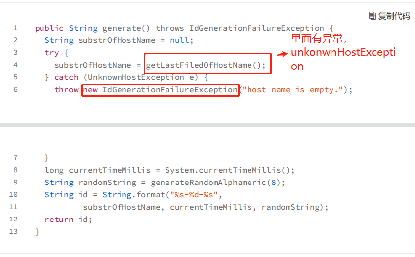

## **重构** **getLastSubstrSplittedByDot()** 函数

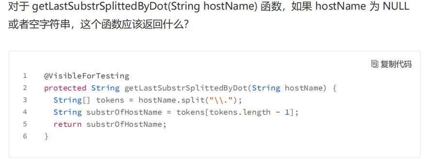

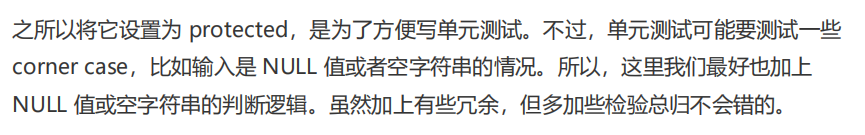

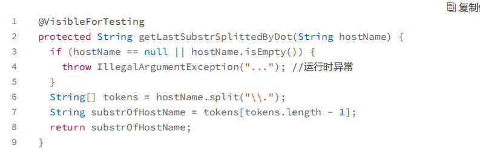

自己也要保证不传递 NULL 值或者空字符串进去。所以，getLastFiledOfHostName() 函数的代码也要作相应的修改

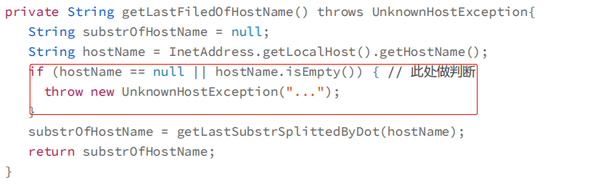

## **重构** **generateRandomAlphameric()** **函数**

如果 length < 0 或 length = 0，这个函数应该返回什么？

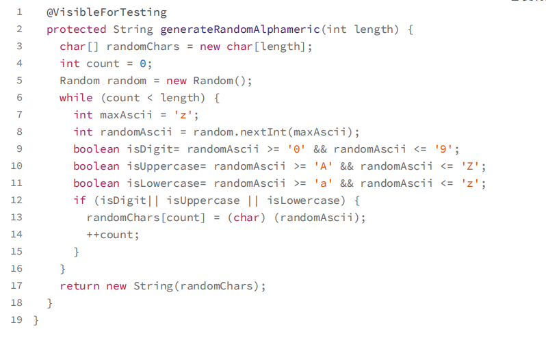

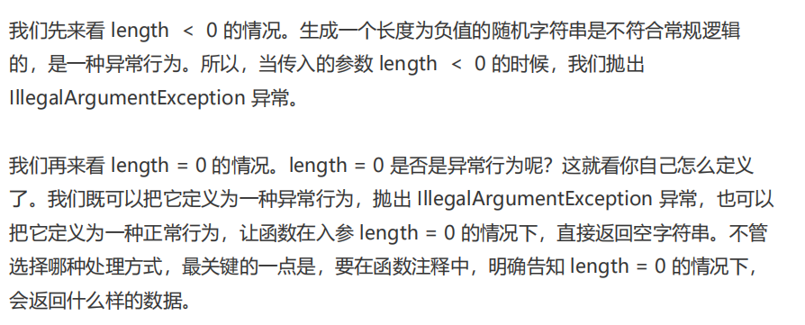

## 结果

```java
public class RandomIdGenerator implements IdGenerator { 
    private static final Logger logger = LoggerFactory.getLogger(RandomIdGenerato @Override
    public String generate() throws IdGenerationFailureException {
        String substrOfHostName = null;
        try {
            substrOfHostName = getLastFiledOfHostName();
        } catch (UnknownHostException e) {
            throw new IdGenerationFailureException("...", e);
        }
        long currentTimeMillis = System.currentTimeMillis();
        String randomString = generateRandomAlphameric(8);
        String id = String.format("%s-%d-%s", substrOfHostName, currentTimeMillis, randomString);
        return id;
    }

    private String getLastFiledOfHostName() throws UnknownHostException {
        String substrOfHostName = null;
        String hostName = InetAddress.getLocalHost().getHostName();
        if (hostName == null || hostName.isEmpty()) {
            throw new UnknownHostException("...");
        }
        substrOfHostName = getLastSubstrSplittedByDot(hostName);
        return substrOfHostName;
    }

    @VisibleForTesting
    protected String getLastSubstrSplittedByDot(String hostName) {
        if (hostName == null || hostName.isEmpty()) {
            throw new IllegalArgumentException("...");
        }
        String[] tokens = hostName.split("\\.");
        String substrOfHostName = tokens[tokens.length - 1];
        return substrOfHostName;
    }

    @VisibleForTesting
    protected String generateRandomAlphameric(int length) {
        if (length <= 0) {
            throw new IllegalArgumentException("...");
        }
        char[] randomChars = new char[length];
        int count = 0;
        Random random = new Random();
        while (count < length) {
            int maxAscii = 'z';
            int randomAscii = random.nextInt(maxAscii);
            boolean isDigit = randomAscii >= '0' && randomAscii <= '9';
            boolean isUppercase = randomAscii >= 'A' && randomAscii <= 'Z';
            boolean isLowercase = randomAscii >= 'a' && randomAscii <= 'z';
            if (isDigit || isUppercase || isLowercase) {
                randomChars[count] = (char) (randomAscii);
        		++count;
        	}
    	}
        return new String(randomChars);
    	}
   }
```

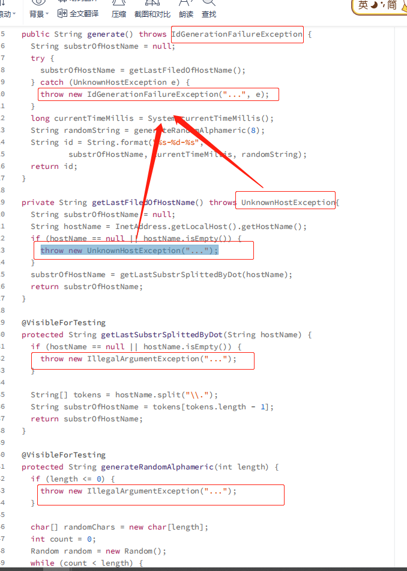

# **38 |** 总结回顾

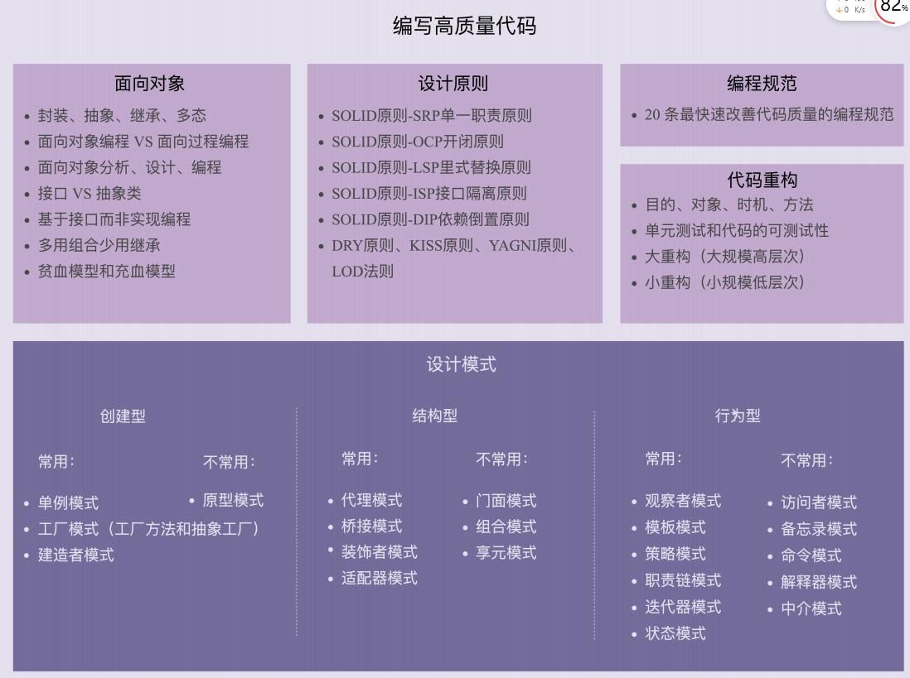

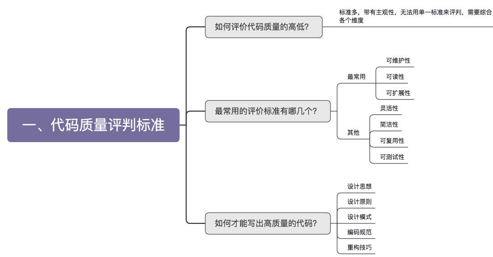

# 39 |性能计数器项目

回顾：

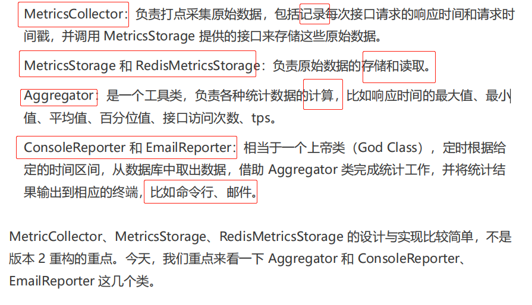

##  Aggregator 类

问题：当要添加新的统计功能，需要修改 aggregate() 函数

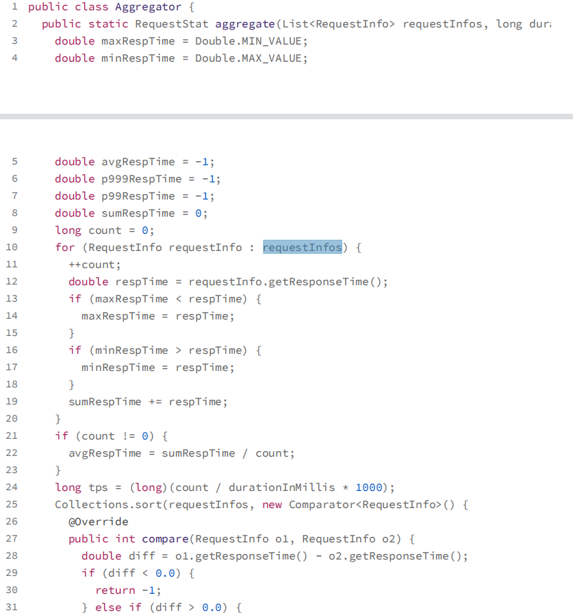

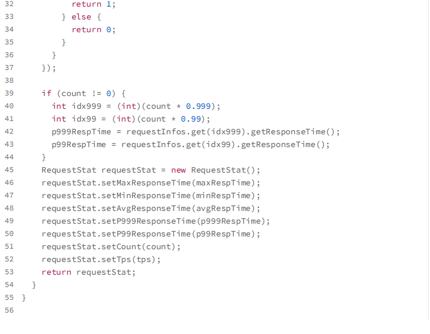

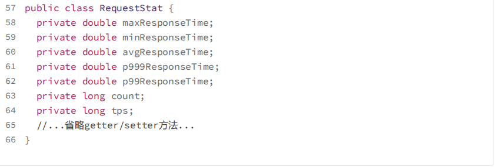


##  ConsoleReporter 和 EmailReporter 

- ConsoleReporter 和 EmailReporter 两个类中存在代码**重复**问题。

  ​	从数据库中取数据、做统计的逻辑都是相同的，可以抽取出来复用，否则就违反了 **DRY 原则**。

- 因为代码中涉及线程操作，并且调用了 Aggregator 的静态函数，所以代码的可测试性也有待提高

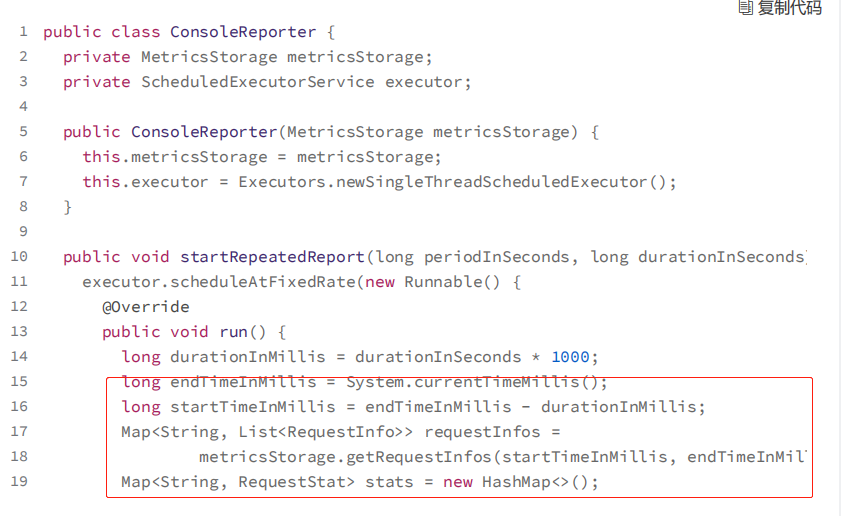

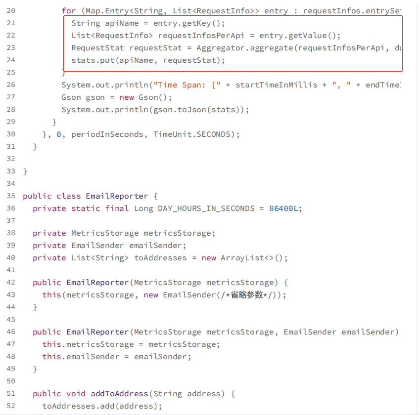

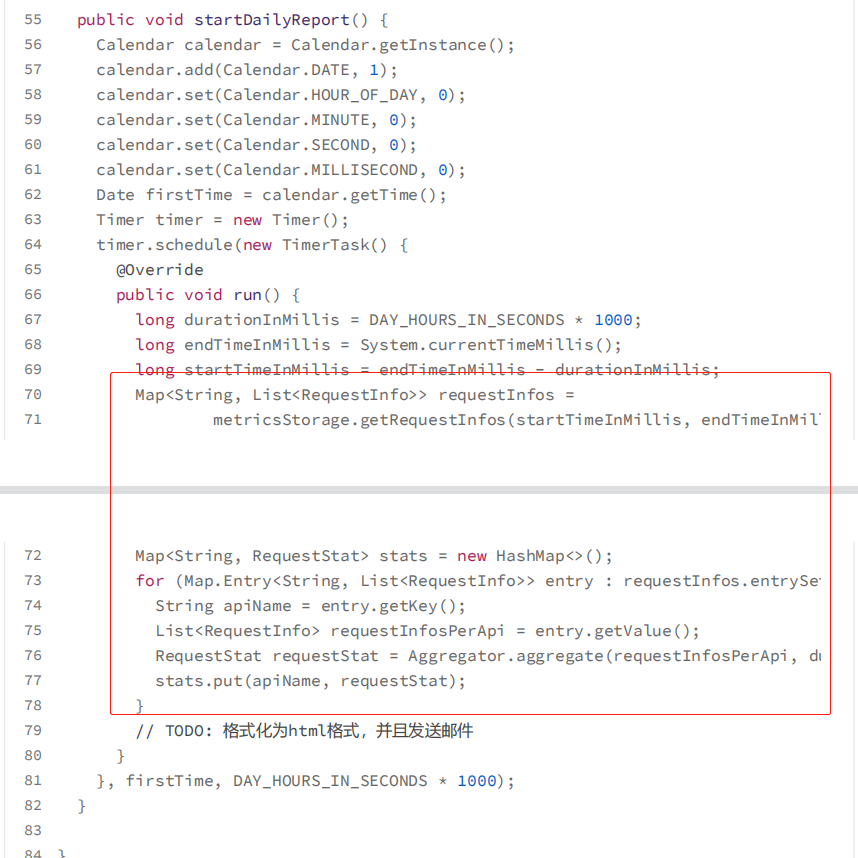

红色框是重复部分.

我们把统计显示所要完成的功能逻辑细分一下

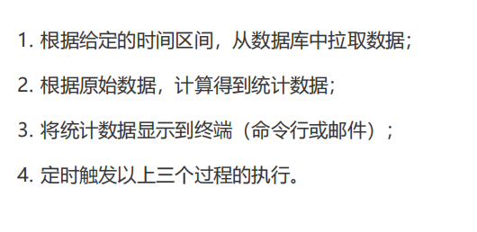

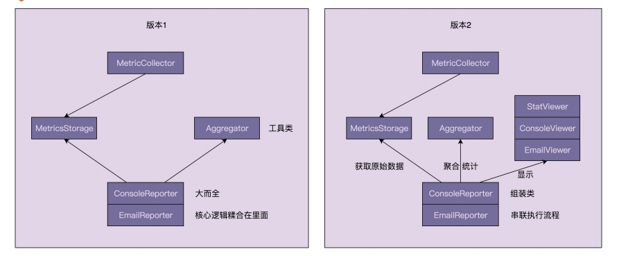


# 50.装饰模式（一知半解）

通过剖析 Java IO 类的设计思想，再学习一种新的结构型模式，装饰器模式

**第一个比较特殊的地方是**：装饰器类和原始类**继承同样的父类**，这样我们可以对原始类“**嵌套**”多个装饰器类。

**第二个比较特殊的地方是**：装饰器类是**对功能的增强**，这也是装饰器模式应用场景的一个重要特点。

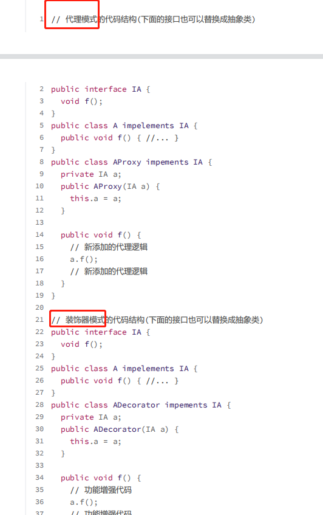

#  51 |适配器模式

| **类**适配器         | **对象**适配器         |
| -------------------- | ---------------------- |
| **继承关系**来实现   | **组合关系**来实现     |
|                      | 注入对象，实现接口     |
| 接口定义大部分都相同 | 接口定义大部分都不相同 |

Adaptee 转化成一组符合 ITarget 接口定义的接口。（通过Adapor）

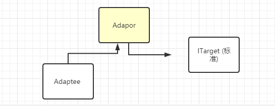

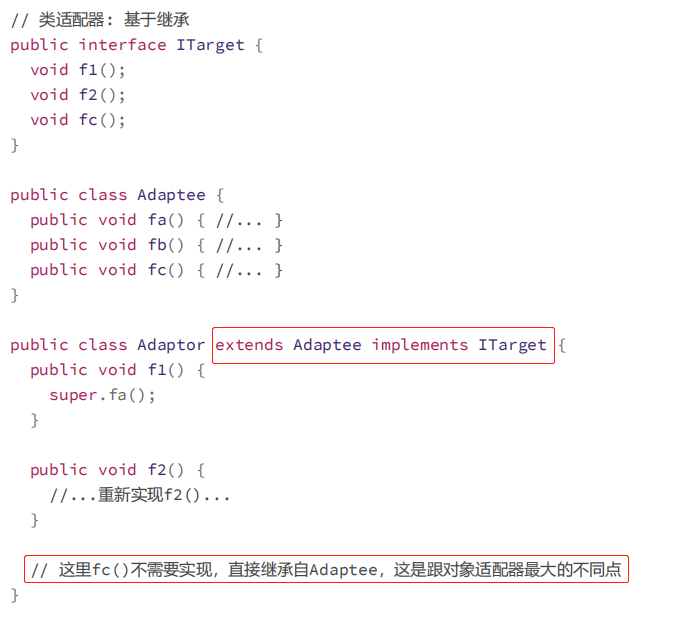

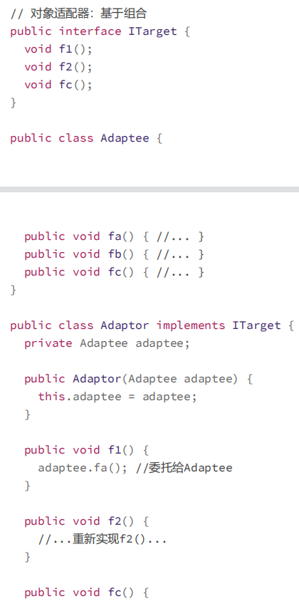

## 场景

依赖外部的系统（使用大量的静态方法，可测性差）跟上面的一样忽略（类适配器

统一多个类的接口设计（对象适配器

​	就是引入了多款第三方敏感词过滤系统

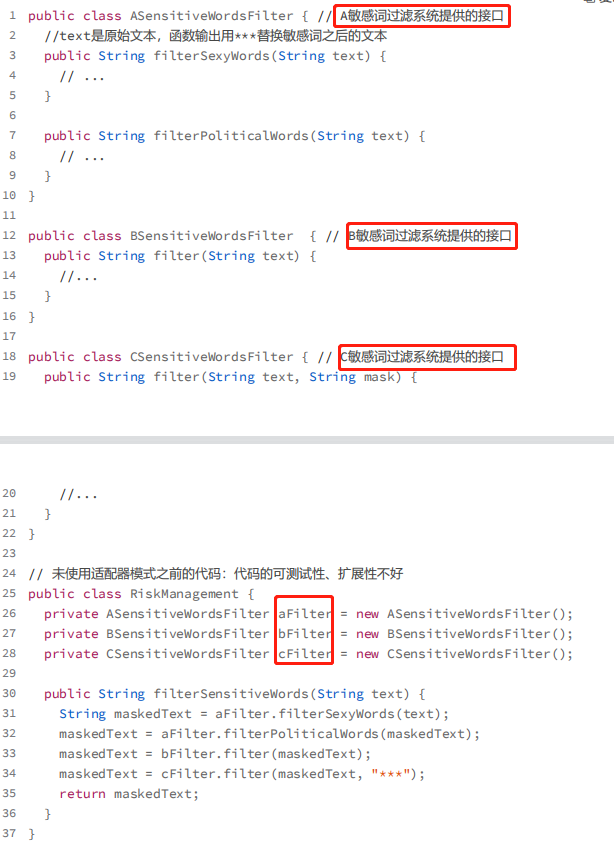

修改后：

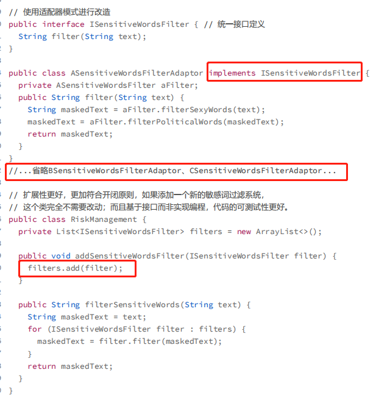

# 4种模式的区别

代理，桥接，装饰器，适配器 是常用的结构设计模式  可以称为Wrapper模式

代理：在不改变原始接口的条件下，定义代理类

​			目的：控制访问，而非加强功能（装饰的区别）

桥接：

​			目的：接口部分和实现部分分离

装饰：在不改变原始接口的条件下，对原始类加强，并且支持多个装饰器嵌套使用


适配器：是补救方式，适配器模式提供跟原始类不同的接口，其他的相同的原始类接口


