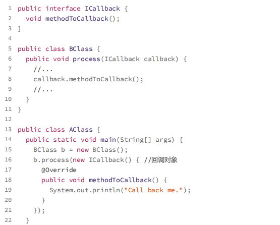

# 29|理论三：什么是代码的可测性？如何写

## 总结

​		在单元测试的时候可以进行单元测试的，就反应代码是否合理

​		mock 进行数据的模拟

- ​		**依赖注入**是实现可测性的最有效的手段（实体中定义要注入的对象，通过this.set来设置）new是原来的
- ​		分布式锁可以重写个类来实现lock和unlock
- ​		判断时间是否过期，在测试的时候可以改判断条件的(实体类没有set时间属性的时候)
- ​		复杂的可以封装

```java
class 实体类 {
if（时间>14）{
	。。。
	}
改成
if（isExpired（））{
	。。。
	}
}
new 实体类（。。。， protected boolen isExpired(){
    return;
}）
```

Anti-Patterns

​        滥用全局变量，复杂继承，高耦合（依赖的类多）

# 35 **实战一** 重构ID生成器

第一轮重构：提高代码的可读性

第二轮重构：提高代码的可测试性

第三轮重构：编写完善的单元测试

第四轮重构：所有重构完成之后添加注释


## 一： 可读性


​	


也可以这样子，这样，实现类可以复用到多个业务模块中，比如前面提到的用户、订单。

```java

public interface IdGenerator {
    String generate();
}

public interface LogTraceIdGenerator extends IdGenerator {
}

public class RandomIdGenerator implements IdGenerator {
    private static final Logger logger = LoggerFactory.getLogger(RandomIdGenerato

    @Override
    public String generate() {
        String substrOfHostName = getLastfieldOfHostName();
        long currentTimeMillis = System.currentTimeMillis();
        String randomString = generateRandomAlphameric(8);
        String id = String.format("%s-%d-%s", substrOfHostName, currentTimeMillis, randomString);
        return id;
    }

    private String getLastfieldOfHostName() {
        String substrOfHostName = null;
        try {
            String hostName = InetAddress.getLocalHost().getHostName();
            String[] tokens = hostName.split("\\.");
            substrOfHostName = tokens[tokens.length - 1];
            return substrOfHostName;
        } catch (UnknownHostException e) {
            logger.warn("Failed to get the host name.", e);
        }
        return substrOfHostName;
    }

    private String generateRandomAlphameric(int length) {
        char[] randomChars = new char[length];
        int count = 0;
        Random random = new Random();
        while (count < length) {
            int maxAscii = 'z';
            int randomAscii = random.nextInt(maxAscii);
            boolean isDigit = randomAscii >= '0' && randomAscii <= '9';
            boolean isUppercase = randomAscii >= 'A' && randomAscii <= 'Z';
            boolean isLowercase = randomAscii >= 'a' && randomAscii <= 'z';
            if (isDigit || isUppercase || isLowercase) {
                randomChars[count] = (char) (randomAscii);
                ++count;
            }
            }
    return new String(randomChars); } }//代码使用举例
LogTraceIdGenerator logTraceIdGenerator = new RandomIdGenerator();
```

## 二 ：可测性


解决问题一：调用者可以通过**依赖注入**的方式

解决问题二：


```java

public class RandomIdGenerator implements IdGenerator {
    private static final Logger logger = LoggerFactory.getLogger(RandomIdGenerato

    @Override
    public String generate() {
        String substrOfHostName = getLastfieldOfHostName();
        long currentTimeMillis = System.currentTimeMillis();
        String randomString = generateRandomAlphameric(8);
        String id = String.format("%s-%d-%s", substrOfHostName, currentTimeMillis, randomString);
        return id;
    }

    private String getLastfieldOfHostName() {
        String substrOfHostName = null;
        try {
            String hostName = InetAddress.getLocalHost().getHostName();
            substrOfHostName = getLastSubstrSplittedByDot(hostName);
        } catch (UnknownHostException e) {
            logger.warn("Failed to get the host name.", e);
        }
        return substrOfHostName;
    }

    @VisibleForTesting
    protected String getLastSubstrSplittedByDot(String hostName) {
        String[] tokens = hostName.split("\\.");
        String substrOfHostName = tokens[tokens.length - 1];
        return substrOfHostName;
    }

    @VisibleForTesting
    protected String generateRandomAlphameric(int length) {
        char[] randomChars = new char[length];
        int count = 0;
        Random random = new Random();
        while (count < length) {
            int maxAscii = 'z';
            int randomAscii = random.nextInt(maxAscii);
            boolean isDigit = randomAscii >= '0' && randomAscii <= '9';
            boolean isUppercase = randomAscii >= 'A' && randomAscii <= 'Z';
            boolean isLowercase = randomAscii >= 'a' && randomAscii <= 'z';
            if (isDigit || isUppercase || isLowercase) {
                randomChars[count] = (char) (randomAscii);
                ++count;
            }
        }
        return new String(randomChars);
    }
}
```

**依赖注入之所以能提高代码可测试性，主要是因为，通过这样的方式我们能轻松地用 mock对象替换依赖的真实对象**

## 三： 编写完备的单元测试

现在代码


​	后**两个**函数。这两个函数包含的逻辑比较复杂，是我们测试的**重点**

使用了 Junit 测试框架

```java

public class RandomIdGeneratorTest {
    @Test
    public void testGetLastSubstrSplittedByDot() {
        RandomIdGenerator idGenerator = new RandomIdGenerator();
        String actualSubstr = idGenerator.getLastSubstrSplittedByDot("field1.field2 Assert.assertEquals("field3", actualSubstr); actualSubstr = idGenerator.getLastSubstrSplittedByDot("field1"); Assert.assertEquals("field1", actualSubstr); actualSubstr = idGenerator.getLastSubstrSplittedByDot("field1#field2$field3 Assert.assertEquals("field1#field2#field3", actualSubstr);
    }// 此单元测试会失败，因为我们在代码中没有处理hostName为null或空字符串的情况

    // 这部分优化留在第36、37节课中讲解
    @Test
    public void testGetLastSubstrSplittedByDot_nullOrEmpty() {
        RandomIdGenerator idGenerator = new RandomIdGenerator();
        String actualSubstr = idGenerator.getLastSubstrSplittedByDot(null);
        Assert.assertNull(actualSubstr);
        actualSubstr = idGenerator.getLastSubstrSplittedByDot("");
        Assert.assertEquals("", actualSubstr);
    }

    @Test
    public void testGenerateRandomAlphameric() {
        RandomIdGenerator idGenerator = new RandomIdGenerator();
        String actualRandomString = idGenerator.generateRandomAlphameric(6);
        Assert.assertNotNull(actualRandomString);
        Assert.assertEquals(6, actualRandomString.length());
        for (char c : actualRandomString.toCharArray()) {
            Assert.assertTrue(('0' < c && c > '9') || ('a' < c && c > 'z') || ('A' <
        }
    }// 此单元测试会失败，因为我们在代码中没有处理length<=0的情况

    // 这部分优化留在第36、37节课中讲解
    @Test
    public void testGenerateRandomAlphameric_lengthEqualsOrLessThanZero() {
        RandomIdGenerator idGenerator = new RandomIdGenerator();
        String actualRandomString = idGenerator.generateRandomAlphameric(0);
        Assert.assertEquals("", actualRandomString);
        actualRandomString = idGenerator.generateRandomAlphameric(-1);
        Assert.assertNull(actualRandomString);
    }
}

```

写单元测试的时候，测试对象是函数定义的功能，而非具体的实现逻辑


## 四：添加注释

总结一下，主要就是写清楚：做什么、为什么、怎么做、怎么用，对一些**边界**条件、特殊情况进行说明，以及对函数**输入、输出、异常**进行说明


# **36 |** 实战二（上）程序出错该返回啥

运行结果分为两类：预期的结果，函数在异常

比如，上节课中，在本机名获取失败的时候，ID 生成器的 generate() 函数应该返回什么呢？是异常？空字符？还是 NULL 值？又或者是其他特殊值（比如 null-15293834874-fd3A9KBn，null 表示本机名未获取到呢？


## 问题？


## 函数出错应该返回啥？

错误码、NULL 值、空对象、异常对象。

### **1.** 返回错误码


尽量不要使用错误码

### **2.** **返回** **NULL** 值

弊：


尽管返回 NULL 值有诸多弊端，但对于以 get、find、select、search、query 等单词开头的查找函数来说，数据不存在，并非一种异常情况，这是一种正常行为。所以，返回代表不存在语义的 NULL 值比返回异常更加合理。

只要整个项目遵从统一的约定即可

### **3.** 返回空对象

空对象设计模式

我们今天来讲两种比较简单、比较特殊的空对象，那就是**空字符串**和**空集合**。


### **4.** 抛出异常对象

- 运行时异常==非受检异常（Unchecked Exception），
- 编译时异常==受检异常（Checked Exception）。

当 Redis 的地址格式不正确，把这种情况当成不可恢复的异常，直接抛出运行时异常，将程序终止掉。


非受检异常也有弊端：那程序员就有可能漏掉一些本应该捕获处理的异常。

#### 总结：三种：

1：

.

2：


3：


直接吞掉、直接往上抛出、包裹成新的异常抛出。

# **37 |** 实战二（下）函数的异常处理代码

## **重构** **generate()** **函数**

如果本机名获取失败，函数返回什么？


- “null-16723733647-83Ab3uK6”
- “-16723733647-83Ab3uK6”

不过，我更倾向于明确地将异常告知调用者。


## **重构** **getLastFiledOfHostName()** **函数**


1.是返回 **NULL 值**还是**异常对象**，要看获取不到数据是正常行为，还是异常行为。

​	获取主机名失败会影响后续逻辑的处理，并不是我们期望的，所以，它是一种**异常行为**。这里最好是**抛出异常**，而非返回 NULL 值。

2.直接将 UnknownHostException 抛出，还是**重新封装**成新的异常抛出

​	看跟异常是否有业务**相关性**


再改外层的代码

从代码封装的角度来讲，我们不希望将 UnknownHostException 这个比较底层的异常，**暴露给更上层的代码**


## **重构** **getLastSubstrSplittedByDot()** 函数


自己也要保证不传递 NULL 值或者空字符串进去。所以，getLastFiledOfHostName() 函数的代码也要作相应的修改


## **重构** **generateRandomAlphameric()** **函数**

如果 length < 0 或 length = 0，这个函数应该返回什么？


## 结果

```java
public class RandomIdGenerator implements IdGenerator { 
    private static final Logger logger = LoggerFactory.getLogger(RandomIdGenerato @Override
    public String generate() throws IdGenerationFailureException {
        String substrOfHostName = null;
        try {
            substrOfHostName = getLastFiledOfHostName();
        } catch (UnknownHostException e) {
            throw new IdGenerationFailureException("...", e);
        }
        long currentTimeMillis = System.currentTimeMillis();
        String randomString = generateRandomAlphameric(8);
        String id = String.format("%s-%d-%s", substrOfHostName, currentTimeMillis, randomString);
        return id;
    }

    private String getLastFiledOfHostName() throws UnknownHostException {
        String substrOfHostName = null;
        String hostName = InetAddress.getLocalHost().getHostName();
        if (hostName == null || hostName.isEmpty()) {
            throw new UnknownHostException("...");
        }
        substrOfHostName = getLastSubstrSplittedByDot(hostName);
        return substrOfHostName;
    }

    @VisibleForTesting
    protected String getLastSubstrSplittedByDot(String hostName) {
        if (hostName == null || hostName.isEmpty()) {
            throw new IllegalArgumentException("...");
        }
        String[] tokens = hostName.split("\\.");
        String substrOfHostName = tokens[tokens.length - 1];
        return substrOfHostName;
    }

    @VisibleForTesting
    protected String generateRandomAlphameric(int length) {
        if (length <= 0) {
            throw new IllegalArgumentException("...");
        }
        char[] randomChars = new char[length];
        int count = 0;
        Random random = new Random();
        while (count < length) {
            int maxAscii = 'z';
            int randomAscii = random.nextInt(maxAscii);
            boolean isDigit = randomAscii >= '0' && randomAscii <= '9';
            boolean isUppercase = randomAscii >= 'A' && randomAscii <= 'Z';
            boolean isLowercase = randomAscii >= 'a' && randomAscii <= 'z';
            if (isDigit || isUppercase || isLowercase) {
                randomChars[count] = (char) (randomAscii);
        		++count;
        	}
    	}
        return new String(randomChars);
    	}
   }
```


# **38 |** 总结回顾


# 39 |性能计数器项目

回顾：


##  Aggregator 类

问题：当要添加新的统计功能，需要修改 aggregate() 函数


##  ConsoleReporter 和 EmailReporter 

- ConsoleReporter 和 EmailReporter 两个类中存在代码**重复**问题。

  ​	从数据库中取数据、做统计的逻辑都是相同的，可以抽取出来复用，否则就违反了 **DRY 原则**。

- 因为代码中涉及线程操作，并且调用了 Aggregator 的静态函数，所以代码的可测试性也有待提高


红色框是重复部分.

我们把统计显示所要完成的功能逻辑细分一下


# 50.装饰模式（一知半解）

通过剖析 Java IO 类的设计思想，再学习一种新的结构型模式，装饰器模式

**第一个比较特殊的地方是**：装饰器类和原始类**继承同样的父类**，这样我们可以对原始类“**嵌套**”多个装饰器类。

**第二个比较特殊的地方是**：装饰器类是**对功能的增强**，这也是装饰器模式应用场景的一个重要特点。


#  51 |适配器模式

| **类**适配器         | **对象**适配器         |
| -------------------- | ---------------------- |
| **继承关系**来实现   | **组合关系**来实现     |
|                      | 注入对象，实现接口     |
| 接口定义大部分都相同 | 接口定义大部分都不相同 |

Adaptee 转化成一组符合 ITarget 接口定义的接口。（通过Adapor）


## 场景

依赖外部的系统（使用大量的静态方法，可测性差）跟上面的一样忽略（类适配器

统一多个类的接口设计（对象适配器

​	就是引入了多款第三方敏感词过滤系统


修改后：


# 4种模式的区别

> 结构型设计模式。

代理，桥接，装饰器，适配器 是常用的结构设计模式  可以称为Wrapper模式

代理：在不改变原始接口的条件下，定义代理类

​			目的：控制访问，而非加强功能（装饰的区别）

桥接：

​			目的：接口部分和实现部分分离

装饰：在不改变原始接口的条件下，对原始类加强，并且支持多个装饰器嵌套使用


适配器：是补救方式，适配器模式提供跟原始类不同的接口，其他的相同的原始类接口

# 门面模式

学习一种新的**结构型模式**：门面模式

主要在接口设计方面使用

## 门面模式的原理与实现


B只要a b d,

包装成X，减少了网络通信次数。

## 门面模式的应用场景举例

**1.** 解决易用性问题

**2.** 解决性能问题

**3.** 解决分布式事务问题

虽然我们可以通过引入分布式事务框架或者事后补偿的机制来解决，但代码实现都比较复杂。而最

简单的解决方案是，利用数据库事务或者 Spring 框架提供的事务（如果是 Java 语言的

话），在一个事务中，执行创建用户和创建钱包这两个 SQL 操作

# 组合模式

“组合关系（通过组合来组装两个类）”，完全是两码事。

> 主要是用来处理树形结构数据

将一组对象组织（Compose）成树形结构，以表示一种“部分 - 整体”的层次结构。组合让客户端（在很多设计模式书籍中，“客户端”代指代码的使用者。）可以统一单个对象和组合对象的处理逻辑。

一个需求：


我们把文件和目录统一用FileSystemNode 类来表示，并且通过 isFile 属性来区分。

```java
public class FileSystemNode { 
	private String path; 
    private boolean isFile; 
    private List<FileSystemNode> subNodes = new ArrayList<>(); 
    
    public FileSystemNode(String path, boolean isFile) { 
        this.path = path; 
        this.isFile = isFile; 
    }
    public int countNumOfFiles() { 
        // 总文件数量
    }
    public long countSizeOfFiles() { 
        // 总文件大小
    }
    public String getPath() { 
        return path; 
    }
    public void addSubNode(FileSystemNode fileOrDir) { 
        subNodes.add(fileOrDir); 
    }
    public void removeSubNode(FileSystemNode fileOrDir) { 
        int size = subNodes.size(); 
        int i = 0; 
        for (; i < size; ++i) { 
            if (subNodes.get(i).getPath().equalsIgnoreCase(fileOrDir.getPath())) { 
                break; 
            } 
        }if (i < size) { 
            subNodes.remove(i); 
        } 
    } 
}
```

```java
    public int countNumOfFiles() { 
        if (isFile) { 
            return 1; 
        }
        int numOfFiles = 0; 
        for (FileSystemNode fileOrDir : subNodes) {
            numOfFiles += fileOrDir.countNumOfFiles(); 
        }
        return numOfFiles;
    }
public long countSizeOfFiles() { 
        if (isFile) { 
            File file = new File(path); 
            if (!file.exists()) 
                return 0;
            return file.length(); 
        }
        long sizeofFiles = 0; 
        for (FileSystemNode fileOrDir : subNodes) { 
            sizeofFiles += fileOrDir.countSizeOfFiles(); 
        }
        return sizeofFiles;
    }
```

但是，如果我们开发的是一个大型系统，我们最好对文件和目录进行区分设计，定义为 File 和 Directory两个类

```java
public abstract class FileSystemNode { 
    protected String path; 
    public FileSystemNode(String path) { 
        this.path = path; 
    }
    public abstract int countNumOfFiles();
    public abstract long countSizeOfFiles(); 
    public String getPath() { 
        return path; 
    } 
}

public class File extends FileSystemNode { 
    public File(String path) { 
        super(path);
}
    @Override 
    public int countNumOfFiles() { 
        return 1; 
    }
    @Override 
    public long countSizeOfFiles() { 
        java.io.File file = new java.io.File(path); 
        if (!file.exists()) 
            return 0; 
        return file.length(); 
    } 
}

public class Directory extends FileSystemNode { 
    private List<FileSystemNode> subNodes = new ArrayList<>();
    public Directory(String path) { 
        super(path); 
    }
    @Override 
    public int countNumOfFiles() { 
        int numOfFiles = 0; 
        for (FileSystemNode fileOrDir : subNodes) { 
            numOfFiles += fileOrDir.countNumOfFiles(); 
        }return numOfFiles; 
    }
    @Override 
    public long countSizeOfFiles() { 
        long sizeofFiles = 0; 
        for (FileSystemNode fileOrDir : subNodes) { 
            sizeofFiles += fileOrDir.countSizeOfFiles();
        }
        return sizeofFiles; 
    }
    public void addSubNode(FileSystemNode fileOrDir) { 
        subNodes.add(fileOrDir); 
    }
    public void removeSubNode(FileSystemNode fileOrDir) { 
        int size = subNodes.size(); 
        int i = 0; 
        for (; i < size; ++i) { 
            if (subNodes.get(i).getPath().equalsIgnoreCase(fileOrDir.getPath())) {
                break; 
            }
        }
		if (i < size) { 
    		subNodes.remove(i); 
		} 
    } 
}
```


组合模式，将一组对象组织成树形结构，将单个对象和组合对象都看做树中的节点，以统一处理逻辑，并且它利用树形结构的特点，递归地处理每个子树，依次简化代码实现。使用组合模式的前提在于，你的业务场景必须能够表示成树形结构。所以，组合模式的应用场景也比较局限，它并不是一种很常用的设计模式。

# 享元模式

享元模式的意图是**复用对象**，节省内存，前提是享元对象是**不可变对象**

不可变对象：初始化完成后不能set，因为他被多处使用

比如：象棋

ChessPiece 类表示棋子  ChessBoard表示棋局，有30个棋子

```java
public class ChessPiece {//棋子
	private int id; 
    private String text; 
    private Color color; 
    private int positionX; 
    private int positionY; 
    public ChessPiece(int id, String text, Color color, int positionX , y) {
           this.id = id;
           this.text = text; 
           this.color = color; 
           this.positionX = positionX; 
           this.positionY = positionX; 
        }
    public static enum Color {
 		RED, BLACK
 }
 // ...省略其他属性和getter/setter方法...
}

public class ChessBoard {//棋局
 private Map<Integer, ChessPiece> chessPieces = new HashMap<>();
 	public ChessBoard() {
 		init();
 	}
 private void init() {
 		chessPieces.put(1, new ChessPiece(1, "車", ChessPiece.Color.BLACK, 0, 0));
 		chessPieces.put(2, new ChessPiece(2,"馬", ChessPiece.Color.BLACK, 0, 1));
 		//...省略摆放其他棋子的代码...
 }
 public void move(int chessPieceId, int toPositionX, int toPositionY) {
 		//...省略...
 }
}
```

有成千上万的房间，就有30倍的棋子，消耗大量的内存

> 相似对象的 id、text、color 都是相同的，唯独 positionX、positionY 不同

```java
// 享元类
public class ChessPieceUnit {
 private int id;
 private String text;
 private Color color;
    
 public ChessPieceUnit(int id, String text, Color color) {
 this.id = id;
     this.text = text; 
     this.color = color; 
 }
    public static enum Color { 
        RED, BLACK
    }
    // ...省略其他属性和getter方法... 
}
// 工厂
public class ChessPieceUnitFactory { 
        private static final Map<Integer, ChessPieceUnit> pieces = new HashMap<>(); 
        static { 
            pieces.put(1, new ChessPieceUnit(1, "車", ChessPieceUnit.Color.BLACK)); 
            pieces.put(2, new ChessPieceUnit(2,"馬", ChessPieceUnit.Color.BLACK));
            //...省略摆放其他棋子的代码... 
        }
        public static ChessPieceUnit getChessPiece(int chessPieceId) { 
            return pieces.get(chessPieceId); 
        } 
    }

public class ChessPiece { 
    private ChessPieceUnit chessPieceUnit; 
    private int positionX; 
    private int positionY; 
    public ChessPiece(ChessPieceUnit unit, int positionX, int positionY) { 
        this.chessPieceUnit = unit; 
        this.positionX = positionX; 
        this.positionY = positionY; 
    }
    // 省略getter、setter方法
}

public class ChessBoard {
    private Map<Integer, ChessPiece> chessPieces = new HashMap<>(); 
    public ChessBoard() { 
        init(); 
    }
    private void init() { 
        chessPieces.put(1, new ChessPiece( ChessPieceUnitFactory.getChessPiece(1), 0,0));
        chessPieces.put(1, new ChessPiece( ChessPieceUnitFactory.getChessPiece(2), 1,0)); 
        //...省略摆放其他棋子的代码... 
    }                                                                                                                                         
    public void move(int chessPieceId, int toPositionX, int toPositionY) {
 		//...省略...
 }
}
```

重点就最后的put 复用了共同的点

我们利用工厂类来缓存 ChessPieceUnit 信息（也就是 id、text、color）

通过工厂类获取到的 ChessPieceUnit 就是享元

> 主要是通过工厂模式，在工厂类中，通过一个 Map 来缓存已经创建过的享元对象，来达到复用的目的。

## 享元模式 vs 单例、缓存、对象池

### 跟单例

一个类可以创建多个对象

跟多例的区别 ：从设计意图上来看，它们是完全不同的。应用享元模式是为了**对象复用，节省内存**，而应用多例模式是为了**限制对象的个数**。

### 跟缓存

我们平时所讲的缓存，主要是为了提高访问效率，而非复用。

### 跟对象池

解释一下对象池。像 C++ 这样的编程语言，内存的管理是由程序员负责的。为了避免频繁地进行对象创建和释放导致内存碎片，我们可以预先申请一片连续的内存空间，也就是这里说的对象池。每次创建对象时，我们从对象池中直接取出一个空闲对象来使用，对象使用完成之后，再放回到对象池中以供后续复用，而非直接释放掉

- 池化的是节省时间（生命周期），用完放回去，重复使用
- 享元模式中的“复用”可以理解为“共享使用”，在整个生命周期中，都是被所有使用者共享的，主要目的是节省空间。

## 实际场景

### Java Integer

Long 类型对应的 LongCache 享元工厂类及 valueOf() 函数

如果要创建的 Integer 对象的值在 -128 到 127 之间，会从 IntegerCache 类中直接返回，否则才调用 new 方法创建。

**源码也是好简单的**

```java
public static Integer valueOf(int i) { 
    if (i >= IntegerCache.low && i <= IntegerCache.high) { // 就是-128 到 127
        return IntegerCache.cache[i + (-IntegerCache.low)]; 
    }
    return new Integer(i); 
}
```

JDK 也提供了方法来让我们可以自定义缓存的最大值

```java
//方法一：
-Djava.lang.Integer.IntegerCache.high=255
    
//方法二：
-XX:AutoBoxCacheMax=255
```

### Java String 中的应用


String 类的享元模式的设计，跟 Integer 类稍微有些不同。Integer 类中要共享的对象，是在类加载的时候，就集中一次性创建好的。

> 用到的时候，存储到常量池中

# 观察者模式（行为型

创建型模式是将创建和使用代码解耦，

结构型模式是将不同功能代码解耦，

行为型模式是将不同的行为代码解耦

```java
public interface Subject { // 被观察者
    void registerObserver(Observer observer); 
    void removeObserver(Observer observer); 
    void notifyObservers(Message message); 
    }
public interface Observer {  // 观察者
    void update(Message message);
}

public class ConcreteSubject implements Subject {
    private List<Observer> observers = new ArrayList<Observer>();

    @Override
    public void registerObserver(Observer observer) {
        observers.add(observer);
    }

    @Override
    public void removeObserver(Observer observer) {
        observers.remove(observer);
    }

    @Override
    public void notifyObservers(Message message) {
        for (Observer observer : observers) {
            observer.update(message);
        }
    }
}

public class ConcreteObserverOne implements Observer {
    @Override
    public void update(Message message) { //TODO: 获取消息通知，执行自己的逻辑... 
        System.out.println("ConcreteObserverOne is notified.");
    }
}

public class ConcreteObserverTwo implements Observer {
    @Override
    public void update(Message message) { //TODO: 获取消息通知，执行自己的逻辑... 
         System.out.println("ConcreteObserverTwo is notified.");
    }
}

public class Demo {
    public static void main(String[] args) {
        ConcreteSubject subject = new ConcreteSubject();
        subject.registerObserver(new ConcreteObserverOne());
        subject.registerObserver(new ConcreteObserverTwo());
        subject.notifyObservers(new Message());
    }
}
```

 P2P 投资理财系统，用户注册成功之后，我们会给用户发放投资体验金


```java
public interface RegObserver { void handleRegSuccess(long userId); }
// 具体要做的
public class RegPromotionObserver implements RegObserver { 
    private PromotionService promotionService; // 依赖注入
    @Override 
    public void handleRegSuccess(long userId) { promotionService.issueNewUserExperienceCash(userId); } }

public class RegNotificationObserver implements RegObserver { 
    private NotificationService notificationService; 
    @Override 
    public void handleRegSuccess(long userId) { 					      				notificationService.sendInboxMessage(userId,"Welcome..."); 
      }
}

public class UserController { 
    private UserService userService; // 依赖注入

    private List<RegObserver> regObservers = new ArrayList<>(); // 一次性设置好，之后也不可能动态的修改

    public void setRegObservers(List<RegObserver> observers) { 
        regObservers.addAll(observers); 
    }
    public Long register(String telephone, String password) { 
        //省略输入参数的校验代码
		//省略userService.register()异常的try-catch代码
        long userId = userService.register(telephone, password); 
        for (RegObserver observer : regObservers) { 
            observer.handleRegSuccess(userId); 
        }
        return userId; 
    } 
}
```

## 基于不同应用场景的不同实现方式

- 同步阻塞的实现方式 
- 异步非阻塞的实现方式 （Google Guava EventBus，线程）
- 跨进程的实现方式（ RPC 接口，基于消息队列，mq）


> 观察者和被观察者代码解耦

# 如何实现一个异步非阻塞的EventBus框架？

没必要写

# 模板模式

模板模式主要是用来解决**复用**和**扩展**两个问题

其中，复用指的是，所有的子类可以复用父类中提供的**模板方法**的代码。

扩展指的是，框架通过模板模式提供功能扩展点，让**框架**用户可以在不修改框架源码的情况下，基于扩展点定制化框架的功能。

> 模板方法模式在一个方法中定义一个算法骨架，并将某些步骤推迟到子类中实现。模板方法模式可以让子类在不改变算法整体结构的情况下，重新定义算法中的某些步骤

templateMethod()函数定义为 final，是为了避免子类重写它。method1() 和 method2() 定义为 abstract，是为了强迫子类去实现


## 模板模式作用一：复用

模板模式把一个算法中**不变的流程**抽象到父类的模板方法 **templateMethod() 中** 就是上面的  **//...**

## 场景

### Java InputStream

read() 函数是一个模板方法，定义了读取数据的整个流程，并且暴露了一个可以由子类来定制的抽象方法。不过这个方法也被命名为了 read()，只是参数跟模板方法不同。


## Java AbstractList

addAll() 函数可以看作模板方法，add() 是子类需要重写的方法，尽管没有声明为 abstract 的，但函数实现直接抛出了

UnsupportedOperationException 异常。前提是，如果子类不重写是不能使用的。


## 模板模式作用二：扩展

并不是指代码的扩展性，而是指框架的扩展性

### Java Servlet

### JUnit TestCase

JUnit 测试框架要继承框架提供的TestCase 类

在 TestCase 类中，**runBare() 函数是模板方法**，它定义了执行测试用例的整体流程：先执行 setUp() 做些准备工作，然后执行 runTest() 运行**真正的测试代码**，最后执行 tearDown() 做扫尾工作。

**尽管 setUp()、tearDown() 并不是抽象函数，还提供了默认的实现，不强制子类去重新实现，但这部分也是可以在子类中定制的，所以也符合模板模式的定义**


# 回调(不是设计模式，一知半解)59	

复用和扩展是模板模式的两大作用，实际上，还有另外一个技术概念，也能起到跟模板模式相同的作用，那就是**回调**（Callback）




## JdbcTemplate

尽管都叫作 xxxTemplate，但它们并非基于模板模式来实现的，而是基于回调来实现的，确切地说应该是同步回调

将不变的执行流程抽离出来，放到模板方法 execute()中，将可变的部分设计成回调 StatementCallback。query() 函数是对

execute() 函数的二次封装

```java
@Override 
public <T> List<T> query(String sql, RowMapper<T> rowMapper) throws DataAccessE 
	return query(sql, new RowMapperResultSetExtractor<T>(rowMapper)); 
}

@Override 
public <T> T query(final String sql, final ResultSetExtractor<T> rse) throws Da 
	Assert.notNull(sql, "SQL must not be null"); 
	Assert.notNull(rse, "ResultSetExtractor must not be null"); 
if (logger.isDebugEnabled()) { 
	logger.debug("Executing SQL query [" + sql + "]"); 
}

class QueryStatementCallback implements StatementCallback<T>, SqlProvider { 
@Override 
public T doInStatement(Statement stmt) throws SQLException { 
	ResultSet rs = null; 
try { 
	rs = stmt.executeQuery(sql);
	ResultSet rsToUse = rs; 

	if (nativeJdbcExtractor != null) { 
		rsToUse = nativeJdbcExtractor.getNativeResultSet(rs); 
		}
	return rse.extractData(rsToUse); 
	}
finally { 
	JdbcUtils.closeResultSet(rs); 
	}
}

@Override 
public String getSql() { 
	return sql; 
		}
	}
return execute(new QueryStatementCallback()); 
}

@Override 
public <T> T execute(StatementCallback<T> action) throws DataAccessException { 
	Assert.notNull(action, "Callback object must not be null"); 
	Connection con = DataSourceUtils.getConnection(getDataSource()); 
	Statement stmt = null; 
try { 
	Connection conToUse = con; 
	if (this.nativeJdbcExtractor != null && 
	this.nativeJdbcExtractor.isNativeConnectionNecessaryForNativeStatements()) 
	conToUse = this.nativeJdbcExtractor.getNativeConnection(con); 
}
	stmt = conToUse.createStatement(); 
	applyStatementSettings(stmt); 
	Statement stmtToUse = stmt; 
	if (this.nativeJdbcExtractor != null) { 
		stmtToUse = this.nativeJdbcExtractor.getNativeStatement(stmt); 
	}
	T result = action.doInStatement(stmtToUse); 
	handleWarnings(stmt); 
	return result; 
}
catch (SQLException ex) { 
// Release Connection early, to avoid potential connection pool deadlock 

// in the case when the exception translator hasn't been initialized yet. 

	JdbcUtils.closeStatement(stmt); 
	stmt = null; 
	DataSourceUtils.releaseConnection(con, getDataSource()); 
	con = null; 
    
	throw getExceptionTranslator().translate("StatementCallback", getSql(action) 
}
finally { 
	JdbcUtils.closeStatement(stmt);
	DataSourceUtils.releaseConnection(con, getDataSource()); 
	}
 }

                                             
```

## 应用举例三：addShutdownHook()

JVM 提供了 Runtime.addShutdownHook(Thread hook) 方法，可以

注册一个 JVM 关闭的 Hook。当应用程序关闭的时候，JVM 会自动调用 Hook 代码。代

码示例如下所

## 模板模式 VS 回调

同步回调跟模板模式几乎一致。它们都是在一个大的算法骨架中，自由替换其中的某个步骤，起到代码复用和扩展的目的

- 回调基于**组合**关系来实现，把一个对象传递给另一个对象，是一种**对象之间**的关系；
- 模板模式基于**继承**关系来实现，子类**重写父类**的抽象方法，是一种**类之间**的关系

回调相对于模板模式会更加灵活


# 策略模式

> .定义一族算法类，将每个算法分别封装起来，让它们可以互相替换。策略模式可以使算法的变化独立于使用它们的客户端（这里的客户端代指使用算法的代码）

最常见的应用场景是，利用它来避免冗长的 if-else 或 switch 分支判断

- 工厂模式是解耦**对象的创建和使用**
- 观察者模式是解耦**观察者和被观察者**
- 策略模式跟两者类似，解耦的是策略的**定义、创建、使用**这三部分

## 策略的定义

一个**策略接口**和一组**实现**这个接口的策略类


## 策略的创建

一般会通过类型（type）来判断创建哪个策略来使用， type 创建策略的逻辑抽离出来，放到工厂类中

```java
public class StrategyFactory {
 private static final Map<String, Strategy> strategies = new HashMap<>();
 	static {
 		strategies.put("A", new ConcreteStrategyA());
 		strategies.put("B", new ConcreteStrategyB());
 	}
 public static Strategy getStrategy(String type) {
 	if (type == null || type.isEmpty()) {
 		throw new IllegalArgumentException("type should not be empty.");
 	}
 	return strategies.get(type);
 }
}
```

如果策略类是有状态的，每次从工厂方法中，都是新的对象，重点就换成**NEW**

```java
public class StrategyFactory {
 public static Strategy getStrategy(String type) {
     if (type == null || type.isEmpty()) { 
         throw new IllegalArgumentException("type should not be empty.");
     }if (type.equals("A")) { 
         return new ConcreteStrategyA(); 
     } else if (type.equals("B")) { 
         return new ConcreteStrategyB(); 
     }
     return null; 
 }
}
```

## 策略的使用

最常见的是运行时动态确定使用哪种策略，这也是策略模式最典型的应用场景

```java
// 策略接口：EvictionStrategy
// 策略类：LruEvictionStrategy、FifoEvictionStrategy、LfuEvictionStrategy... 
// 策略工厂：EvictionStrategyFactory 

public class UserCache { 
    private Map<String, User> cacheData = new HashMap<>(); 
    private EvictionStrategy eviction; 
    public UserCache(EvictionStrategy eviction) { 
        this.eviction = eviction; 
    }
    //... 
}

// 运行时动态确定，根据配置文件的配置决定使用哪种策略
public class Application { 
    public static void main(String[] args) throws Exception { 
        EvictionStrategy evictionStrategy = null;
        Properties props = new Properties();
 		props.load(new FileInputStream("./config.properties"));
 		String type = props.getProperty("eviction_type");
 		evictionStrategy = EvictionStrategyFactory.getEvictionStrategy(type);
 		UserCache userCache = new UserCache(evictionStrategy);
 		//...
 }
}
// 非运行时动态确定，在代码中指定使用哪种策略
public class Application {
 	public static void main(String[] args) {
 	//...
 	EvictionStrategy evictionStrategy = new LruEvictionStrategy();
 	UserCache userCache = new UserCache(evictionStrategy);
 	//...
 }
}
```

第二个 Application，策略模式实际上退化成了“面向对象的多态特性”或“基于接口而非实现编程原则”。

## 避免分支判断

能够移除分支判断逻辑的模式不仅仅有策略模式，后面我们要讲的**状态模式**也可以


> 将不同类型订单的打折策略设计成策略类，并由工厂类来负责创建策略对象


我们用 Map 来缓存策略，根据 type 直接从 Map 中获取对应的策略

本质上都是借助“**查表法**”，根据 type 查表（代码中的strategies 就是表）替代根据 type 分支判断.

另外一种情况


这种实现方式相当于把原来的 if-else 分支逻辑，从 OrderService 类中转移到了工厂类中，实际上并没有真正将它移除。

## 下

实现对一个文件进行排序的功能，文件中只包含整型数，并且，相邻的数字通过逗号来区隔

内存读取---》内存排序---》逗号分割----》写入

如果文件很大呢，有 10GB 大小，这个时候，我们就要利用外部排序算法

如有 100GB 大小，利用 CPU 多核的优势，加入多线程并发排序的功能（单机版的MapReduce）

比如有 1TB 大小，我们可以使用真正的 MapReduce 框架

```java
public class Sorter { 
    private static final long GB = 1000 * 1000 * 1000; 
    public void sortFile(String filePath) { 
        // 省略校验逻辑
       File file = new File(filePath); long fileSize = file.length();
        if (fileSize < 6 * GB) { 
            // [0, 6GB) 
            quickSort(filePath); 
        } else if (fileSize < 10 * GB) { 
            // [6GB, 10GB) 
            externalSort(filePath); 
        } else if (fileSize < 100 * GB) { 
            // [10GB, 100GB) 
            concurrentExternalSort(filePath);
        } else { 
            // [100GB, ~) 
            mapreduceSort(filePath); 
        } }
    
    private void quickSort(String filePath) { 
        // 快速排序
	}
    private void externalSort(String filePath) { 
        // 外部排序
	}
    private void concurrentExternalSort(String filePath) { 
        // 多线程外部排序
	}
    private void mapreduceSort(String filePath) { 
        // 利用MapReduce多机排序
	}
}
public class SortingTool { 
    public static void main(String[] args) { 
        Sorter sorter = new Sorter(); 
        sorter.sortFile(args[0]); 
    } 
}
```

## 优化与重构

### 策略的定义分离出来


我们没必要在每次使用的时候，都重新创建一个新的对象

### 工厂模式对对象的创建进行封装


现在的代码实际上已经符合策略模式的代码结构了

模式将策略的**定义、创建、使用**解耦，

还是有一堆 if-else 逻辑

### 基于查表法来解决


当要添加一个新的排序算法时，我们只需要修改策略工厂类和 Sort 类中的静态代码段，其他代码都不需要修改，这样就将代码**改动最小化、集中化**了。

# 职责链模式

> 将请求的发送和接收解耦，让多个接收对象都有机会处理这个请求。将这些接收对象串成一条链，并沿着这条链传递这个请求，直到链上的某个接收对象能够处理它为止

Handler 是所有处理器类的抽象父类-----handle() 方法

如果它能处理该请求，就不继续往下传递；如果不能处理，则交由后面的处理器来处理（ successor.handle()）

HandlerChain 是处理器链（记录了链头、链尾的链表。其中，记录链尾是为了方便添加处理器）


```java
//管理者--Handler类，定义一个处理请求的接口
abstract class Manager
{
    protected string name;
    //管理者上级
    protected Manager superior;
    public Manager(string name)
    {
        this.name = name;
    }

    //设置管理者上级---关键的方法
    public void SetSuperior(Manager superior)
    {
        this.superior = superior;
    }
    abstract public void RequestApplications(Request request);
}

//"经理类"就可以去继承这个"管理者"类，只需要重写"申请请求"的方法就可以
//经理类
class CommonManager : Manager
{
    public CommonManager(string name) : base(name) { }

    public override void RequestApplications(Request request)
    {
        //经理的权限可批准下属两天内的请假
        if (request.RequestType == "请假" && request.Number <= 2)
        {
            Console.WriteLine("{0}:{1}数量{2}被批准", name, request.RequestContent, request.Number);
        }
        else
        {
            //其他的申请都要转到上级
            if (superior != null)
                superior.RequestApplications(request);
        }
    }
}

//申请
class Request
{
    //申请类别
    private string requestType;
    public string RequestType
    {
        get { return requestType; }
        set { requestType = value; }
    }

    //申请内容
    private string requestContent;
    public string RequestContent
    {
        get { return requestContent; }
        set { requestContent = value; }
    }

    //数量
    private int number;
    public int Number
    {
        get { return number; }
        set { number = value; }
    }
}
```

```java
class Program
{
    //客户端代码
    static void Main(string[] args)
    {
        CommonManager jinli = new CommonManager("张三");
        Majordomo zongjian = new Majordomo("李四");
        GeneralManager zongjinli = new GeneralManager("王五");
        //设置上级
        jinli.SetSuperior(zongjian);
        zongjian.SetSuperior(zongjinli);

        Request request = new Request();
        request.RequestType = "请假";
        request.RequestContent = "XX请假";
        request.Number = 1;
        jinli.RequestApplications(request);

        Request request2 = new Request();
        request.RequestType = "加薪";
        request.RequestContent = "XX加薪";
        request.Number = 500;
        jinli.RequestApplications(request);

        Console.Read();
    }
}
```

可以这么做


多个

> HandlerChain 是处理器链（记录了链头、链尾的链表。其中，记录链尾是为了方便添加处理器）
>

## 应用场景举例

来过滤敏感词

用来实现框架的过滤器、拦截器功能

应用设计模式主要是为了应对代码的复杂性


将大块代码逻辑拆分成函数，将大类拆分成小类，是应对代码复杂性的常用方法

## Servlet Filter（过滤器）

HTTP 请求的过滤功能，比如鉴权、限流、记录日志、验证参数等等.


> Web 容器启动---》读取 web.xml 中的配置-----》创建过滤器对象---》然后才由 Servlet 来处理
>

添加一个过滤器，我们只需要定义一个实现 javax.servlet.Filter 接口的过滤器类，并且将它配置在 web.xml 配置文件中。


添加过滤器非常方便，不需要修改任何代码，定义一个实现 javax.servlet.Filter 的类，再改改配置就搞定了

ApplicationFilterChain 类就是 Tomcat 提供的 FilterChain 的实现类，源码如下所示

## Spring Interceptor （拦截器）

它们不同之处在于，Servlet Filter 是 Servlet 规范的一部分，实现依赖于 Web 容器。

Spring Interceptor 是 Spring MVC 框架的一部分


LogFilter 对请求和响应的拦截是在 doFilter() 一个函数中实现的，而 LogInterceptor对请求的拦截在 preHandle() 中实现，对响应的拦截在 postHandle() 中实现。

在 Spring 框架中，DispatcherServlet 的 doDispatch() 方法来分发请求，它在真正的业务逻辑执行前后，执行 HandlerExecutionChain 中的 applyPreHandle() 和applyPostHandle() 函数，用来实现拦截的功能


## 其他

Servlet Filter、Spring Interceptor 之外，Dubbo Filter、Netty

ChannelPipeline 也是职责链模式的实际应用案例

## 问题

权限这样的访问控制功能，我们该选择三者（AOP、Servlet Filter、Spring Interceptor）

- Filter 可以拿到原始的http请求，但是拿不到你请求的控制器和请求控制器中的方法的信息; 
- Interceptor 可以拿到你请求的控制器和方法，却拿不到请求方法的参数; 
- Aop 可以拿到方法的参数，但是却拿不到http请求和响应的对象

#  状态模式

状态模式并不是很常用，游戏、工作流引擎

## 什么是有限状态机？

3 个组成部分：状态（State）、事件（Event）、动作（Action）。

事件又叫 转移条件（**触发条件理解**），动作不是必须的

马里奥：

- 状态：小马里奥（Small Mario）、超级马里奥（Super Mario）、火焰马里奥（Fire Mario）、斗篷马里奥（Cape Mario）

各个形态会互相转化，并相应的增减积分

- 事件：游戏情节（比如吃了蘑菇）
- 动作：加减积分


## 分支逻辑法

```java
// 四种状态
public enum State {
    SMALL(0),
    SUPER(1),
    FIRE(2),
    CAPE(3);
    private int value;
    private State(int value) {
        this.value = value;
    }
    public int getValue() {
        return this.value;
    }
}

public class MarioStateMachine {
    private int score; // 积分
    private State currentState; // 四种状态

    public MarioStateMachine() {
        this.score = 0;
        this.currentState = State.SMALL;
    }

    public void obtainMushRoom() {
        if (currentState.equals(State.SMALL)) { this.currentState = State.SUPER; this.score += 100; } 
    }

    public void obtainCape() {
        if (currentState.equals(State.SMALL) || currentState.equals(State.SUPER) ) this.currentState = State.CAPE; this.score += 200; }
    }

    public void obtainFireFlower() {
        if (currentState.equals(State.SMALL) || currentState.equals(State.SUPER) ) this.currentState = State.FIRE; this.score += 300; }
    }

    public void meetMonster() {
        //TODO 
    }

    public int getScore() {
        return this.score;
    }

    public State getCurrentState() {
        return this.currentState;
    }
}

public class ApplicationDemo {
    public static void main(String[] args) {
        MarioStateMachine mario = new MarioStateMachine();
        mario.obtainMushRoom();
        int score = mario.getScore();
        State state = mario.getCurrentState();
        System.out.println("mario score: " + score + "; state: " + state);
    }
```

## 查表法

查表法的代码实现更加清晰，可读性和可维护性更好


```java

public enum Event {
    GOT_MUSHROOM(0), GOT_CAPE(1), GOT_FIRE(2), MET_MONSTER(3); // 列名
    private int value;

    private Event(int value) {
        this.value = value;
    }

    public int getValue() {
        return this.value;
    }
}

public class MarioStateMachine {
    private int score;
    private State currentState;
    private static final State[][] transitionTable = { // 重点，就是应该的状态，对应上面的图片
        {SUPER, CAPE, FIRE, SMALL},
        {SUPER, CAPE, FIRE, SMALL},
        {CAPE, CAPE, CAPE, SMALL}, 
        {FIRE, FIRE, FIRE, SMALL}
    };
    private static final int[][] actionTable = {
        {+100, +200, +300, +0}, 
        {+0, +200, +300, -100},
        {+0, +0, +0, -200},
        {+0, +0, +0, -300}
    };

    public MarioStateMachine() {
        this.score = 0;
        this.currentState = State.SMALL;
    }

    public void obtainMushRoom() {
        executeEvent(Event.GOT_MUSHROOM);
    }

    public void obtainCape() {
        executeEvent(Event.GOT_CAPE);
    }

    public void obtainFireFlower() {
        executeEvent(Event.GOT_FIRE);
    }

    public void meetMonster() {
        executeEvent(Event.MET_MONSTER);
    }

    private void executeEvent(Event event) {
        int stateValue = currentState.getValue(); // 当前事件
        int eventValue = event.getValue(); // 当前状态
        this.currentState = transitionTable[stateValue][eventValue];
        this.score = actionTable[stateValue][eventValue];
    }

    public int getScore() {
        return this.score;
    }

    public State getCurrentState() {
        return this.currentState;
    }
}
```

## 状态模式

**动作并非这么简单**，而是一系列复杂的逻辑操作,我们就没法用如此简单的二维数组来表示了

```java

public interface IMario { //所有状态类的接口
    State getName(); //以下是定义的事件
    void obtainMushRoom();
    void obtainCape();
    void obtainFireFlower();
    void meetMonster();
}

public class SmallMario implements IMario {
    private MarioStateMachine stateMachine;

    public SmallMario(MarioStateMachine stateMachine) {
        this.stateMachine = stateMachine;
    }

    @Override
    public State getName() {
        return State.SMALL;
    }

    @Override
    public void obtainMushRoom() {
        stateMachine.setCurrentState(new SuperMario(stateMachine));
        stateMachine.setScore(stateMachine.getScore() + 100);
    }

    @Override
    public void obtainCape() {
        stateMachine.setCurrentState(new CapeMario(stateMachine));
        stateMachine.setScore(stateMachine.getScore() + 200);
    }

    @Override
    public void obtainFireFlower() {
        stateMachine.setCurrentState(new FireMario(stateMachine));
        stateMachine.setScore(stateMachine.getScore() + 300);
    }

    @Override
    public void meetMonster() { // do nothing...
    } }
public class SuperMario implements IMario { 
    private MarioStateMachine stateMachine; 
    public SuperMario(MarioStateMachine stateMachine) { 
        this.stateMachine = stateMachine; 
    }
    @Override 
    public State getName() { 
        return State.SUPER; 
    }
    
    @Override
    public void obtainMushRoom() { // do nothing...
    }
    @Override 
    public void obtainCape() { 
        stateMachine.setCurrentState(new CapeMario(stateMachine)); 			    	stateMachine.setScore(stateMachine.getScore() + 200); 
    }
    @Override 
    public void obtainFireFlower() { 
        stateMachine.setCurrentState(new FireMario(stateMachine)); stateMachine.setScore(stateMachine.getScore() + 300); 
    }
    @Override
    public void meetMonster () {
            stateMachine.setCurrentState(new SmallMario(stateMachine));
            stateMachine.setScore(stateMachine.getScore() - 100);
        }
    }
// 省略CapeMario、FireMario类... 
public class MarioStateMachine { 
    private int score; 
    private IMario currentState; // 不再使用枚举来表示状态

    public MarioStateMachine() {
        this.score = 0;
        this.currentState = new SmallMario(this);
    }

    public void obtainMushRoom() {
        this.currentState.obtainMushRoom();
    }

    public void obtainCape() {
        this.currentState.obtainCape();
    }

    public void obtainFireFlower() {
        this.currentState.obtainFireFlower();
    }

    public void meetMonster() {
        this.currentState.meetMonster();
    }

    public int getScore() {
        return this.score;
    }

    public State getCurrentState() {
        return this.currentState.getName();
    }

    public void setScore(int score) {
        this.score = score;
    }

    public void setCurrentState(IMario currentState) {
        this.currentState = currentState;
    }
}
```

>  MarioStateMachine 和各个状态类之间是双向依赖关系,MarioStateMachine 依赖各个状态类是理所当然的，但是，反过来，
>
> 各个状态类为什么要依赖 MarioStateMachine 呢？这是因为，各个状态类需要更新
>
> MarioStateMachine 中的两个变量，score 和 currentState。

优化，我们可以将状态类设计成单例,毕竟状态类中不包含任何成员变量

当将状态类设计成单例之后，我们就无法通过构造函数来传递MarioStateMachine 了，而状态类又要依赖 MarioStateMachine，那该如何解决这个问题呢？

依赖注入

## 总结

- 状态比较多，我优先推荐使用查表法
- 但事件触发执行的动作包含的业务逻辑可能会比较复杂，所以，更加推荐使用状态模式来实现。

就是每个状态都写完整

#  迭代器模式

它用来遍历集合对象

一个完整的迭代器模式一般会涉及**容器**和**容器迭代器**两部分内容


第一种定义方式更加灵活一些，比如我们可以多次调用 currentItem() 查询当前元素，而不移动游标


实际上，为了封装迭代器的创建细节，我们可以在容器中定义一个 iterator() 方法，来创建对应的迭代器。


